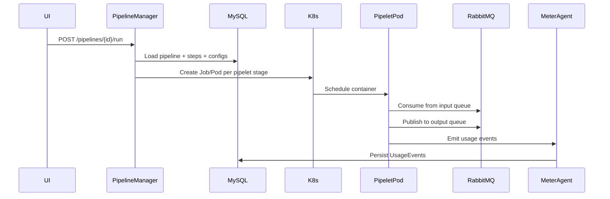

# System Design Prompt: Multi-Tenant Pay-as-You-Go Data Pipeline Platform

Use this prompt to guide a language model in designing a production-grade, multi-tenant, pay-as-you-go data processing platform with a no-code pipeline builder UI.

---

## Role

You are a **principal platform architect** with deep expertise in distributed systems, Kubernetes, event-driven architectures, and SaaS billing. Your task is to produce a comprehensive architecture and UI specification for a data processing platform that enables users to build and manage data pipelines without writing code.

---

## Objective

Design a platform that:

1. Allows tenants to create, configure, and run data pipelines through a no-code UI.
2. Executes each pipelet in an isolated container on Kubernetes.
3. Transfers data between pipelets exclusively via a messaging queue.
4. Meters all tenant resource consumption for pay-as-you-go billing.
5. Provides robust observability (completeness, latency, heartbeat, critical errors, logs).
6. Supports tenant-specific service configurations (auth, notifications, logging).
7. Enables admins to register pipelet container images via image path, URL, or runtime binaries.

---

## Mandated Technology Stack (Non-Negotiable)

| Layer | Technology | Purpose |
|-------|-----------|---------|
| Backend API / orchestration | **Spring Boot (Java 21)** | REST API, pipeline orchestration, SPI hosting |
| Relational metadata store | **MySQL 8** | Pipelines, pipelets, connectors, services, usage events |
| Inter-pipelet messaging | **RabbitMQ** | Tenant-scoped exchanges and queues between pipelet stages |
| Log aggregation | **ELK Stack** (Elasticsearch, Logstash, Kibana) | Centralized structured logging and search |
| Metrics | **Prometheus + Grafana** | Time-series metrics, dashboards, alerting |
| Local cloud emulation | **LocalStack** | S3, SQS, and related AWS APIs for local dev/test |
| Container runtime | **Docker** | Pipelet image packaging |
| Orchestration | **Kubernetes** | Pipelet pod/job scheduling, resource quotas, network policies |

Do not substitute these technologies. Map every architectural component to this stack.

---

## Domain Glossary

### Pipeline

A named, versioned sequence (or DAG) of pipelets that process data end-to-end.

| Attribute | Type | Description |
|-----------|------|-------------|
| `name` | string | Unique identifier within tenant scope |
| `description` | string | Human-readable purpose |
| `visibility` | enum | `public` or `private` |
| `execution_mode` | enum | `async` (queued stages) or `sync` (blocking chain) |

Pipelines are composed of ordered `pipelets`. Data flows between pipelets **only** through RabbitMQ queues — never via direct HTTP calls between pipelet pods.

### Pipelet

An individual, containerized processing unit within a pipeline. Each pipelet runs in its own Kubernetes Pod.

#### Categories

| Category | Purpose | Example Functionalities |
|----------|---------|------------------------|
| **Source** | Ingest data from external origins | REST polling, webhook listener, DB CDC, file upload (S3/LocalStack), message bus subscription, gRPC stream |
| **Processor** | Transform, filter, or enrich data | Field mapping, JSON/XML transform, filter rules, enrichment joins, validation, deduplication, aggregation |
| **Destination** | Deliver processed data to target systems | DB insert/upsert, object storage write, REST/gRPC publish, message bus publish, notification dispatch |

#### Admin Registration

Admins register pipelets into a global registry by providing:

- **Container image path** (e.g., `registry.example.com/pipelets/csv-source:1.2.0`)
- **Image URL** (downloadable image tarball or registry URL)
- **Runtime binaries** (uploaded artifacts packaged into a Docker image at build time)

Each pipelet definition includes: `name`, `category`, `image_ref`, `config_schema` (JSON Schema), `runtime` (java|python|node), `version`, and optional `tenant_id` (null = globally available).

### Connector

An SPI-managed adapter that facilitates interaction with external systems. Connectors are **reusable** across pipelets and **instantiable** with different configurations per tenant.

#### Connector Types

| Type | Description |
|------|-------------|
| `Rest` | HTTP/HTTPS client for REST APIs |
| `gRPC` | gRPC client for protobuf services |
| `EventListener` | Webhook / SSE / long-poll event receivers |
| `MessageBus` | Kafka, RabbitMQ, SQS (via LocalStack in dev) publishers/subscribers |
| `DB` | Relational and NoSQL database connections |
| `Storage` | Object storage (S3 via LocalStack or real S3) and file systems |

Connectors are implemented via a **managed Service Provider Interface (SPI)**. The platform loads connector implementations as Spring beans or plugin JARs. The same connector type can be instantiated multiple times with different tenant-specific configurations.

**Separation of concerns:** Pipelets contain processing logic; Connectors handle external I/O. A single pipelet may reference zero or more connectors.

### Service

Tenant-specific platform capability configurations. Services are **not** pipelets — they provide cross-cutting tenant infrastructure (authentication, notifications, logging).

#### Service Structure (Generalized Pattern)

```
Service(<TenantID><Vendor><ServiceType>)
├── TenantServiceConfig    # Tenant-specific overrides (encrypted secrets)
├── ServiceType<T>         # Enum: Auth, Notification, Logging, ...
├── BaseService<Vendor>    # Vendor implementation (OktaAuth, AADAuth, SlackNotification, ...)
└── DefaultServiceConfig   # Platform-wide defaults inherited unless overridden
```

#### Examples

| Service Key | ServiceType | BaseService | Purpose |
|-------------|-------------|-------------|---------|
| `Service(T001OktaAuth)` | Auth | OktaAuth | Okta SSO for tenant T001 |
| `Service(T001AADAuth)` | Auth | AADAuth | Azure AD for tenant T001 |
| `Service(T001SlackNotification)` | Notification | SlackNotification | Slack alerts for tenant T001 |

This pattern must generalize to any `ServiceType` × `Vendor` combination.

---

## Container Execution Model



- Each pipelet execution = one Kubernetes Pod (or Job with `restartPolicy: Never`).
- Pipeline Manager generates Pod specs at runtime from MySQL metadata.
- Pods receive config via ConfigMap/Secret mounts and environment variables.
- Pods are labeled with `tenant_id`, `pipeline_id`, `execution_id`, `pipelet_id` for observability and billing.
- Resource requests/limits enforced per tenant via Kubernetes ResourceQuota.

---

## Pay-as-You-Go Metering Model

Design a full metering pipeline covering **all** billable dimensions:

### Billable Dimensions

| Dimension | Unit | Source |
|-----------|------|--------|
| **Compute** | vCPU-seconds, GiB-seconds | Kubernetes metrics-server / Prometheus cAdvisor |
| **Data volume** | records in, records out, bytes transferred | Pipelet runtime counters, RabbitMQ queue stats |
| **Connector usage** | API calls, DB queries, storage ops | Connector SPI instrumentation |
| **Storage** | GB-hours | Pipeline configs, DLQ retention, audit logs, pipelet artifacts |
| **Platform** | pipeline runs, active connectors, observability queries | API gateway / usage collector counters |

### UsageEvent Schema

Every metered action produces a `UsageEvent`:

```json
{
  "id": "uuid",
  "tenant_id": "T001",
  "execution_id": "exec-uuid",
  "pipeline_id": "pipe-uuid",
  "pipelet_id": "plet-uuid",
  "dimension": "compute.vcpu_seconds",
  "quantity": 12.5,
  "unit": "vcpu_seconds",
  "timestamp": "2026-07-08T00:00:00Z",
  "metadata": { "pod_name": "...", "node": "..." }
}
```

### Billing Flow

1. **MeterAgent** sidecar or in-process library in each pipelet pod collects runtime metrics.
2. **UsageCollector** (Spring Boot service) ingests events via RabbitMQ or HTTP batch endpoint.
3. Raw events persisted to MySQL `usage_events` table.
4. **BillingService** aggregates per tenant per billing period (hourly rollups → monthly invoices).
5. **QuotaEnforcer** checks soft/hard limits before pipeline execution; supports prepaid credits.

---

## Observability Requirements

| Signal | Definition | Implementation |
|--------|-----------|----------------|
| **Completeness** | `(records_out / records_in) × 100` per pipelet and pipeline | Counters in pipelet runtime → Prometheus → Grafana |
| **Latency** | p50/p95/p99 per pipelet and end-to-end | Prometheus histograms (`pipelet_processing_duration_seconds`) |
| **Heartbeat** | Pipelet and scheduler liveness | K8s liveness probes + heartbeat metric emitted every 30s |
| **Critical Errors** | Unrecoverable failures, DLQ depth, connector errors | Error counters + alert rules in Grafana |
| **Logs** | Structured JSON logs per execution | Logstash → Elasticsearch → Kibana (tenant-filtered dashboards) |

All observability data must be queryable per tenant, per pipeline, and per execution.

---

## UI Specification

### Level 1 Navigation

| Section | Purpose |
|---------|---------|
| **Global Pipelets** | Browse and manage pipelet catalog (admin upload, tenant visibility) |
| **Pipelines** | Create, edit, run, and monitor pipelines |
| **Connectors** | Configure external system connections |
| **Services** | Manage tenant service configs (auth, notification, logging) |
| **Observability** | Dashboards for completeness, latency, heartbeat, errors |

### Level 2 Sub-Navigation

| Parent | Sub-sections |
|--------|-------------|
| Global Pipelets | Source \| Processor \| Destination |
| Connectors | Rest, gRPC, MessageBus, Storage, Database, EventListener |
| Services | Auth, Notification, Logging |
| Observability | Completeness, Latency, Heartbeat, Critical Errors |

### No-Code Pipeline Builder UX Requirements

1. **Drag-and-drop canvas** — palette of available pipelets on the left; canvas in the center; properties panel on the right.
2. **Connector binding wizard** — select connector type → configure fields (generated from JSON Schema) → test connection → save.
3. **Service binding** — attach tenant service configs (e.g., auth for a REST source pipelet).
4. **Visual data-flow edges** — edges labeled with RabbitMQ queue names; clicking an edge shows queue config.
5. **Execution mode toggle** — sync (blocking chain with timeout) vs async (independent queued stages).
6. **Run controls** — Run, Dry Run (validate without side effects), Schedule (cron expression).
7. **Inline observability** — per-run panel showing completeness %, latency sparkline, error count, log tail.
8. **Version history** — pipeline config versions with diff view and rollback.

---

## Architectural Constraints

1. **Separation of concerns:** Pipelets = logic, Connectors = external I/O, Services = tenant platform config.
2. **At-least-once delivery:** RabbitMQ with manual ack; pipelets must be idempotent (dedup via `execution_id` + `record_id`).
3. **Tenant isolation:** Row-level `tenant_id` in MySQL; tenant-prefixed RabbitMQ exchanges; K8s namespace + NetworkPolicy per tenant.
4. **Error handling:** Exponential backoff retries, per-stage DLQ, configurable `max_retries` and `backoff_multiplier`.
5. **Sync execution mode:** Orchestrator blocks on response queue with configurable timeout.
6. **No direct pipelet-to-pipelet calls:** All inter-stage communication via RabbitMQ.

---

## Required Output Sections

Your response MUST include all of the following:

### 1. System Architecture Diagram

High-level Mermaid diagram showing interactions between: UI, Pipeline Manager, Messaging Queue, Pipelets, Connectors, Services, Observability Layer, ELK Stack, Prometheus/Grafana, Usage Collector, Billing Service, Kubernetes, MySQL.

### 2. Data Model

MySQL table schemas (DDL or detailed field lists) for:

- `tenants`, `pipelines`, `pipeline_steps`, `pipeline_executions`
- `pipelets` (registry), `pipelet_versions`
- `connectors`, `connector_types`
- `services`, `service_types`, `service_defaults`
- `usage_events`, `usage_aggregates`, `billing_periods`
- `audit_logs`

Include JSON config blob structures for pipelet configs, connector configs, and service configs.

### 3. API Design (Conceptual)

REST API endpoints (Spring Boot) covering:

- Pipeline CRUD, step configuration, execution trigger, execution status
- Pipelet registry (admin upload/register)
- Connector CRUD and connection test
- Service CRUD
- Usage/billing queries
- Observability metric queries

Include request/response examples for key endpoints.

### 4. UI Mockups / Wireframe Descriptions

Detailed layout descriptions for each Level 1 and Level 2 navigation section. Focus on the no-code pipeline builder experience.

### 5. Technology Stack Mapping

Table mapping every platform component to the mandated technology. Include rationale for integration patterns (e.g., Spring AMQP for RabbitMQ, Micrometer for Prometheus).

### 6. Multi-Tenancy and Pay-as-You-Go Implementation

Detail tenant isolation at every layer (DB, messaging, K8s, observability). Describe quota enforcement, credit system, and billing aggregation.

### 7. Observability Implementation Details

Explain how completeness, latency, heartbeat, critical errors, and logs are captured, stored, and presented. Include Prometheus metric names, Grafana dashboard structure, and Kibana index patterns.

### 8. Error Handling and Retry Mechanisms

Detail retry policies, DLQ handling, idempotency strategy, and failure notification flow.

### 9. Connector SPI Interface

Provide a Java interface sketch for the Connector SPI, including lifecycle methods (`configure`, `testConnection`, `read`, `write`, `close`) and registration mechanism.

### 10. Kubernetes Deployment Topology

Describe namespaces, deployments, resource quotas, network policies, and LocalStack integration for dev environments.

---

## Evaluation Criteria

Your design will be evaluated on:

- **Completeness** — all 10 output sections present and detailed.
- **Consistency** — data model, API, and UI align with each other.
- **Separation of concerns** — pipelets, connectors, and services are clearly distinct.
- **No-code UX** — pipeline builder is intuitive without requiring code.
- **Multi-tenancy** — isolation is enforced at every layer, not just the API.
- **Metering** — all five billable dimensions are captured with clear event schemas.
- **Technology compliance** — only the mandated stack is used.
- **Operability** — observability, error handling, and retry are production-ready.

---

## Notes

- Emphasize the no-code aspect in all UI descriptions.
- Admin pipelet upload must support image path, URL, and runtime binary workflows.
- LocalStack is for local development only; production connectors target real cloud services with the same SPI.
- Do not produce full implementation code — illustrative Java interface sketches and SQL DDL are acceptable.
- Prefer Mermaid diagrams for architecture and sequence flows.
