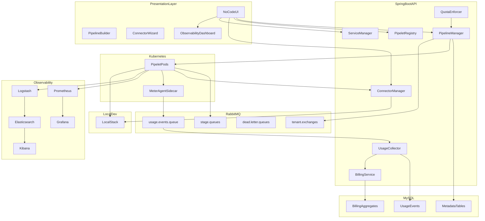
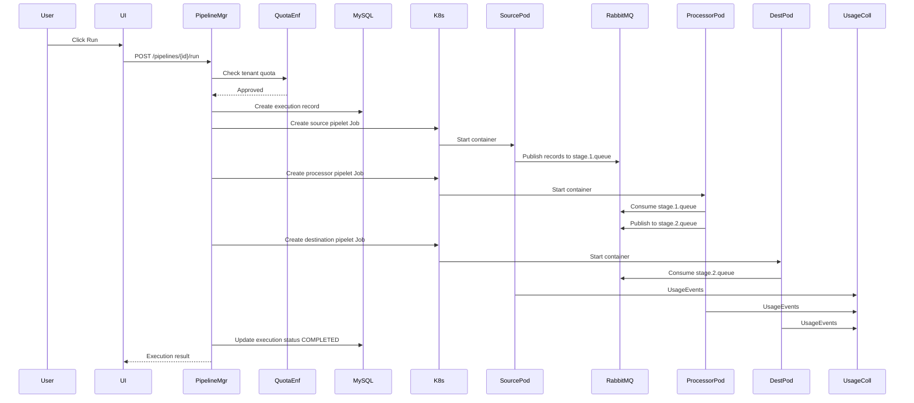
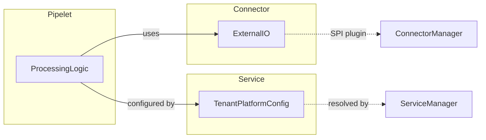
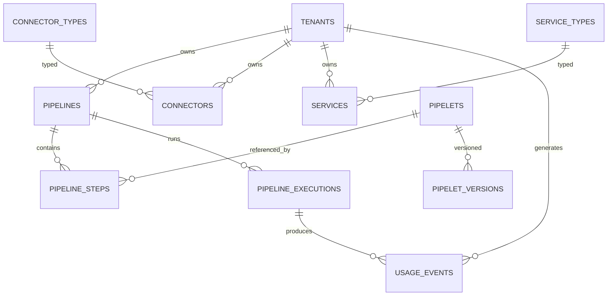
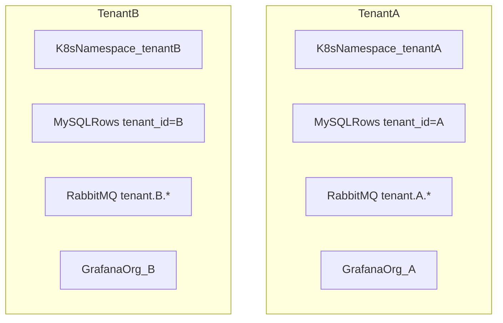
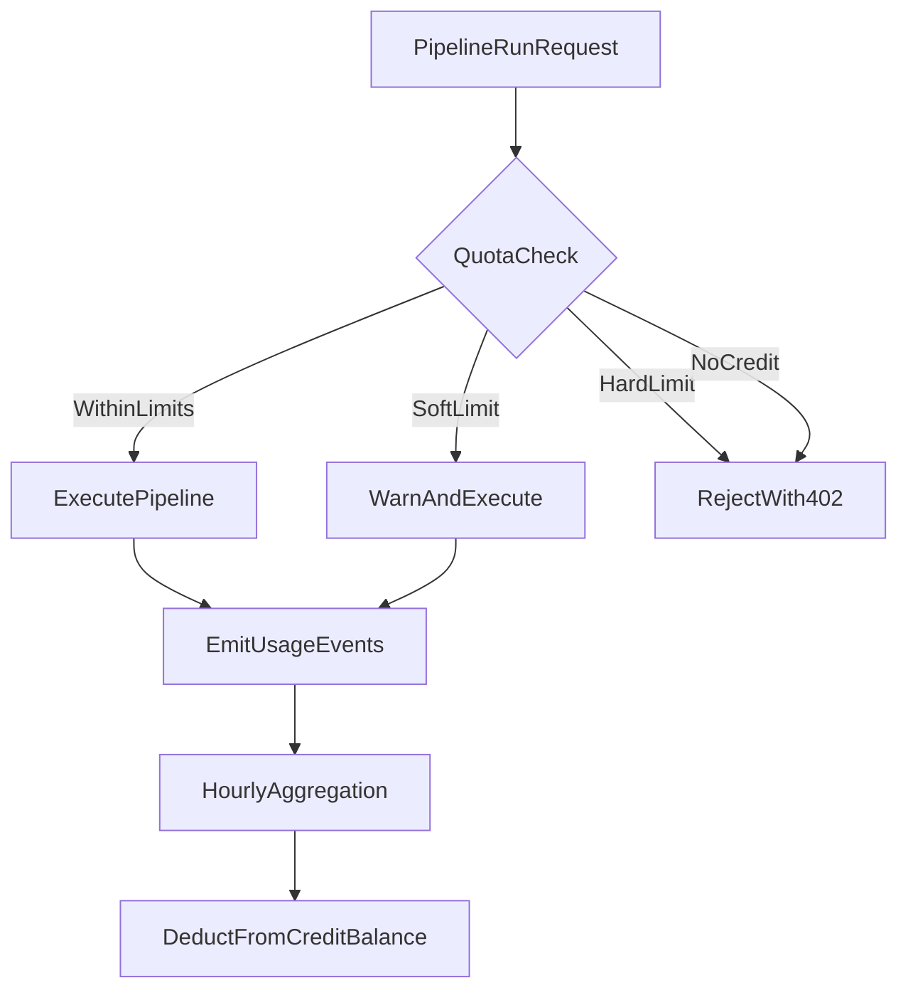
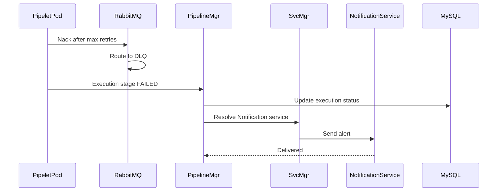

# Multi-Tenant Pay-as-You-Go Data Pipeline Platform — Architecture

This document is the full system design for a no-code, multi-tenant data processing platform. It was produced by applying the requirements defined in [SYSTEM_DESIGN_PROMPT.md](../SYSTEM_DESIGN_PROMPT.md).

**Incremental delivery** (waves → features → epics → user stories, with test and support-KB acceptance criteria): [DELIVERY_PLAN.md](DELIVERY_PLAN.md) · trackers under [delivery/](delivery/).

---

## Table of Contents

1. [System Architecture](#1-system-architecture)
2. [Data Model](#2-data-model)
3. [API Design](#3-api-design)
4. [UI Wireframe Descriptions](#4-ui-wireframe-descriptions)
5. [Technology Stack Mapping](#5-technology-stack-mapping)
6. [Multi-Tenancy and Pay-as-You-Go](#6-multi-tenancy-and-pay-as-you-go)
7. [Observability Implementation](#7-observability-implementation)
8. [Error Handling and Retry](#8-error-handling-and-retry)
9. [Connector SPI Interface](#9-connector-spi-interface)
10. [Kubernetes Deployment Topology](#10-kubernetes-deployment-topology)

---

## 1. System Architecture

### 1.1 High-Level Overview

The platform consists of six logical layers:

| Layer | Components |
|-------|-----------|
| **Presentation** | No-code React UI (pipeline builder, connector wizard, observability dashboards) |
| **API / Orchestration** | Spring Boot services (Pipeline Manager, Pipelet Registry, Connector Manager, Service Manager, Usage Collector) |
| **Execution** | Kubernetes Jobs/Pods running pipelet containers |
| **Messaging** | RabbitMQ tenant-scoped exchanges and queues |
| **Data** | MySQL 8 (metadata, usage, billing) |
| **Observability** | Prometheus, Grafana, ELK Stack |

### 1.2 Architecture Diagram



### 1.3 Component Responsibilities

| Component | Responsibility |
|-----------|---------------|
| **Pipeline Manager** | CRUD pipelines, generate K8s Job specs, trigger executions, manage sync/async orchestration |
| **Pipelet Registry** | Admin upload/register pipelet images; version management; config schema storage |
| **Connector Manager** | CRUD connector instances; load SPI plugins; test connections |
| **Service Manager** | Tenant service config CRUD; resolve `Service(TenantID+Vendor+Type)` at runtime |
| **Usage Collector** | Ingest `UsageEvent` batches; persist to MySQL; trigger aggregation |
| **Billing Service** | Hourly/daily/monthly rollups; invoice generation; credit balance management |
| **Quota Enforcer** | Pre-execution quota check; soft-limit warnings; hard-limit blocking |
| **Meter Agent** | Sidecar in pipelet pods; collects CPU/memory duration, record counts, connector call counts |

### 1.4 Pipeline Execution Flow



### 1.5 Separation of Concerns



- **Pipelets** contain data transformation logic and run in containers.
- **Connectors** abstract external system I/O and are shared, configurable plugins.
- **Services** provide tenant-level platform capabilities (auth tokens, notification endpoints) that pipelets and connectors consume.

---

## 2. Data Model

### 2.1 Entity Relationship Overview



### 2.2 Core Tables

#### `tenants`

| Column | Type | Notes |
|--------|------|-------|
| `id` | VARCHAR(36) PK | UUID |
| `name` | VARCHAR(255) | Display name |
| `slug` | VARCHAR(64) UNIQUE | URL-safe identifier |
| `status` | ENUM | `active`, `suspended`, `trial` |
| `credit_balance` | DECIMAL(12,4) | Prepaid credits |
| `quota_config` | JSON | Soft/hard limits per dimension |
| `k8s_namespace` | VARCHAR(63) | Dedicated K8s namespace |
| `created_at` | TIMESTAMP | |
| `updated_at` | TIMESTAMP | |

#### `pipelines`

| Column | Type | Notes |
|--------|------|-------|
| `id` | VARCHAR(36) PK | |
| `tenant_id` | VARCHAR(36) FK | |
| `name` | VARCHAR(255) | Unique per tenant |
| `description` | TEXT | |
| `visibility` | ENUM | `public`, `private` |
| `execution_mode` | ENUM | `async`, `sync` |
| `version` | INT | Incremented on each save |
| `status` | ENUM | `draft`, `active`, `archived` |
| `schedule_cron` | VARCHAR(64) NULL | Optional cron schedule |
| `retry_config` | JSON | `{max_retries, backoff_multiplier, initial_delay_ms}` |
| `created_at` | TIMESTAMP | |
| `updated_at` | TIMESTAMP | |

#### `pipeline_steps`

| Column | Type | Notes |
|--------|------|-------|
| `id` | VARCHAR(36) PK | |
| `pipeline_id` | VARCHAR(36) FK | |
| `pipelet_id` | VARCHAR(36) FK | |
| `step_order` | INT | 1-based sequence |
| `config` | JSON | Pipelet-specific config (validated against `config_schema`) |
| `connector_ids` | JSON | Array of connector instance IDs |
| `service_ids` | JSON | Array of service instance IDs |
| `input_queue` | VARCHAR(255) | RabbitMQ queue name |
| `output_queue` | VARCHAR(255) | RabbitMQ queue name |
| `resource_limits` | JSON | `{cpu, memory}` K8s limits |

Unique constraint: `(pipeline_id, step_order)`

#### `pipeline_executions`

| Column | Type | Notes |
|--------|------|-------|
| `id` | VARCHAR(36) PK | `execution_id` |
| `pipeline_id` | VARCHAR(36) FK | |
| `tenant_id` | VARCHAR(36) FK | |
| `pipeline_version` | INT | Snapshot version at run time |
| `status` | ENUM | `pending`, `running`, `completed`, `failed`, `cancelled` |
| `trigger` | ENUM | `manual`, `schedule`, `api` |
| `started_at` | TIMESTAMP | |
| `completed_at` | TIMESTAMP NULL | |
| `records_in` | BIGINT | Aggregated across stages |
| `records_out` | BIGINT | |
| `completeness_pct` | DECIMAL(5,2) | |
| `error_summary` | JSON NULL | |

#### `pipelets`

| Column | Type | Notes |
|--------|------|-------|
| `id` | VARCHAR(36) PK | |
| `tenant_id` | VARCHAR(36) NULL | NULL = globally available |
| `name` | VARCHAR(255) | |
| `category` | ENUM | `source`, `processor`, `destination` |
| `description` | TEXT | |
| `image_ref` | VARCHAR(512) | Container image URI |
| `config_schema` | JSON | JSON Schema for step config |
| `runtime` | ENUM | `java`, `python`, `node` |
| `status` | ENUM | `active`, `deprecated` |
| `created_by` | VARCHAR(36) | Admin user ID |
| `created_at` | TIMESTAMP | |

#### `pipelet_versions`

| Column | Type | Notes |
|--------|------|-------|
| `id` | VARCHAR(36) PK | |
| `pipelet_id` | VARCHAR(36) FK | |
| `version` | VARCHAR(32) | Semver |
| `image_ref` | VARCHAR(512) | Version-specific image |
| `upload_method` | ENUM | `image_path`, `image_url`, `runtime_binary` |
| `binary_artifact_url` | VARCHAR(512) NULL | For runtime binary uploads |
| `changelog` | TEXT | |
| `created_at` | TIMESTAMP | |

#### `connector_types`

| Column | Type | Notes |
|--------|------|-------|
| `id` | VARCHAR(36) PK | |
| `type` | ENUM | `rest`, `grpc`, `event_listener`, `message_bus`, `db`, `storage` |
| `display_name` | VARCHAR(128) | |
| `config_schema` | JSON | JSON Schema for connector config |
| `spi_class` | VARCHAR(512) | Fully qualified SPI class name |
| `spi_version` | VARCHAR(16) | |

#### `connectors`

| Column | Type | Notes |
|--------|------|-------|
| `id` | VARCHAR(36) PK | |
| `tenant_id` | VARCHAR(36) FK | |
| `connector_type_id` | VARCHAR(36) FK | |
| `name` | VARCHAR(255) | Unique per tenant |
| `config` | JSON | Encrypted at rest (AES-256) |
| `status` | ENUM | `active`, `inactive`, `error` |
| `last_tested_at` | TIMESTAMP NULL | |
| `created_at` | TIMESTAMP | |

#### `service_types`

| Column | Type | Notes |
|--------|------|-------|
| `id` | VARCHAR(36) PK | |
| `type` | ENUM | `auth`, `notification`, `logging` |
| `display_name` | VARCHAR(128) | |

#### `service_defaults`

| Column | Type | Notes |
|--------|------|-------|
| `id` | VARCHAR(36) PK | |
| `service_type_id` | VARCHAR(36) FK | |
| `vendor` | VARCHAR(64) | e.g., `OktaAuth`, `AADAuth`, `SlackNotification` |
| `base_service_class` | VARCHAR(512) | Java class |
| `default_config` | JSON | Platform-wide defaults |

#### `services`

| Column | Type | Notes |
|--------|------|-------|
| `id` | VARCHAR(36) PK | |
| `tenant_id` | VARCHAR(36) FK | |
| `service_type_id` | VARCHAR(36) FK | |
| `vendor` | VARCHAR(64) | |
| `name` | VARCHAR(255) | e.g., `T001OktaAuth` |
| `tenant_config` | JSON | Encrypted tenant overrides |
| `inherits_default` | BOOLEAN | Merge with `service_defaults` |
| `status` | ENUM | `active`, `inactive` |
| `created_at` | TIMESTAMP | |

#### `usage_events`

| Column | Type | Notes |
|--------|------|-------|
| `id` | VARCHAR(36) PK | |
| `tenant_id` | VARCHAR(36) FK | Indexed |
| `execution_id` | VARCHAR(36) NULL | |
| `pipeline_id` | VARCHAR(36) NULL | |
| `pipelet_id` | VARCHAR(36) NULL | |
| `dimension` | VARCHAR(64) | e.g., `compute.vcpu_seconds` |
| `quantity` | DECIMAL(18,6) | |
| `unit` | VARCHAR(32) | |
| `metadata` | JSON | |
| `recorded_at` | TIMESTAMP | Partition key for rollups |

Index: `(tenant_id, recorded_at)`, `(tenant_id, dimension, recorded_at)`

#### `usage_aggregates`

| Column | Type | Notes |
|--------|------|-------|
| `id` | VARCHAR(36) PK | |
| `tenant_id` | VARCHAR(36) FK | |
| `period_start` | TIMESTAMP | |
| `period_end` | TIMESTAMP | |
| `granularity` | ENUM | `hourly`, `daily`, `monthly` |
| `dimension` | VARCHAR(64) | |
| `total_quantity` | DECIMAL(18,6) | |
| `total_cost` | DECIMAL(12,4) | |
| `created_at` | TIMESTAMP | |

#### `billing_periods`

| Column | Type | Notes |
|--------|------|-------|
| `id` | VARCHAR(36) PK | |
| `tenant_id` | VARCHAR(36) FK | |
| `period_start` | DATE | |
| `period_end` | DATE | |
| `total_cost` | DECIMAL(12,4) | |
| `status` | ENUM | `open`, `invoiced`, `paid` |
| `invoice_url` | VARCHAR(512) NULL | |

#### `audit_logs`

| Column | Type | Notes |
|--------|------|-------|
| `id` | VARCHAR(36) PK | |
| `tenant_id` | VARCHAR(36) FK | |
| `actor_id` | VARCHAR(36) | |
| `action` | VARCHAR(64) | |
| `resource_type` | VARCHAR(64) | |
| `resource_id` | VARCHAR(36) | |
| `details` | JSON | |
| `created_at` | TIMESTAMP | |

### 2.3 JSON Config Examples

#### Pipelet Step Config

```json
{
  "poll_interval_seconds": 60,
  "batch_size": 100,
  "field_mapping": {
    "source_field": "target_field"
  },
  "filter_expression": "status == 'active'"
}
```

#### Connector Config (Rest)

```json
{
  "base_url": "https://api.example.com/v1",
  "auth_type": "bearer",
  "auth_service_id": "svc-uuid-okta",
  "headers": { "Accept": "application/json" },
  "timeout_ms": 30000,
  "retry_count": 3
}
```

#### Service Tenant Config (OktaAuth)

```json
{
  "domain": "dev-12345.okta.com",
  "client_id": "encrypted:...",
  "client_secret": "encrypted:...",
  "scopes": ["openid", "profile"]
}
```

---

## 3. API Design

All endpoints are served by Spring Boot under `/api/v1`. Authentication via tenant-scoped JWT (resolved through `Service(TenantID*Auth)`).

### 3.1 Pipeline Endpoints

| Method | Path | Description |
|--------|------|-------------|
| `GET` | `/pipelines` | List pipelines for tenant |
| `POST` | `/pipelines` | Create pipeline |
| `GET` | `/pipelines/{id}` | Get pipeline with steps |
| `PUT` | `/pipelines/{id}` | Update pipeline metadata |
| `DELETE` | `/pipelines/{id}` | Archive pipeline |
| `PUT` | `/pipelines/{id}/steps` | Replace step sequence |
| `POST` | `/pipelines/{id}/run` | Trigger execution |
| `POST` | `/pipelines/{id}/dry-run` | Validate without side effects |
| `GET` | `/pipelines/{id}/executions` | List executions |
| `GET` | `/pipelines/{id}/executions/{execId}` | Execution detail + per-stage metrics |
| `GET` | `/pipelines/{id}/versions` | Version history |
| `POST` | `/pipelines/{id}/versions/{v}/rollback` | Rollback to version |

#### Create Pipeline

```
POST /api/v1/pipelines
```

Request:

```json
{
  "name": "customer-sync",
  "description": "Sync customers from CRM to data warehouse",
  "visibility": "private",
  "execution_mode": "async"
}
```

Response `201`:

```json
{
  "id": "pipe-uuid",
  "name": "customer-sync",
  "description": "Sync customers from CRM to data warehouse",
  "visibility": "private",
  "execution_mode": "async",
  "version": 1,
  "status": "draft",
  "created_at": "2026-07-08T00:00:00Z"
}
```

#### Configure Steps

```
PUT /api/v1/pipelines/{id}/steps
```

Request:

```json
{
  "steps": [
    {
      "pipelet_id": "plet-rest-source",
      "step_order": 1,
      "config": { "poll_interval_seconds": 60, "batch_size": 100 },
      "connector_ids": ["conn-crm-rest"],
      "service_ids": ["svc-okta-auth"],
      "resource_limits": { "cpu": "500m", "memory": "512Mi" }
    },
    {
      "pipelet_id": "plet-json-transform",
      "step_order": 2,
      "config": { "field_mapping": { "cust_id": "customer_id" } },
      "connector_ids": [],
      "service_ids": []
    },
    {
      "pipelet_id": "plet-db-dest",
      "step_order": 3,
      "config": { "table": "customers", "mode": "upsert" },
      "connector_ids": ["conn-warehouse-db"],
      "service_ids": []
    }
  ]
}
```

#### Trigger Execution

```
POST /api/v1/pipelines/{id}/run
```

Response `202`:

```json
{
  "execution_id": "exec-uuid",
  "status": "pending",
  "pipeline_id": "pipe-uuid",
  "started_at": "2026-07-08T00:05:00Z"
}
```

### 3.2 Pipelet Registry Endpoints (Admin)

| Method | Path | Description |
|--------|------|-------------|
| `GET` | `/pipelets` | List pipelets (filter by category, tenant) |
| `GET` | `/pipelets/{id}` | Get pipelet detail |
| `POST` | `/pipelets` | Register new pipelet |
| `POST` | `/pipelets/{id}/versions` | Upload new version |
| `POST` | `/pipelets/upload-binary` | Upload runtime binary artifact |

#### Register Pipelet (Image Path)

```
POST /api/v1/pipelets
```

Request:

```json
{
  "name": "REST Source",
  "category": "source",
  "description": "Polls a REST endpoint for records",
  "image_ref": "registry.example.com/pipelets/rest-source:1.0.0",
  "upload_method": "image_path",
  "runtime": "java",
  "config_schema": {
    "type": "object",
    "properties": {
      "poll_interval_seconds": { "type": "integer", "minimum": 1 },
      "batch_size": { "type": "integer", "minimum": 1, "maximum": 10000 }
    },
    "required": ["poll_interval_seconds", "batch_size"]
  }
}
```

#### Register Pipelet (Image URL)

```json
{
  "name": "CSV Source",
  "category": "source",
  "image_url": "https://artifacts.example.com/pipelets/csv-source-1.0.0.tar.gz",
  "upload_method": "image_url",
  "runtime": "python",
  "config_schema": { }
}
```

#### Register Pipelet (Runtime Binary)

```
POST /api/v1/pipelets/upload-binary
Content-Type: multipart/form-data
```

Fields: `name`, `category`, `runtime`, `binary` (file), `config_schema` (JSON string).

The platform builds a Docker image from the binary, pushes to the internal registry, and creates the pipelet record.

### 3.3 Connector Endpoints

| Method | Path | Description |
|--------|------|-------------|
| `GET` | `/connectors` | List tenant connectors |
| `GET` | `/connector-types` | List available SPI types |
| `POST` | `/connectors` | Create connector instance |
| `PUT` | `/connectors/{id}` | Update config |
| `DELETE` | `/connectors/{id}` | Deactivate connector |
| `POST` | `/connectors/{id}/test` | Test connection |

#### Test Connection

```
POST /api/v1/connectors/{id}/test
```

Response:

```json
{
  "success": true,
  "latency_ms": 142,
  "message": "Connection successful",
  "tested_at": "2026-07-08T00:10:00Z"
}
```

### 3.4 Service Endpoints

| Method | Path | Description |
|--------|------|-------------|
| `GET` | `/services` | List tenant services |
| `GET` | `/service-types` | List service types and vendors |
| `POST` | `/services` | Create tenant service config |
| `PUT` | `/services/{id}` | Update tenant config |
| `DELETE` | `/services/{id}` | Deactivate service |

### 3.5 Usage and Billing Endpoints

| Method | Path | Description |
|--------|------|-------------|
| `GET` | `/tenants/{id}/usage` | Usage summary (current period) |
| `GET` | `/tenants/{id}/usage/events` | Raw usage events (paginated) |
| `GET` | `/tenants/{id}/billing/periods` | Billing history |
| `GET` | `/tenants/{id}/quota` | Current quota status |

#### Usage Summary

```
GET /api/v1/tenants/T001/usage?period=current
```

Response:

```json
{
  "tenant_id": "T001",
  "period_start": "2026-07-01T00:00:00Z",
  "period_end": "2026-07-31T23:59:59Z",
  "dimensions": {
    "compute.vcpu_seconds": { "quantity": 4520.5, "cost": 22.60 },
    "data.records_processed": { "quantity": 1250000, "cost": 12.50 },
    "connector.api_calls": { "quantity": 8400, "cost": 4.20 },
    "storage.gb_hours": { "quantity": 15.3, "cost": 1.53 },
    "platform.pipeline_runs": { "quantity": 320, "cost": 3.20 }
  },
  "total_cost": 44.03,
  "credit_balance": 155.97
}
```

### 3.6 Observability Endpoints

| Method | Path | Description |
|--------|------|-------------|
| `GET` | `/observability/pipelines/{id}/completeness` | Completeness metrics |
| `GET` | `/observability/pipelines/{id}/latency` | Latency percentiles |
| `GET` | `/observability/pipelines/{id}/heartbeat` | Heartbeat status |
| `GET` | `/observability/pipelines/{id}/errors` | Critical error summary |
| `GET` | `/observability/executions/{execId}/logs` | Execution log tail (proxied from Kibana) |

---

## 4. UI Wireframe Descriptions

### 4.1 Global Layout

```
┌──────────────────────────────────────────────────────────────────────┐
│  Logo   Global Pipelets │ Pipelines │ Connectors │ Services │ Obs   │
├──────────┬───────────────────────────────────────────┬───────────────┤
│          │                                           │               │
│  Sub-nav │           Main Content Area               │  Properties   │
│  (L2)    │                                           │  Panel        │
│          │                                           │  (contextual) │
│          │                                           │               │
├──────────┴───────────────────────────────────────────┴───────────────┤
│  Status bar: tenant name │ credit balance │ quota usage │ alerts    │
└──────────────────────────────────────────────────────────────────────┘
```

### 4.2 Global Pipelets

**Sub-nav:** Source | Processor | Destination

**Layout:** Card grid of pipelet tiles. Each card shows: icon, name, category badge, version, runtime badge, description snippet.

**Admin actions (top-right):** "Register Pipelet" button opens a modal with three tabs:

| Tab | Fields |
|-----|--------|
| Image Path | Name, category, image registry path, config schema builder |
| Image URL | Name, category, URL, auto-pull toggle |
| Runtime Binary | Name, category, runtime selector, file upload drag-and-drop zone |

**Tenant view:** Read-only browse of global + tenant-private pipelets. Click a card to see full config schema, version history, and "Add to Pipeline" shortcut.

### 4.3 Pipelines — List View

**Layout:** Table with columns: Name, Status, Last Run, Completeness, Mode (async/sync), Visibility, Actions.

**Actions per row:** Edit, Run, Duplicate, Archive.

**Top bar:** "New Pipeline" button, search/filter by status and visibility.

### 4.4 Pipelines — Builder (No-Code Canvas)

The primary no-code experience. Three-panel layout:

```
┌────────────┬────────────────────────────────────┬──────────────────┐
│  Pipelet   │         Canvas                      │  Properties      │
│  Palette   │                                    │                  │
│            │   ┌─────────┐    ┌─────────┐      │  Step: REST      │
│  Sources   │   │ REST    │───>│ Transform│──>  │  Source          │
│  ├ REST    │   │ Source  │    │          │     │                  │
│  ├ CSV     │   └─────────┘    └─────────┘      │  Config fields   │
│  ├ Webhook │        │              │           │  (auto-generated │
│            │   queue: stage.1  queue: stage.2  │   from schema)   │
│  Processors│                                    │                  │
│  ├ Transform│                                   │  Connectors:     │
│  ├ Filter  │                                    │  [CRM REST ▼]    │
│  ├ Validate│                                    │                  │
│            │                                    │  Services:       │
│  Destinations│                                  │  [Okta Auth ▼]   │
│  ├ DB Write│                                    │                  │
│  ├ S3 Write│                                    │  Resources:      │
│  ├ Webhook │                                    │  CPU: [500m]     │
│            │                                    │  Mem: [512Mi]    │
├────────────┴────────────────────────────────────┴──────────────────┤
│  [Dry Run]  [Save]  [Run ▶]  │  Mode: ○ Async  ○ Sync  │  v3     │
└──────────────────────────────────────────────────────────────────┘
```

**Interactions:**

- Drag pipelet from palette onto canvas → auto-creates step node with default config.
- Connect nodes by dragging edge handles → auto-provisions RabbitMQ queue names displayed on edges.
- Click node → properties panel shows JSON-Schema-driven form fields.
- Connector/Service dropdowns populated from tenant's configured instances.
- Bottom bar: Dry Run validates config + connector tests; Run triggers execution; version badge shows current version with rollback link.

**Execution overlay:** When a run is active, nodes animate with status colors (green=running, blue=completed, red=failed). Inline metrics appear below each node: records in/out, latency, completeness %.

### 4.5 Connectors

**Sub-nav:** Rest | gRPC | MessageBus | Storage | Database | EventListener

**Layout:** Split view — left: list of tenant connector instances; right: detail/edit form.

**Create flow (wizard):**

1. Select connector type (card selection).
2. Fill config form (generated from `config_schema`).
3. Bind auth service if needed (dropdown of tenant Auth services).
4. Test connection (inline result with latency).
5. Save.

### 4.6 Services

**Sub-nav:** Auth | Notification | Logging

**Layout:** Table of tenant services: Name, Vendor, Type, Status, Last Updated.

**Create flow:** Select service type → select vendor (OktaAuth, AADAuth, SlackNotification, etc.) → fill tenant config form (sensitive fields masked) → toggle "inherit defaults" → save.

Resolved config preview shown at bottom: merged view of `DefaultServiceConfig` + `TenantServiceConfig`.

### 4.7 Observability

**Sub-nav:** Completeness | Latency | Heartbeat | Critical Errors

**Completeness dashboard:**

- Top: pipeline selector dropdown, time range picker.
- Main: line chart of completeness % over time per pipeline execution.
- Table: execution list with records_in, records_out, completeness %, status.
- Alert banner if completeness drops below threshold (configurable, default 95%).

**Latency dashboard:**

- Heatmap: pipelet stages × latency percentiles (p50, p95, p99).
- End-to-end latency trend line.

**Heartbeat dashboard:**

- Grid of pipelet pods with green/yellow/red heartbeat indicators.
- Last heartbeat timestamp, pipeline scheduler status.

**Critical Errors dashboard:**

- Error count timeline.
- DLQ depth per pipeline stage.
- Top error types table with drill-down to Kibana logs.

---

## 5. Technology Stack Mapping

| Platform Component | Technology | Integration Pattern |
|-------------------|-----------|---------------------|
| REST API | Spring Boot 3.x (Java 21) | Spring Web MVC, Spring Security |
| Pipeline orchestration | Spring Boot + Spring K8s Client | Fabric8 Kubernetes client for Job/Pod CRUD |
| Metadata persistence | MySQL 8 | Spring Data JPA, Flyway migrations |
| Inter-pipelet messaging | RabbitMQ | Spring AMQP, tenant-scoped exchange declarations |
| Connector SPI | Spring Boot + PF4J plugin framework | Plugin JARs loaded at runtime |
| Service resolution | Spring Boot | Strategy pattern keyed by `ServiceType` + `Vendor` |
| Usage collection | Spring Boot + RabbitMQ | Dedicated `usage.events` queue |
| Billing aggregation | Spring Boot `@Scheduled` | Hourly cron rollup jobs |
| Pipelet containers | Docker | Images stored in internal container registry |
| Pipelet scheduling | Kubernetes Jobs | One Job per pipelet stage per execution |
| Metrics collection | Prometheus | Micrometer Prometheus registry in Spring Boot + pipelet sidecar |
| Metrics visualization | Grafana | Pre-built dashboards per tenant (Grafana org per tenant) |
| Log shipping | Logstash | Filebeat sidecar in pipelet pods → Logstash → Elasticsearch |
| Log search | Kibana | Index pattern: `pipeline-logs-{tenant_id}-*` |
| Local cloud emulation | LocalStack | S3/SQS endpoints for Storage and MessageBus connectors in dev |
| Secrets management | K8s Secrets + MySQL encrypted columns | Connector/service configs encrypted at rest |
| API documentation | SpringDoc OpenAPI | Auto-generated Swagger UI |
| Frontend | React 18 + TypeScript | React Flow for pipeline canvas, TanStack Query for API |
| CI/CD | GitHub Actions + Docker + K8s manifests | Build pipelet images, deploy platform services |

---

## 6. Multi-Tenancy and Pay-as-You-Go

### 6.1 Tenant Isolation



| Layer | Isolation Mechanism |
|-------|-------------------|
| **API** | JWT contains `tenant_id`; Spring Security filter rejects cross-tenant access |
| **MySQL** | `tenant_id` column on all tenant-owned tables; JPA `@Filter` auto-applied |
| **RabbitMQ** | Exchanges: `tenant.{tenant_id}.pipeline.{pipeline_id}.stage.{n}`; vhost per environment |
| **Kubernetes** | Namespace `tenant-{tenant_id}`; ResourceQuota limits CPU/memory/pod count |
| **Network** | NetworkPolicy: pods can only reach RabbitMQ, MySQL, and approved connector endpoints |
| **Observability** | Prometheus labels `tenant_id`; Grafana org per tenant; Kibana space per tenant |
| **LocalStack** | Separate S3 bucket prefix `tenant-{tenant_id}/` in dev |

### 6.2 Pay-as-You-Go Metering

#### Pricing Dimensions

| Dimension | Unit Price (example) | Measurement |
|-----------|---------------------|-------------|
| vCPU-seconds | $0.005 / vCPU-sec | K8s metrics-server |
| GiB-seconds | $0.001 / GiB-sec | K8s metrics-server |
| Records processed | $0.00001 / record | Pipelet counter |
| Bytes transferred | $0.01 / GB | RabbitMQ management API |
| Connector API calls | $0.0005 / call | Connector SPI interceptor |
| Storage GB-hours | $0.10 / GB-hour | S3/LocalStack + MySQL audit |
| Pipeline runs | $0.01 / run | Pipeline Manager counter |

#### Quota Enforcement



- **Soft limits:** Allow execution, send notification via tenant Notification service.
- **Hard limits:** Block execution, return HTTP 402 with quota details.
- **Prepaid credits:** `tenants.credit_balance` decremented on aggregation; pipeline blocked when balance ≤ 0.

#### Aggregation Schedule

| Granularity | Schedule | Purpose |
|-------------|----------|---------|
| Raw events | Real-time | Inserted on ingestion |
| Hourly | Cron: `0 * * * *` | Dashboard display, soft-limit checks |
| Daily | Cron: `0 0 * * *` | Tenant usage reports |
| Monthly | Cron: `0 0 1 * *` | Invoice generation |

---

## 7. Observability Implementation

### 7.1 Metrics (Prometheus)

#### Pipelet Runtime Metrics

| Metric Name | Type | Labels | Description |
|-------------|------|--------|-------------|
| `pipelet_records_in_total` | Counter | tenant_id, pipeline_id, pipelet_id, execution_id | Records consumed |
| `pipelet_records_out_total` | Counter | tenant_id, pipeline_id, pipelet_id, execution_id | Records produced |
| `pipelet_processing_duration_seconds` | Histogram | tenant_id, pipeline_id, pipelet_id | Per-record processing time |
| `pipelet_errors_total` | Counter | tenant_id, pipeline_id, pipelet_id, error_type | Processing errors |
| `pipelet_heartbeat_timestamp` | Gauge | tenant_id, pipeline_id, pipelet_id, pod_name | Last heartbeat epoch |
| `connector_calls_total` | Counter | tenant_id, connector_id, connector_type | External API calls |
| `connector_call_duration_seconds` | Histogram | tenant_id, connector_id | Connector latency |
| `pipeline_completeness_ratio` | Gauge | tenant_id, pipeline_id, execution_id | records_out / records_in |
| `rabbitmq_queue_depth` | Gauge | tenant_id, queue_name | Pending messages |
| `dlq_messages_total` | Counter | tenant_id, pipeline_id, stage | Dead-lettered messages |

#### Spring Boot Platform Metrics

Standard Micrometer metrics plus:

| Metric Name | Type | Description |
|-------------|------|-------------|
| `pipeline_executions_total` | Counter | Executions by status |
| `pipeline_execution_duration_seconds` | Histogram | End-to-end duration |
| `usage_events_ingested_total` | Counter | Billing events processed |
| `quota_check_result` | Counter | Quota check outcomes |

### 7.2 Grafana Dashboards

| Dashboard | Panels |
|-----------|--------|
| **Pipeline Overview** | Execution count, success rate, avg completeness, avg latency |
| **Pipelet Performance** | Per-pipelet latency heatmap, records/sec, error rate |
| **Completeness** | Completeness % trend, records in vs out stacked chart |
| **Infrastructure** | Pod CPU/memory, queue depth, DLQ depth |
| **Billing** | Cost by dimension, credit balance trend, quota utilization |

Tenant isolation: each tenant gets a Grafana Organization with dashboards pre-provisioned via API on tenant creation.

### 7.3 Logging (ELK)

#### Log Format

Pipelet pods emit structured JSON to stdout:

```json
{
  "timestamp": "2026-07-08T00:05:12.345Z",
  "level": "INFO",
  "tenant_id": "T001",
  "pipeline_id": "pipe-uuid",
  "execution_id": "exec-uuid",
  "pipelet_id": "plet-uuid",
  "pod_name": "customer-sync-stage-1-abc12",
  "message": "Processed batch of 100 records",
  "records_in": 100,
  "records_out": 98,
  "duration_ms": 1234
}
```

#### Pipeline

1. **Filebeat** sidecar collects stdout from pipelet pods.
2. **Logstash** pipeline parses JSON, enriches with tenant metadata, routes to Elasticsearch.
3. **Elasticsearch** index: `pipeline-logs-{tenant_id}-{YYYY.MM.DD}`.
4. **Kibana** space per tenant with pre-built Discover and Dashboard views.

### 7.4 Completeness Calculation

```
completeness_pct = (total_records_out / total_records_in) × 100
```

- Calculated per pipelet stage and aggregated at pipeline level.
- `records_in` for stage N = `records_out` from stage N-1 (validates queue integrity).
- Alert rule in Grafana: `pipeline_completeness_ratio < 0.95 for 5m` → notification via tenant Notification service.

### 7.5 Heartbeat

- Each pipelet pod emits `pipelet_heartbeat_timestamp` every 30 seconds.
- Pipeline Manager emits scheduler heartbeat for cron-triggered pipelines.
- Grafana alert: `time() - pipelet_heartbeat_timestamp > 90` → critical alert.

---

## 8. Error Handling and Retry

### 8.1 Retry Policy

Pipeline-level `retry_config`:

```json
{
  "max_retries": 3,
  "backoff_multiplier": 2.0,
  "initial_delay_ms": 1000,
  "max_delay_ms": 60000
}
```

| Layer | Retry Behavior |
|-------|---------------|
| **RabbitMQ consumer** | Manual ack; on failure, nack with requeue up to `max_retries`; then route to DLQ |
| **K8s Job** | `backoffLimit` set to `max_retries`; new pod on failure |
| **Connector calls** | Connector SPI applies exponential backoff internally for transient errors (5xx, timeouts) |
| **Sync mode** | Orchestrator waits on response queue with `initial_delay_ms * backoff_multiplier^attempt` timeout |

### 8.2 Dead Letter Queue (DLQ)

Per pipeline stage, a DLQ is provisioned:

```
tenant.{tenant_id}.pipeline.{pipeline_id}.stage.{n}.dlq
```

| Event | Action |
|-------|--------|
| Message exceeds max retries | Routed to DLQ; `dlq_messages_total` incremented |
| DLQ depth > threshold | Grafana alert → tenant Notification service |
| Admin replay | UI button "Replay DLQ" re-publishes messages to input queue |

### 8.3 Idempotency

- Every record carries `execution_id` + `record_id` (UUID).
- Processor pipelets maintain a dedup store (MySQL or Redis) keyed on `(execution_id, record_id)`.
- Destination pipelets use upsert semantics where supported.

### 8.4 Failure Notification Flow



### 8.5 Sync vs Async Error Handling

| Mode | Behavior |
|------|----------|
| **Async** | Stages run independently; failure in stage N does not block stage N-1 completion; DLQ captures failed messages |
| **Sync** | Orchestrator chains stages; failure in any stage aborts subsequent stages; execution marked `failed` with stage detail |

---

## 9. Connector SPI Interface

### 9.1 Core Interface

```java
package com.platform.connector.spi;

public interface Connector {

    /** Returns the connector type identifier (e.g., "rest", "db", "storage"). */
    String getType();

    /** Returns the SPI version this implementation conforms to. */
    String getSpiVersion();

    /**
     * Initialize the connector with tenant-specific configuration.
     * Called once when a connector instance is created or updated.
     */
    void configure(ConnectorContext context, ConnectorConfig config);

    /**
     * Validate connectivity. Called by POST /connectors/{id}/test.
     * @return test result with latency and diagnostic message
     */
    ConnectionTestResult testConnection();

    /**
     * Read data from the external system.
     * Used by Source pipelets and Processor enrichment steps.
     */
    ConnectorResponse read(ConnectorRequest request);

    /**
     * Write data to the external system.
     * Used by Destination pipelets and Processor side-effects.
     */
    ConnectorResponse write(ConnectorRequest request);

    /** Release resources. Called on connector deactivation or pod shutdown. */
    void close();
}
```

### 9.2 Supporting Types

```java
public record ConnectorContext(
    String tenantId,
    String connectorId,
    String executionId,
    ServiceResolver serviceResolver,
    MeterRegistry meterRegistry
) {}

public record ConnectorConfig(
    Map<String, Object> properties,
    Map<String, String> secrets
) {}

public record ConnectorRequest(
    String recordId,
    Map<String, Object> headers,
    byte[] payload
) {}

public record ConnectorResponse(
    boolean success,
    int statusCode,
    byte[] payload,
    Map<String, String> metadata,
    String errorMessage
) {}

public record ConnectionTestResult(
    boolean success,
    long latencyMs,
    String message
) {}
```

### 9.3 Service Resolver

```java
public interface ServiceResolver {
    /**
     * Resolves a tenant service configuration.
     * Merges DefaultServiceConfig with TenantServiceConfig
     * when inherits_default is true.
     */
    <T> T resolve(String tenantId, ServiceType type, String vendor, Class<T> configClass);
}
```

### 9.4 Plugin Registration

Connectors are packaged as PF4J plugin JARs with a `META-INF/services/com.platform.connector.spi.Connector` descriptor. The Connector Manager:

1. Scans the plugin directory on startup.
2. Registers each implementation in `connector_types` table.
3. Instantiates per-tenant connectors on demand with tenant config.

### 9.5 Built-in Connector Implementations

| Type | Class | External System |
|------|-------|----------------|
| `rest` | `RestConnector` | HTTP/HTTPS APIs |
| `grpc` | `GrpcConnector` | gRPC services |
| `event_listener` | `EventListenerConnector` | Webhooks, SSE |
| `message_bus` | `MessageBusConnector` | RabbitMQ, SQS (LocalStack) |
| `db` | `DatabaseConnector` | MySQL, PostgreSQL |
| `storage` | `StorageConnector` | S3 (LocalStack / AWS) |

---

## 10. Kubernetes Deployment Topology

### 10.1 Namespace Layout

| Namespace | Contents |
|-----------|----------|
| `platform` | Spring Boot API, Usage Collector, Billing Service |
| `platform-infra` | RabbitMQ, MySQL (or external), Prometheus, Grafana, ELK, LocalStack |
| `tenant-{tenant_id}` | Pipelet execution pods (one namespace per tenant) |

### 10.2 Platform Services (namespace: `platform`)

```yaml
# Deployments
- pipeline-api        (replicas: 3, port: 8080)
- usage-collector     (replicas: 2, port: 8081)
- billing-service     (replicas: 1, port: 8082)

# ConfigMaps
- pipeline-api-config  (RabbitMQ host, MySQL DSN, K8s namespace prefix)
- grafana-dashboards   (pre-built dashboard JSON)
```

### 10.3 Pipelet Execution (namespace: `tenant-{tenant_id}`)

Each pipeline execution creates K8s Jobs:

```yaml
apiVersion: batch/v1
kind: Job
metadata:
  name: "exec-{execution_id}-stage-{step_order}"
  namespace: "tenant-{tenant_id}"
  labels:
    tenant_id: "{tenant_id}"
    pipeline_id: "{pipeline_id}"
    execution_id: "{execution_id}"
    pipelet_id: "{pipelet_id}"
spec:
  backoffLimit: 3
  template:
    spec:
      restartPolicy: Never
      containers:
        - name: pipelet
          image: "{pipelet_image_ref}"
          env:
            - name: TENANT_ID
              value: "{tenant_id}"
            - name: EXECUTION_ID
              value: "{execution_id}"
            - name: INPUT_QUEUE
              value: "tenant.{tenant_id}.pipeline.{pipeline_id}.stage.{n}.in"
            - name: OUTPUT_QUEUE
              value: "tenant.{tenant_id}.pipeline.{pipeline_id}.stage.{n+1}.in"
            - name: CONNECTOR_CONFIG
              valueFrom:
                secretKeyRef:
                  name: "connector-{connector_id}"
                  key: config
          resources:
            requests:
              cpu: "250m"
              memory: "256Mi"
            limits:
              cpu: "500m"
              memory: "512Mi"
        - name: meter-agent
          image: "registry.example.com/platform/meter-agent:1.0.0"
          env:
            - name: USAGE_ENDPOINT
              value: "http://usage-collector.platform.svc:8081/api/v1/usage/events"
```

### 10.4 Resource Quotas (per tenant namespace)

```yaml
apiVersion: v1
kind: ResourceQuota
metadata:
  name: tenant-quota
  namespace: "tenant-{tenant_id}"
spec:
  hard:
    requests.cpu: "4"
    requests.memory: "8Gi"
    limits.cpu: "8"
    limits.memory: "16Gi"
    pods: "20"
```

### 10.5 Network Policies

```yaml
apiVersion: networking.k8s.io/v1
kind: NetworkPolicy
metadata:
  name: tenant-isolation
  namespace: "tenant-{tenant_id}"
spec:
  podSelector: {}
  policyTypes: [Egress, Ingress]
  egress:
    - to:
        - namespaceSelector:
            matchLabels:
              name: platform-infra
      ports:
        - port: 5672   # RabbitMQ
        - port: 3306   # MySQL
        - port: 4566   # LocalStack
    - to:
        - namespaceSelector:
            matchLabels:
              name: platform
      ports:
        - port: 8081   # Usage Collector
  ingress:
    - from:
        - namespaceSelector:
            matchLabels:
              name: platform
```

### 10.6 LocalStack (Dev Environment)

Deployed in `platform-infra` namespace:

```yaml
# LocalStack for S3, SQS emulation
image: localstack/localstack:latest
ports:
  - 4566
environment:
  SERVICES: s3,sqs
  DEFAULT_REGION: us-east-1
```

Storage and MessageBus connectors point to `http://localstack.platform-infra.svc:4566` in dev. Production configs swap endpoint to real AWS services with the same SPI — only the `config.endpoint` value changes.

### 10.7 Environment Matrix

| Component | Dev | Staging | Production |
|-----------|-----|---------|------------|
| MySQL | Single pod | RDS single-AZ | RDS Multi-AZ |
| RabbitMQ | Single node | 3-node cluster | 3-node cluster + mirrored queues |
| LocalStack | Enabled | Disabled | Disabled |
| K8s | Minikube / Kind | Managed K8s (EKS/GKE) | Managed K8s Multi-AZ |
| Pipelet registry | Local registry | ECR/GCR | ECR/GCR with image scanning |
| Secrets | K8s Secrets | AWS Secrets Manager | AWS Secrets Manager + rotation |

---

## Appendix: RabbitMQ Topology Example

For tenant `T001`, pipeline `pipe-abc`, with 3 stages:

```
Exchange: tenant.T001.pipeline.pipe-abc (topic)

Queues:
  tenant.T001.pipeline.pipe-abc.stage.1.in    ← Source output
  tenant.T001.pipeline.pipe-abc.stage.2.in    ← Processor output
  tenant.T001.pipeline.pipe-abc.stage.3.in    ← Destination input
  tenant.T001.pipeline.pipe-abc.stage.1.dlq
  tenant.T001.pipeline.pipe-abc.stage.2.dlq
  tenant.T001.pipeline.pipe-abc.stage.3.dlq

Bindings:
  stage.1.in ← routing_key: stage.1
  stage.2.in ← routing_key: stage.2
  stage.3.in ← routing_key: stage.3
```

---

*Generated from [SYSTEM_DESIGN_PROMPT.md](../SYSTEM_DESIGN_PROMPT.md).*
