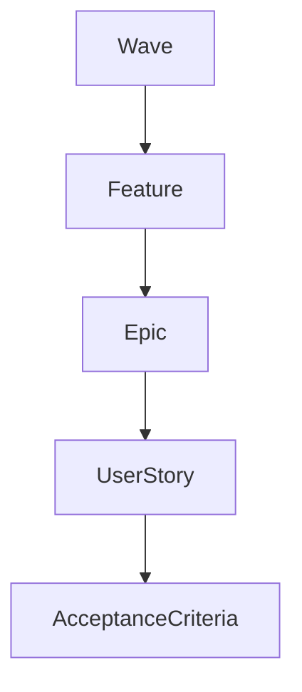
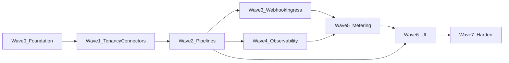

# Incremental Delivery Plan

Ship the multi-tenant, pay-as-you-go, no-code pipeline platform in incremental **waves**. Each wave is a vertical slice that can be demonstrated and tested before the next starts.

**Architecture source of truth:** [`ARCHITECTURE.md`](ARCHITECTURE.md) (§1–11, especially webhook ingress §11)  
**Trackers & templates:**

| Doc | Purpose |
|-----|---------|
| [`delivery/STORY_TEMPLATE.md`](delivery/STORY_TEMPLATE.md) | Mandatory AC: TDD, unit, integration, mocks/LocalStack, manual, support KB |
| [`delivery/TDD_WAVE_TEMPLATE.md`](delivery/TDD_WAVE_TEMPLATE.md) | Template for per-wave TDD docs (technical stakeholders) |
| [`delivery/tdd/`](delivery/tdd/README.md) | Wave TDD docs W0–W7 (strategy, red/green backlog, exit gates) |
| [`delivery/tdd/stories/`](delivery/tdd/stories/README.md) | Per-story TDD playbooks for developers (junior Red→Green→Refactor) |
| [`delivery/WAVE_TRACKER.md`](delivery/WAVE_TRACKER.md) | Status per story |
| [`delivery/TEST_MATRIX.md`](delivery/TEST_MATRIX.md) | Story × test-type coverage |
| [`delivery/SUPPORT_KB_TEMPLATE.md`](delivery/SUPPORT_KB_TEMPLATE.md) | Customer-support feature + dataflow articles |

---

## Hierarchy



| Level | ID pattern | Meaning |
|-------|------------|---------|
| Wave | `W0`–`W7` | Shippable increment |
| Feature | `Wn-Fn` | Cohesive capability within a wave |
| Epic | `Wn-Fn-Em` | Delivery chunk under a feature |
| User story | `Wn-USzz` | INVEST slice with full AC |

---

## Definition of Done

### Story DoD

A story is **Done** only when every section in [`delivery/STORY_TEMPLATE.md`](delivery/STORY_TEMPLATE.md) is complete:

1. TDD (red → green → refactor)
2. Unit tests
3. Integration tests (Testcontainers / Compose where needed)
4. Mock data service / fixtures
5. Mock server and/or LocalStack as applicable
6. Manual test steps executed
7. Support KB draft (feature functional + dataflow) using [`delivery/SUPPORT_KB_TEMPLATE.md`](delivery/SUPPORT_KB_TEMPLATE.md)
8. [`delivery/TEST_MATRIX.md`](delivery/TEST_MATRIX.md) and [`delivery/WAVE_TRACKER.md`](delivery/WAVE_TRACKER.md) updated
9. No cross-tenant leakage in applicable tests

### Wave DoD

- All **Must** stories for the wave are Done
- Wave exit criteria (below) demonstrable on local Compose (and Kind where Jobs are in scope)
- Support can follow KB articles for the wave’s customer-visible features

---

## Architecture traceability

| Wave | Theme | Primary architecture refs |
|------|-------|---------------------------|
| W0 | Foundation | §5 stack, §10.6 LocalStack, Compose baseline |
| W1 | Tenancy, Services, Connectors | §2 models, §3.3–3.4, §6.1, §9 SPI |
| W2 | Pipelines & ephemeral Jobs | §1.4, §2 pipeline tables, §3.1–3.2, §8, §10.3 |
| W3 | Webhook Ingress + queue | **§11**, §3.3 webhook APIs |
| W4 | Observability | §7, §3.6 |
| W5 | Metering & PAYG | §6.2, §3.5 |
| W6 | No-code UI | §4 |
| W7 | Hardening & ops | §6.1, §8, §10.4–10.5, sync mode §8.5 |

---

## Wave catalog

Stories below list **title + intent**. Fill full AC from the story template when pulling work. One **fully worked example** is provided for **W3-US01** (and mirrored under Wave 3).

---

### Wave 0 — Foundation

**Goal:** Developer runs `docker compose up`, hits a health API, and has green unit/IT harness with LocalStack + WireMock available.

#### Feature W0-F1 — Local platform skeleton

| Epic | Intent |
|------|--------|
| **W0-F1-E1** Compose stack | MySQL, RabbitMQ, LocalStack, optional ELK stubs |
| **W0-F1-E2** Spring Boot skeleton | Multi-module API module, Flyway baseline |
| **W0-F1-E3** Observability baseline | Structured JSON logs + Micrometer Prometheus endpoint |
| **W0-F1-E4** Test harness | Mock-data factories + WireMock module |

| Story ID | Priority | Depends | Intent |
|----------|----------|---------|--------|
| **W0-US01** | Must | — | Compose stack + LocalStack healthy (`S3`/`SQS` smoke) |
| **W0-US02** | Must | W0-US01 | Spring Boot `/actuator/health` + Testcontainers MySQL IT |
| **W0-US03** | Must | W0-US02 | Flyway baseline schema applies cleanly |
| **W0-US04** | Should | W0-US02 | Structured logging + Micrometer smoke scrape |
| **W0-US05** | Must | W0-US02 | Mock-data factories + WireMock harness for HTTP stubs |

**Exit criteria:** Health green; IT suite runs against Testcontainers; LocalStack reachable on `4566`; WireMock fixture for a sample REST endpoint.

**Wave 0 execution plan (full AC):** [`delivery/waves/WAVE_0.md`](delivery/waves/WAVE_0.md) · branch `wave-0`  
**Wave 0 TDD (stakeholders):** [`delivery/tdd/WAVE_0_TDD.md`](delivery/tdd/WAVE_0_TDD.md)

---

### Wave 1 — Tenancy, Services, Connectors (SPI)

**Goal:** Create a tenant, configure Auth-like service, create Rest/Storage/MessageBus connectors, and pass connection tests against WireMock/LocalStack.

#### Features

| Feature | Epics |
|---------|-------|
| **W1-F1** Tenancy | E1 Tenant CRUD + isolation |
| **W1-F2** Services | E1 ServiceType / defaults / tenant config |
| **W1-F3** Connectors | E1 SPI + Rest; E2 Storage/MessageBus via LocalStack |

| Story ID | Priority | Depends | Intent |
|----------|----------|---------|--------|
| **W1-US01** | Must | W0 | Tenant CRUD + JWT/`tenant_id` request context |
| **W1-US02** | Must | W1-US01 | JPA tenant filters block cross-tenant reads |
| **W1-US03** | Must | W1-US01 | Service types + platform default configs |
| **W1-US04** | Must | W1-US03 | Tenant service config (Auth vendor pattern) |
| **W1-US05** | Must | W0-US05 | Connector SPI load + Rest plugin registration |
| **W1-US06** | Must | W1-US05 | `POST /connectors/{id}/test` against WireMock |
| **W1-US07** | Must | W1-US05, W0-US01 | Storage connector put/get against LocalStack S3 |
| **W1-US08** | Should | W1-US05, W0-US01 | MessageBus connector publish against LocalStack SQS |

**Exit criteria:** Tenant A cannot read Tenant B connectors; Rest test and S3 round-trip succeed; KB for “how to add a connector” drafted.

**Wave 1 execution plan (full AC):** [`delivery/waves/WAVE_1.md`](delivery/waves/WAVE_1.md) · branch `wave-1`  
**Wave 1 TDD (stakeholders):** [`delivery/tdd/WAVE_1_TDD.md`](delivery/tdd/WAVE_1_TDD.md)  
**Wave 1 TDD (developers / juniors):** [`delivery/tdd/stories/README.md`](delivery/tdd/stories/README.md) § Wave 1

---

### Wave 2 — Pipelines & Ephemeral Execution
**Goal:** Configure Source → Processor → Destination; run async with RabbitMQ handoff; persist execution status.

#### Features

| Feature | Epics |
|---------|-------|
| **W2-F1** Pipeline API | E1 CRUD/steps; E2 executions |
| **W2-F2** Runtime | E1 RabbitMQ topology; E2 Job spawn + async orchestration |
| **W2-F3** Resilience | E1 Retries + DLQ |

| Story ID | Priority | Depends | Intent |
|----------|----------|---------|--------|
| **W2-US01** | Must | W1 | Pipeline CRUD (`visibility`, `execution_mode`) |
| **W2-US02** | Must | W2-US01 | Put steps / connector_ids / queues metadata |
| **W2-US03** | Must | W2-US02 | Declare tenant-prefixed exchanges/queues; publish/consume |
| **W2-US04** | Must | W2-US03 | Async `POST .../run` orchestration across stages |
| **W2-US05** | Must | W2-US04 | Create pipelet Job/Pod (Kind or container stub acceptable in wave) |
| **W2-US06** | Must | W2-US03 | Retry + stage DLQ path for poison messages |
| **W2-US07** | Must | W2-US04 | Execution status/detail API |

**Exit criteria:** Fixture 3-stage pipeline reaches `completed`; one forced failure reaches DLQ; KB for “pipeline run failed” with dataflow.

**Wave 2 TDD (stakeholders):** [`delivery/tdd/WAVE_2_TDD.md`](delivery/tdd/WAVE_2_TDD.md)

---

### Wave 3 — Webhook Ingress + Queue

**Goal:** Always-on ingress returns `202`, queues event, triggers on-demand processing without cold-starting ingress. Aligns with [`ARCHITECTURE.md`](ARCHITECTURE.md) §11.

#### Features

| Feature | Epics |
|---------|-------|
| **W3-F1** Ingress core | E1 Accept/publish; E2 Security & limits |
| **W3-F2** Binding & trigger | E1 Webhook URL + queue→Job trigger |
| **W3-F3** Metering hooks | E1 webhook_events / bytes_in |

| Story ID | Priority | Depends | Intent |
|----------|----------|---------|--------|
| **W3-US01** | Must | W2-US03 | Ingress accept + RabbitMQ publish (**full AC below**) |
| **W3-US02** | Must | W3-US01, W1-US04 | HMAC/signature + Auth service resolution |
| **W3-US03** | Must | W3-US01 | Idempotency via `X-Webhook-Id` or payload hash |
| **W3-US04** | Should | W3-US01 | Rate limit `429` + RabbitMQ failure `503` |
| **W3-US05** | Must | W3-US01 | `POST /connectors/{id}/webhook-url` provisions URL |
| **W3-US06** | Must | W3-US01, W2-US04 | On-demand processor when queue depth > 0 |
| **W3-US07** | Must | W3-US01 | Emit `platform.webhook_events` + `data.bytes_in` usage events |

**Exit criteria:** External POST `202` without waiting for pipelets; event on `tenant.*.webhook.*.in`; support KB for webhook troubleshooting live.

**Wave 3 TDD (stakeholders):** [`delivery/tdd/WAVE_3_TDD.md`](delivery/tdd/WAVE_3_TDD.md)

#### Fully worked example: W3-US01

> Use this as the pattern when filling other stories from [`delivery/STORY_TEMPLATE.md`](delivery/STORY_TEMPLATE.md).

| Field | Value |
|-------|--------|
| **Story ID** | W3-US01 |
| **Wave / Feature / Epic** | W3 / W3-F1 / W3-F1-E1 |
| **Title** | Ingress accepts webhook and publishes to tenant queue |
| **Priority** | Must |
| **Dependencies** | W2-US03 (RabbitMQ topology), W1-US01 (tenant context) |
| **Architecture refs** | §11.2–11.5, §3.3 webhook POST |

**User story:** As a tenant integrator, I want to POST events to a stable platform webhook URL so that my events are durably queued for pipeline processing without requiring a hot pipelet pod at ingress time.

**Scope — in:** HTTP ingress, validate tenant+connector exist, publish to `tenant.{tenantId}.webhook.{connectorId}.in`, respond `202` with `event_id`.  
**Out:** Signature verification (W3-US02), idempotency (W3-US03), Job trigger (W3-US06).

##### TDD

| Step | Evidence |
|------|----------|
| **Red** | `WebhookIngressServiceTest.shouldPublishToTenantQueue_andReturnAccepted` fails (no service); `WebhookControllerIT.shouldReturn202_whenQueuePublishSucceeds` fails |
| **Green** | Minimal controller + service + RabbitMQ publisher |
| **Refactor** | Extract routing-key builder; keep tests green |

##### Unit tests

| Under test | Assertions | Fixtures |
|------------|------------|----------|
| `WebhookIngressService.accept` | Publishes expected exchange/routing key; returns `event_id`; never starts K8s Job | `TenantFixtures.T001`, `ConnectorFixtures.webhookGithub` |
| `WebhookIngressService.accept` unknown connector | Throws `NotFound` / maps to 404 | Fixture connector missing |

##### Integration tests

| Test | Stack | Assertions |
|------|-------|------------|
| `WebhookControllerIT` | `@SpringBootTest` + Testcontainers RabbitMQ (+ MySQL for connector row) | POST → 202; message body on queue |

##### Mock data service

| Factory | Entity | Location |
|---------|--------|----------|
| `TenantFixtures.T001` | tenant | `src/test/resources/fixtures/tenants/t001.json` |
| `ConnectorFixtures.eventListenerGithub` | event_listener connector | `src/test/resources/fixtures/connectors/github-webhook.json` |

##### Mock server / LocalStack

| Dependency | Tool | Notes |
|------------|------|-------|
| RabbitMQ | Testcontainers (IT) / Compose (manual) | Prefer Testcontainers for CI |
| External sender | curl / WireMock as client optional | WireMock not required for publish path |
| LocalStack | n/a | Not required for W3-US01 |

##### Manual test steps

**Preconditions:** Compose up; tenant `T001`; event_listener connector `conn-github-events`; queue declared.

| # | Action | Expected |
|---|--------|----------|
| 1 | `POST /api/v1/webhooks/T001/conn-github-events` with JSON body | `202` + `event_id` + `queued_to` |
| 2 | Inspect RabbitMQ management UI / `rabbitmqadmin get` | Message payload matches body |
| 3 | Confirm no new pipelet Job was created solely by ingress | No Job for this POST alone |

**Teardown:** Purge webhook `.in` queue; delete test event ids from logs if needed.

##### Support KB (summary — full article uses SUPPORT_KB_TEMPLATE)

| Section | Content |
|---------|---------|
| Overview | Platform receives partner webhooks immediately and queues them for async pipeline processing. |
| Dataflow | External → Webhook Ingress → RabbitMQ `tenant.T.webhook.C.in` → (later) processor Job → destination → metrics |
| Verify | `202` response; queue depth; later execution id after W3-US06 |
| Failures | `404` bad connector; `503` if broker publish fails (sender should retry) |
| Escalate | Sustained 503, rising queue depth without consumers |

##### Story DoD checklist

- [ ] TDD red/green/refactor evidenced in PR
- [ ] Unit + IT green
- [ ] Fixtures committed
- [ ] Manual steps run on Compose
- [ ] KB draft under `docs/delivery/kb/W3-US01-webhook-ingress-accept.md`
- [ ] TEST_MATRIX + WAVE_TRACKER updated

---

### Wave 4 — Observability

**Goal:** Completeness %, latency, heartbeat, errors, and logs visible for a fixture execution.

#### Features

| Feature | Epics |
|---------|-------|
| **W4-F1** Metrics | E1 Completeness/latency; E2 Heartbeat/errors |
| **W4-F2** Logs & APIs | E1 ELK path; E2 Observability REST + Grafana |

| Story ID | Priority | Depends | Intent |
|----------|----------|---------|--------|
| **W4-US01** | Must | W2 | Emit records_in/out + processing histograms |
| **W4-US02** | Must | W4-US01 | Completeness ratio on fixture execution |
| **W4-US03** | Must | W4-US01 | Heartbeat gauge + critical error counters |
| **W4-US04** | Must | W0 | Structured logs → Logstash → ES → Kibana pattern |
| **W4-US05** | Must | W4-US02 | Observability REST APIs (completeness/latency/errors/logs) |
| **W4-US06** | Should | W4-US02 | Provision Grafana dashboards per tenant org |

**Exit criteria:** Support locates completeness and logs for known `execution_id`; KB “how to read completeness”.

**Wave 4 TDD (stakeholders):** [`delivery/tdd/WAVE_4_TDD.md`](delivery/tdd/WAVE_4_TDD.md)

---

### Wave 5 — Metering & Pay-as-you-go

**Goal:** Fixture run produces usage across compute, records, connector calls, and webhook dimensions; quotas enforce.

#### Features

| Feature | Epics |
|---------|-------|
| **W5-F1** Usage pipeline | E1 Ingest/MeterAgent; E2 Aggregates |
| **W5-F2** Billing controls | E1 Quota/credits; E2 Block 402 |

| Story ID | Priority | Depends | Intent |
|----------|----------|---------|--------|
| **W5-US01** | Must | W0 | UsageEvent ingest API/queue + MySQL persist |
| **W5-US02** | Must | W5-US01, W2 | MeterAgent emits from pipelet run |
| **W5-US03** | Must | W5-US01 | Hourly aggregate job |
| **W5-US04** | Must | W5-US03 | Soft/hard quota + credit_balance |
| **W5-US05** | Must | W5-US03 | Usage/billing/quota query APIs |
| **W5-US06** | Must | W5-US04 | Hard limit / zero credit returns `402` on run |

**Exit criteria:** Usage summary matches fixture within defined tolerance; billing-dispute KB drafted.

**Wave 5 TDD (stakeholders):** [`delivery/tdd/WAVE_5_TDD.md`](delivery/tdd/WAVE_5_TDD.md)

---

### Wave 6 — No-code UI

**Goal:** Build and run a 3-step pipeline in the UI without writing code.

#### Features

| Feature | Epics |
|---------|-------|
| **W6-F1** Shells & catalogs | E1 Nav/auth; E2 Connectors/Services/Pipelets |
| **W6-F2** Builder & ops UI | E1 Canvas/run; E2 Observability panels |

| Story ID | Priority | Depends | Intent |
|----------|----------|---------|--------|
| **W6-US01** | Must | W1 | Level-1 nav + tenant session context |
| **W6-US02** | Must | W1, W6-US01 | Connectors & Services list/forms/wizards |
| **W6-US03** | Must | W2, W6-US01 | Global Pipelets catalog + admin register entry points |
| **W6-US04** | Must | W2, W6-US03 | Drag-drop builder save (React Flow) |
| **W6-US05** | Must | W6-US04, W2-US04 | Run / dry-run + execution overlay |
| **W6-US06** | Should | W4, W6-US05 | Observability panels in UI |

**Exit criteria:** Manual E2E script builds+runs pipeline without Postman; UI KB with screenshots placeholders.

**Wave 6 TDD (stakeholders):** [`delivery/tdd/WAVE_6_TDD.md`](delivery/tdd/WAVE_6_TDD.md)

---

### Wave 7 — Hardening & Ops

**Goal:** Production-readiness checklist; sync mode; rollback; isolation suite; complete support playbooks.

#### Features

| Feature | Epics |
|---------|-------|
| **W7-F1** Correctness | E1 Sync mode; E2 Isolation + versioning |
| **W7-F2** Ops readiness | E1 K8s quotas/policies; E2 KB + Go/No-Go |

| Story ID | Priority | Depends | Intent |
|----------|----------|---------|--------|
| **W7-US01** | Must | W2 | Sync execution mode with timeout/fail-forward rules |
| **W7-US02** | Must | W1–W5 | Cross-tenant access-denied automated suite |
| **W7-US03** | Must | W2 | Pipeline version history + rollback API/UI |
| **W7-US04** | Should | W2 | ResourceQuota + NetworkPolicy verified in Kind |
| **W7-US05** | Must | W1–W6 | Finalize support KB suite for major features |
| **W7-US06** | Must | W7-US05 | Production readiness checklist sign-off |

**Exit criteria:** Go/No-Go signed; TEST_MATRIX complete for Must stories in shipped waves.

**Wave 7 TDD (stakeholders):** [`delivery/tdd/WAVE_7_TDD.md`](delivery/tdd/WAVE_7_TDD.md)

---

## Suggested delivery sequence



W4 can start after W2 once fixture executions exist; W3 can proceed in parallel with early W4 if staffing allows. W6 should not start before W2 Must APIs are stable.

---

## Working agreements

1. **Pull story → copy STORY_TEMPLATE → fill AC before coding.**
2. **TDD first** for backend and SPI changes; UI stories still require unit tests for reducers/hooks and Playwright/Cypress (or documented manual equivalent until E2E harness exists).
3. **Prefer Testcontainers** for MySQL/RabbitMQ in CI; Compose + LocalStack for manual and LS-marked matrix rows.
4. **Every customer-visible story** updates or creates a KB article.
5. **Trackers:** update WAVE_TRACKER and TEST_MATRIX in the same PR as the story.
6. **Wave TDD docs:** keep [`delivery/tdd/WAVE_N_TDD.md`](delivery/tdd/README.md) current for technical stakeholders (red/green evidence, deferrals, exit gates) when stories ship or strategy changes.
7. **Story TDD playbooks:** before coding, follow or create [`delivery/tdd/stories/W#-US##-tdd.md`](delivery/tdd/stories/README.md) (junior Red→Green→Refactor guide). Wave 0 examples are the pattern.
8. **Story branch lifecycle (mandatory for every user story):**

```text
feature branch (e.g. W0-US02)
  → implement + push
  → merge into wave branch (e.g. wave-0)
  → annotate tag on wave branch with story id (e.g. W0-US02)
  → delete feature branch (local + remote)
  → create next story branch from wave branch
```

Tagging uses the **story id** (same as the finished branch name). Push tags with `git push origin refs/tags/<STORY_ID>` and delete remotes with `git push origin --delete refs/heads/<STORY_ID>` so tag/branch name collisions do not break `git push`.

When a **wave** is complete, merge the wave branch to `master` and optionally tag `wave-N-complete` (or similar).


---

## Out of scope for this document set

- Implementing application modules (starts when Wave 0 stories are pulled)
- Automatic Jira/GitHub Issues sync (markdown is canonical; import later if desired)
