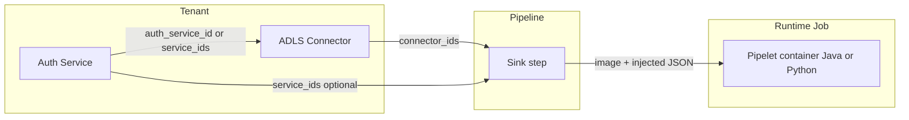

# Service, Connector & Pipelet Modeling

| Field | Value |
|-------|--------|
| **Audience** | Architects, platform engineers, pipelet authors |
| **Status** | Canonical design note (aligned with Waves 1–5) |
| **Architecture** | [`ARCHITECTURE.md`](ARCHITECTURE.md) §1.5, §2.2, §7, §9, §10.3 |
| **Last updated** | 2026-07-09 |

This note captures how **services**, **connectors**, and **pipeline steps / pipelets** are modeled, how a non-Java (e.g. Python) sink receives config, and how **pipelet telemetry** and **record completeness** are expected to appear in Prometheus / Grafana. It complements story KBs; if something conflicts with a shipped KB, prefer the KB for operational detail and update this note.

---

## 1. Three layers (do not collapse them)

| Layer | Question it answers | Scope | Primary tables |
|-------|---------------------|-------|----------------|
| **Service** | *How does this tenant authenticate / use a platform capability?* | Per tenant | `service_types`, `service_defaults`, `services` |
| **Connector** | *Where / how do we talk to an external system?* | Per tenant | `connector_types`, `connectors` |
| **Pipeline step** | *How does this pipelet run in this pipeline?* | Per pipeline step | `pipeline_steps` (+ future `pipelets` registry) |



**Rules of thumb**

- Pipelets (any language) should **not** hard-code long-lived ADLS credentials.
- **Auth modes** (Federated, Managed Identity, cert, AKV+cert) live on **services**, not inside the pipelet image.
- **Endpoint / path / I/O retries** live on **connectors**.
- **This-pipeline behavior** (mapping, filters, sometimes batch size) lives on **step `config`**.

---

## 2. Services (tenant platform capabilities)

### 2.1 Storage

| Table | Role |
|-------|------|
| `service_types` | Catalog: `auth`, `notification`, `logging` |
| `service_defaults` | Vendor templates + `default_config` / `config_schema` (e.g. StubAuth; later AADAuth) |
| `services` | Tenant instance: `vendor`, `name`, `tenant_config` JSON, `inherits_default` |

Resolution (implemented for Auth): merge defaults + tenant overrides → decrypt secrets (`DefaultServiceResolver`, `ConfigMerger`, `SecretEncryptor`). API responses redact secrets.

### 2.2 Auth options (modeling intent)

Under type `auth`, prefer **vendors** (or an explicit `auth_mode` in JSON) such as:

| Mode | Typical `tenant_config` contents |
|------|----------------------------------|
| Federated (OIDC / AAD app) | tenant/issuer, client id, secret or cert ref, scopes |
| Managed Identity | identity type, client id (no shared secret) |
| Cert-based | cert thumbprint / PEM reference |
| AKV + cert | vault URI, secret/cert name; optional MI to reach Key Vault |

All of these are **tenant-specific rows** in `services`. Wave 1 ships StubAuth only; other vendors are additive catalog rows + schemas.

### 2.3 Operational KB

- [`delivery/kb/W1-US03-service-types.md`](delivery/kb/W1-US03-service-types.md)
- [`delivery/kb/W1-US04-tenant-service-config.md`](delivery/kb/W1-US04-tenant-service-config.md)

---

## 3. Connectors (tenant external I/O)

### 3.1 Storage

| Table | Role |
|-------|------|
| `connector_types` | Catalog + JSON Schema (`rest`, `storage`, `message_bus`, …) |
| `connectors` | Tenant instance: `name`, `config` JSON (encrypt at rest), `status` |

Platform-side plugins implement Java `Connector` SPI (`RestConnector`, `StorageConnector`, `MessageBusConnector`, …) for **test connection** and platform-mediated I/O. That SPI is **not** what a Python pipelet pod loads.

### 3.2 Example: ADLS sink connector

Model as `storage` (or a dedicated `adls` type later). Example `config` shape (illustrative):

```json
{
  "account_url": "https://{account}.dfs.core.windows.net",
  "container": "landing",
  "folder_path": "/tenant-a/out",
  "batch_size": 500,
  "record_size_hint": 65536,
  "timeout_ms": 30000,
  "retry_count": 3,
  "auth_service_id": "<services.id>"
}
```

Architecture already shows the same pattern for Rest (`auth_service_id` on connector config). See [`ARCHITECTURE.md`](ARCHITECTURE.md) §2.3.

### 3.3 What belongs on connector vs step

| Prefer **connector** | Prefer **step `config`** |
|----------------------|---------------------------|
| Account URL, container, folder | Field mapping / filters for *this* pipeline |
| Shared retries / timeouts | Pipeline-specific batch overrides |
| Link to auth service | Pipelet-only knobs from `config_schema` |

### 3.4 Operational KB

- [`delivery/kb/W1-US05-connector-spi.md`](delivery/kb/W1-US05-connector-spi.md)
- [`delivery/kb/W1-US06-connector-test-wiremock.md`](delivery/kb/W1-US06-connector-test-wiremock.md)
- [`delivery/kb/W1-US07-storage-localstack.md`](delivery/kb/W1-US07-storage-localstack.md)

---

## 4. Pipeline steps & pipelets

### 4.1 Step binding (`pipeline_steps`)

| Column | Role |
|--------|------|
| `pipelet_id` | Which image/type to spawn (opaque id today; registry later) |
| `step_order` | Stage sequence (source → processor → destination) |
| `config` | Pipelet-specific JSON (validated against pipelet `config_schema` when registry exists) |
| `connector_ids` | JSON array of connector instance UUIDs |
| `service_ids` | JSON array of service instance UUIDs |
| `input_queue` / `output_queue` | Platform broker destinations |
| `resource_limits` | K8s CPU/memory for the Job |

### 4.2 Pipelet registry (architecture; partial delivery)

Future / designed tables `pipelets` / `pipelet_versions` hold `image_ref`, `runtime` (`java` \| `python` \| `node`), and `config_schema`. Execution Jobs use that image regardless of language.

### 4.3 How a Python ADLS sink gets values

```text
Tenant admin:
  1. Create Auth service     → services.tenant_config
  2. Create ADLS connector   → connectors.config (+ auth_service_id)
  3. Bind sink step          → pipelet_id, connector_ids, service_ids, step config

At run (target §10.3):
  Platform creates Job with pipelet image
  Injects CONNECTOR_CONFIG / SERVICE_CONFIG (resolved + decrypted) as Secret/env
  Python process reads JSON — does not call Java SPI
```

Language-agnostic contract: **queues + injected config**. Orchestration does not import Python.

### 4.4 Orchestration (brief)

1. `POST .../run` → quota gate → `PipelineRunOrchestrator.start`
2. Declare RabbitMQ stage topology; create Job for stage 1 (`PipeletJobClient`)
3. Publish stage message; subsequent stages advance via worker / real pipelet consume-produce
4. Last stage → `markCompleted` (completeness + metrics)

Today: `StubPipeletJobClient` + `StubStageWorker` prove the contract without a cluster. See [`delivery/kb/W2-US04-async-run.md`](delivery/kb/W2-US04-async-run.md), [`delivery/kb/W2-US05-pipelet-job.md`](delivery/kb/W2-US05-pipelet-job.md).

---

## 5. Pipelet telemetry & completeness expectations

### 5.1 Two streams — do not mix

| Stream | Store | Consumers | Purpose |
|--------|-------|-----------|---------|
| **Telemetry** | Prometheus (`/actuator/prometheus`) → Grafana | Ops / SRE / tenant dashboards | Completeness, latency, errors, heartbeat |
| **Billing usage** | `usage_events` / `usage_aggregates` | Billing APIs, quota | Cost, credits (Wave 5) |

The same stage may emit both (stub worker: Micrometer + `MeterAgent`). Grafana completeness is **not** read from billing tables.

### 5.2 Completeness

```text
completeness_pct = (total_records_out / total_records_in) × 100
```

| Surface | Value | Cardinality |
|---------|-------|-------------|
| `pipeline_executions.completeness_pct` | Per **execution** | Exact run history |
| `GET /api/v1/observability/pipelines/{id}/completeness` | Same for UI/support | Per request |
| `pipeline_completeness_ratio` (Prometheus gauge) | Latest ratio **per pipeline** | Labels: `tenant_id`, `pipeline_id` only |

**Expectation:** Grafana tracks live health via the gauge; dispute a specific run via DB/API. Do **not** add `execution_id` as a Prometheus label (unbounded cardinality). Zero `records_in` → ratio/percent `0` (Wave 4 policy).

**Grafana (tenant org):** panel query example:

```promql
pipeline_completeness_ratio{tenant_id="${tenant_id}"}
```

Alert (architecture): `pipeline_completeness_ratio < 0.95 for 5m`.

KBs: [`delivery/kb/W4-US02-completeness.md`](delivery/kb/W4-US02-completeness.md), [`delivery/kb/W4-US06-grafana-provision.md`](delivery/kb/W4-US06-grafana-provision.md).

### 5.3 Pipelet telemetry series (implemented)

Emitted by `PipeletMetricsEmitter` (stub path today; real pods / meter sidecar later):

| Metric | Type | Labels |
|--------|------|--------|
| `pipelet_records_in_total` | Counter | `tenant_id`, `pipeline_id`, `pipelet_id` |
| `pipelet_records_out_total` | Counter | same |
| `pipelet_processing_duration_seconds` | Timer/histogram | same |
| `pipelet_heartbeat_timestamp` | Gauge | + `pod_name` |
| `pipelet_errors_total` | Counter | + allowlisted `error_type` |

**Cardinality policy:** omit `execution_id` on these series. Correlate runs via logs (ELK) and execution APIs.

**Grafana expectations**

| Dashboard | Panels / queries |
|-----------|------------------|
| Pipeline Overview | Completeness gauge; heartbeat age `time() - pipelet_heartbeat_timestamp{...}` |
| Pipelet Performance | `rate(pipelet_records_*[5m])`, duration percentiles, error rate |
| Completeness | Ratio trend; stacked in vs out |

Template seed: `pipeline-api/src/main/resources/grafana/tenant-pipeline-overview.json`.

Isolation: **one** Grafana instance, **org per tenant**; **one** Prometheus with `tenant_id` labels. See architecture §7.2.

### 5.4 Future pipelet authors (Java or Python)

To stay on the platform contract, a pipelet (or sidecar) should:

1. Emit the same `pipelet_*` metric names and low-cardinality labels (or push equivalents to the platform registry).
2. Touch heartbeat periodically (~30s); Grafana alerts if age &gt; 90s.
3. Leave billing to `MeterAgent` / usage collector — separate from Prometheus.

---

## 6. Worked example (ADLS Python sink)

| Step | Artifact |
|------|----------|
| 1 | `services` row: Auth vendor = Federated or MI or cert/AKV |
| 2 | `connectors` row: type storage/ADLS; path, retries; `auth_service_id` |
| 3 | `pipeline_steps` row: `pipelet_id` → Python image; `connector_ids`; step `config` for mapping/batch |
| 4 | Run → Job gets queues + injected connector/service JSON |
| 5 | Telemetry → `pipelet_*` + on complete `pipeline_completeness_ratio` / `completeness_pct` |
| 6 | Billing (optional) → `usage_events` via MeterAgent |

---

## 7. Delivery status snapshot

| Capability | Status |
|------------|--------|
| Tenant services + Auth merge/redact | Done (W1) |
| Tenant connectors + Rest/Storage/MessageBus | Done (W1) |
| Step `connector_ids` / `service_ids` / `config` | Done (W2) |
| Stub orchestration + Job client | Done (W2) |
| Pipelet metrics + completeness gauge + REST | Done (W4) |
| Grafana org provision | Stub client + template (W4) |
| Full pipelet registry (`runtime=python`) | Designed |
| Real K8s Job secret injection | Designed (§10.3) |
| ADLS / Federated / MI / AKV vendors | Not built — extend catalogs |

---

## Related

- Architecture: [`ARCHITECTURE.md`](ARCHITECTURE.md) §1.5, §2.2–2.3, §7, §9, §10.3
- Completeness KB: [`delivery/kb/W4-US02-completeness.md`](delivery/kb/W4-US02-completeness.md)
- Pipelet metrics KB: [`delivery/kb/W4-US01-pipelet-metrics.md`](delivery/kb/W4-US01-pipelet-metrics.md)
- Grafana KB: [`delivery/kb/W4-US06-grafana-provision.md`](delivery/kb/W4-US06-grafana-provision.md)
- Metering (billing, not Grafana): [`delivery/kb/W5-US02-meter-agent.md`](delivery/kb/W5-US02-meter-agent.md)
