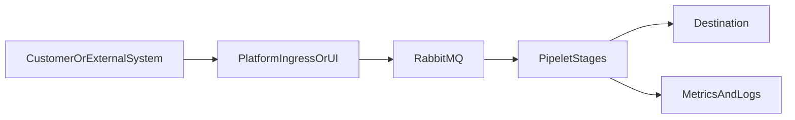

# Support Knowledge Base Article Template

Use this template for customer support and internal knowledge-base articles. Each user story that touches a customer-visible capability should produce (or extend) an article.

Related: [`STORY_TEMPLATE.md`](STORY_TEMPLATE.md) §7 · Architecture: [`../ARCHITECTURE.md`](../ARCHITECTURE.md)

Suggested path for finished articles: `docs/delivery/kb/<story-id>-<slug>.md`

---

## Metadata

| Field | Value |
|-------|--------|
| **Article ID / Story ID** | e.g. `KB-W3-US01` / `W3-US01` |
| **Title** | Clear support-facing title |
| **Audience** | Customer support / Customer admin / Platform ops |
| **Product area** | Pipelines / Connectors / Webhooks / Billing / Observability / UI |
| **Last reviewed** | YYYY-MM-DD |
| **Owner** | |

---

## 1. Audience & prerequisites

**Who this is for:**

**Prerequisites (accounts, roles, env):**

1.
2.

**Related articles:**

-

---

## 2. Feature overview

Explain in plain language what the feature does and when a customer would use it (2–4 short paragraphs or bullets). Avoid internal class names; prefer UI labels and public API paths.

-

---

## 3. Happy-path dataflow

Describe the end-to-end path for support agents. Adapt stages as needed (webhook ingress may replace Source Job).

**Narrative (fill in):**

1. **Entry:** Where the request/event enters (UI action, API, webhook URL).
2. **Queue / orchestration:** What is published and which queues/stages are involved.
3. **Processing:** Which pipelets/connectors run and what they do to the data.
4. **Exit:** Destination system or UI confirmation.
5. **Evidence:** Where support verifies success (execution status, completeness %, Kibana logs, usage event).

---

## 4. How to verify (functional checks)

### UI

| # | Step | Expected |
|---|------|----------|
| 1 | | |
| 2 | | |

### API

| # | Call | Expected |
|---|------|----------|
| 1 | `METHOD /api/v1/...` | Status + key fields |
| 2 | | |

### Observability / billing

| Check | Where | Healthy signal |
|-------|-------|----------------|
| Completeness | Grafana / Observability UI | ≥ configured threshold (default 95%) |
| Latency | Prometheus / UI | p95 within SLO |
| Logs | Kibana `pipeline-logs-{tenant}-*` | No critical errors for `execution_id` |
| Usage | `GET /tenants/{id}/usage` | Expected dimensions incremented |

---

## 5. Failure modes & troubleshooting

| Symptom | Likely cause | Support checks | Mitigation / escalate |
|---------|--------------|----------------|------------------------|
| Webhook sender timeouts / retries | Ingress down or 503 backpressure | Ingress health, RabbitMQ publish errors | Ops: RabbitMQ / ingress pods |
| `401` / signature failure | Wrong signing secret / Auth service | Connector webhook config, Auth service status | Customer: rotate secret; verify header |
| Pipeline `failed` | Stage exception / DLQ | Execution detail, DLQ depth, Kibana | Replay DLQ after fix; eng if repeated |
| Completeness drop | Record drop / filter / partial fail | Stage records_in vs out | Review filter config; check DLQ |
| `402` on run | Quota / zero credits | Usage API + credit balance | Billing / customer prepaid |

**Common escalation metrics:**

- `pipeline_completeness_ratio < 0.95`
- `dlq_messages_total` increasing
- Ingress returning sustained `503`
- Missing `pipelet_heartbeat_timestamp`

---

## 6. Data sensitivity & tenancy notes

- Confirm customer can only see their `tenant_id` resources.
- Never share signing secrets or encrypted connector configs in tickets; ask customer to rotate if exposed.
- Log export must be filtered by tenant Kibana space / index pattern.

---

## 7. Change log

| Date | Change | Author |
|------|--------|--------|
| | Initial draft for story | |
