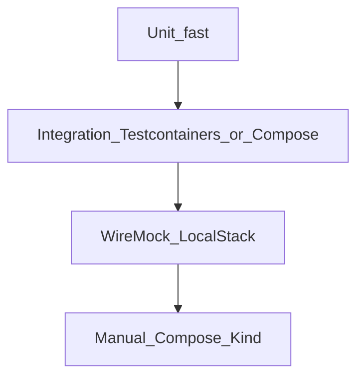

# Wave TDD Document Template

**Audience:** Technical stakeholders (eng leads, architects, QA leads, SRE)  
**Purpose:** Describe how a wave will be proven with TDD — not a support playbook (see [`SUPPORT_KB_TEMPLATE.md`](SUPPORT_KB_TEMPLATE.md)).

Copy to `docs/delivery/tdd/WAVE_N_TDD.md` when planning or closing a wave. Update status as stories ship.

Related:

| Doc | Role |
|-----|------|
| [`../DELIVERY_PLAN.md`](../DELIVERY_PLAN.md) | Wave catalog + story intents |
| [`waves/WAVE_N.md`](waves/) | Story AC / execution plan |
| [`TEST_MATRIX.md`](TEST_MATRIX.md) | Story × test-type coverage |
| [`STORY_TEMPLATE.md`](STORY_TEMPLATE.md) | Per-story red/green/refactor AC |
| [`WAVE_TRACKER.md`](WAVE_TRACKER.md) | Delivery status |

---

## Metadata

| Field | Value |
|-------|--------|
| **Wave** | `W#` — Theme |
| **Audience** | Technical stakeholders |
| **Status** | Draft / In Progress / Complete |
| **Architecture refs** | e.g. §5, §11 |
| **Branch / tags** | `wave-N` · story tags `W#-US##` |
| **Last updated** | YYYY-MM-DD |

---

## 1. Stakeholder summary

One short paragraph: what this wave proves technically, and what “good” looks like for sign-off.

**Quality goals**

| Goal | How we prove it |
|------|-----------------|
| | Unit / IT / smoke / manual |

**Out of scope for this wave’s TDD**

- …

---

## 2. Test strategy

| Layer | Tools | Cadence | Notes |
|-------|-------|---------|-------|
| Unit | JUnit 5, AssertJ, Mockito | Every PR | No network/cloud |
| Integration | `@SpringBootTest`, Testcontainers / Compose MySQL/Rabbit | Every PR or nightly | Prefer Testcontainers in CI |
| External mocks | WireMock, LocalStack | Labeled CI / local | Stub only declared services |
| Manual / E2E | Compose, Kind, curl/UI | Story + wave exit | Recorded in TEST_MATRIX |

**CI gates (target)**

1. …
2. …

---

## 3. Environments & fixtures

| Environment | Purpose | Dependencies |
|-------------|---------|--------------|
| `local` | Manual + Compose-backed IT | docker compose |
| `test` / CI | Automated suite | Testcontainers preferred |

| Fixture / factory | Entity | Path |
|-------------------|--------|------|
| | | `src/test/resources/fixtures/...` |

**Real vs mocked**

| Dependency | Unit | IT | Manual |
|------------|------|----|--------|
| MySQL | n/a or H2 (avoid if dialect-sensitive) | Testcontainers / Compose | Compose |
| RabbitMQ | mock publisher | Testcontainers / Compose | Compose |
| External HTTP | WireMock | WireMock | optional real |
| S3 / SQS | n/a | LocalStack | LocalStack |

---

## 4. Story TDD backlog

For each story: planned **Red → Green → Refactor**, primary test names, and gate.

### W#-US## — Title

| Field | Value |
|-------|--------|
| Priority | Must / Should |
| Status | Todo / Done |
| Architecture | §… |

| Step | Evidence |
|------|----------|
| **Red** | Failing test names |
| **Green** | Minimal production surface |
| **Refactor** | Cleanup without behavior change |

| Layer | Tests / scripts | Key assertions |
|-------|-----------------|----------------|
| Unit | | |
| Integration | | |
| WireMock / LS | | |
| Manual | | |

**Tenant / security notes:** …  
**KB:** link when Done

---

## 5. Cross-cutting test themes

| Theme | Wave-specific rule | Owning stories |
|-------|--------------------|----------------|
| Tenant isolation | | |
| Idempotency / retries | | |
| No secrets in logs | | |
| Deterministic fixtures | | |

---

## 6. Wave exit criteria ↔ tests

| Exit criterion | Verification |
|----------------|--------------|
| | Command / test class / manual step |

Sign-off: engineering lead reviews TEST_MATRIX rows for all **Must** stories.

---

## 7. Risks & deferrals

| Risk / deferral | Impact | Mitigation / tracker note |
|-----------------|--------|---------------------------|
| | | |

---

## 8. Change log

| Date | Change |
|------|--------|
| | Initial draft / story Done updates |
