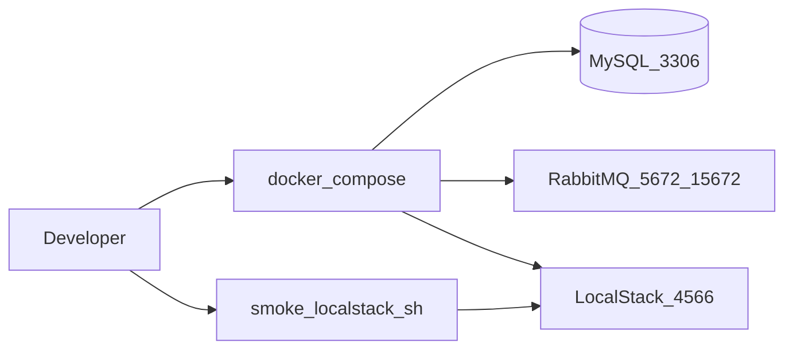

# KB: Local Compose stack (Wave 0)

| Field | Value |
|-------|--------|
| **Article / Story** | KB-W0-US01 / W0-US01 |
| **Audience** | Platform engineers / support (local env) |
| **Product area** | Foundation / LocalStack |

## Prerequisites

- Docker Desktop (or compatible engine)
- Repo checkout on branch with `docker-compose.yml` (Wave 0)

## Feature overview

Local development depends on MySQL (metadata), RabbitMQ (messaging), and LocalStack (S3/SQS cloud emulation). This article describes how to start the stack and verify LocalStack.

## Happy-path dataflow

## How to verify

1. `docker compose up -d`
2. `docker compose ps` — services healthy
3. `./scripts/smoke-localstack.sh` — exit 0
4. RabbitMQ management: http://localhost:15672 (default guest/guest)

## Failure modes

| Symptom | Check | Mitigation |
|---------|-------|------------|
| Port in use | `lsof -i :3306,:5672,:4566` | Stop conflicting services |
| LocalStack not ready | Logs `docker compose logs localstack` | Wait for healthcheck; rerun smoke |
| Permission errors | Docker daemon running | Restart Docker Desktop |

## Escalation

If CI cannot reach LocalStack, run LocalStack-labeled jobs only on runners with Docker; Prefer Testcontainers for MySQL in unit/IT paths.
