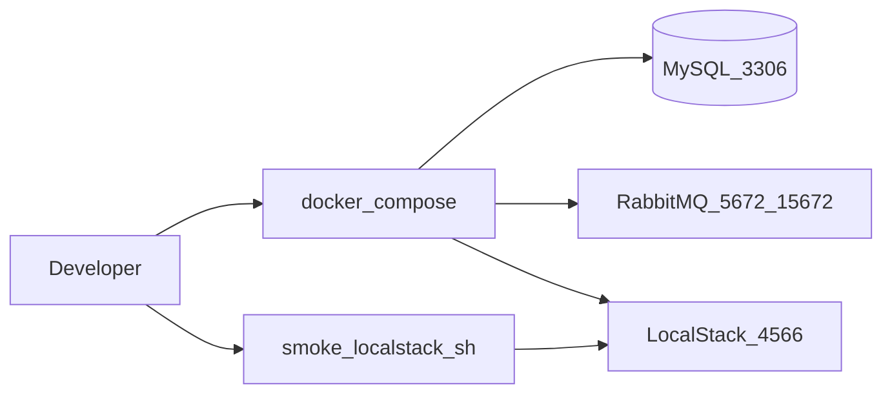

# KB: Local Compose stack (Wave 0)

| Field | Value |
|-------|--------|
| **Article / Story** | KB-W0-US01 / W0-US01 |
| **Audience** | Platform engineers / support (local env) |
| **Product area** | Foundation / LocalStack |

## Prerequisites

- Docker Desktop (or compatible engine)
- Repo checkout with `docker-compose.yml` (W0-US01)
- AWS CLI v2 **or** `awslocal` for LocalStack smoke

**Default ports:** MySQL `3306`, RabbitMQ `5672` / mgmt `15672`, LocalStack **host `4567`** (maps to container `4566`). If `4566` is free on your machine, run `LOCALSTACK_HOST_PORT=4566 docker compose up -d` and set `LOCALSTACK_ENDPOINT=http://localhost:4566`.

## Feature overview

Local development depends on MySQL (metadata), RabbitMQ (messaging), and LocalStack (S3/SQS cloud emulation). This article describes how to start the stack and verify LocalStack.

## Happy-path dataflow

## How to verify

1. `docker compose up -d`
2. `docker compose ps` — services healthy
3. `./scripts/smoke-compose-deps.sh` — MySQL + RabbitMQ OK
4. `./scripts/smoke-localstack.sh` — exit 0 (S3 + SQS)
5. RabbitMQ management: http://localhost:15672 (`pipeline` / `pipeline`)

## Failure modes

| Symptom | Check | Mitigation |
|---------|-------|------------|
| Port in use (e.g. 4566) | `lsof -iTCP:4566 -sTCP:LISTEN` | Default LocalStack host port is **4567**; or free the port / set `LOCALSTACK_HOST_PORT` |
| LocalStack not ready | `docker compose logs localstack` | Wait for healthcheck; rerun smoke |
| Permission errors | Docker daemon running | Restart Docker Desktop |

## Escalation

If CI cannot reach LocalStack, run LocalStack-labeled jobs only on runners with Docker; Prefer Testcontainers for MySQL in unit/IT paths.
