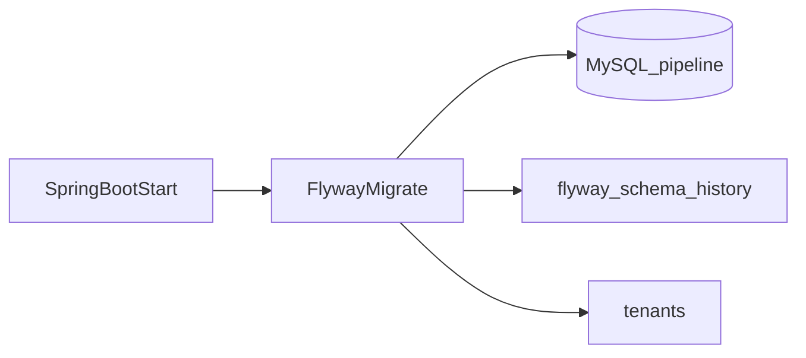

# KB: Flyway baseline (Wave 0)

| Field | Value |
|-------|--------|
| **Article / Story** | KB-W0-US03 / W0-US03 |
| **Audience** | Platform engineers |
| **Product area** | Foundation / Schema |

## Prerequisites

- Compose MySQL running (`docker compose up -d mysql`)
- `pipeline-api` with `local` profile

## Feature overview

On startup, Spring Boot Flyway applies versioned SQL from `classpath:db/migration`. Wave 0 ships `V1__baseline.sql`, which creates the `tenants` stub table (architecture §2.2 columns).

## Happy-path dataflow



## How to verify

### App logs

```bash
./mvnw -pl pipeline-api spring-boot:run -Dspring-boot.run.profiles=local
```

Look for Flyway migrate success (`Successfully applied 1 migration` on a fresh DB, or `Current version` if already applied).

### SQL

```bash
docker compose exec -T mysql mysql -upipeline -ppipeline pipeline -e "SHOW TABLES; SELECT version, script, success FROM flyway_schema_history;"
```

Expect tables `tenants` and `flyway_schema_history`, and script `V1__baseline.sql`.

### Tests

```bash
./mvnw -pl pipeline-api test
```

`FlywayBaselineIT` asserts both tables/history when MySQL is up.

## Failure modes

| Symptom | Check | Mitigation |
|---------|-------|------------|
| Migration checksum mismatch | Changed `V1__baseline.sql` after apply | Prefer new `V2__...` migration; avoid editing applied files |
| Empty DB after recreate | Volume wiped | `docker compose up -d mysql` then restart app |
| Access denied | Credentials | Match Compose `pipeline` / `pipeline` |

## Related

- Health check: [`W0-US02-health-endpoint.md`](W0-US02-health-endpoint.md)
- Compose stack: [`W0-US01-local-compose-stack.md`](W0-US01-local-compose-stack.md)
