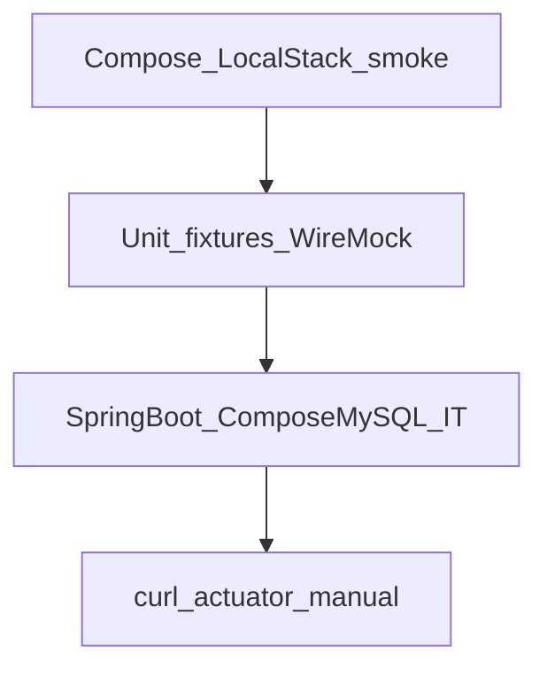

# Wave 0 TDD — Foundation

| Field | Value |
|-------|--------|
| **Wave** | W0 — Foundation |
| **Audience** | Technical stakeholders |
| **Status** | Complete |
| **Architecture refs** | [`ARCHITECTURE.md`](../../ARCHITECTURE.md) §5, §10.6 |
| **Branch / tags** | `wave-0` · `W0-US02` … `W0-US05` |
| **Last updated** | 2026-07-08 |
| **Template** | [`../TDD_WAVE_TEMPLATE.md`](../TDD_WAVE_TEMPLATE.md) |
| **Execution plan** | [`../waves/WAVE_0.md`](../waves/WAVE_0.md) |
| **Developer story TDD** | [`stories/README.md`](stories/README.md) (junior playbooks W0-US01–US05) |
| **Coverage** | [`../TEST_MATRIX.md`](../TEST_MATRIX.md) § Wave 0 |

---

## 1. Stakeholder summary

Wave 0 proves a developer can bring up local infrastructure, boot Spring Boot against MySQL, apply Flyway, scrape Prometheus, and run a WireMock + fixture harness — **without** any tenant/pipeline business APIs.

| Quality goal | How we prove it |
|--------------|-----------------|
| Local deps healthy | Compose + LocalStack smoke script |
| App boots + DB connected | `/actuator/health` IT |
| Schema versioned | Flyway baseline IT |
| Observability baseline | Prometheus IT + structured JSON logs |
| HTTP stub harness | WireMock + tenant fixture unit tests |

**Out of scope for W0 TDD:** Tenant CRUD, connectors, pipelines, Kind Jobs, ELK full path, UI.

---

## 2. Test strategy

| Layer | Tools | Cadence | Notes |
|-------|-------|---------|-------|
| Smoke | `scripts/smoke-localstack.sh` | Manual / local CI optional | Host port default `4567` |
| Unit | JUnit 5, AssertJ, WireMock | Every `./mvnw -pl pipeline-api test` | No Compose required |
| Integration | `@SpringBootTest` + Compose MySQL (`local`) | Same suite; skip if MySQL down (`assumeTrue`) | Testcontainers deferred (Rancher Desktop / docker-java) |
| Manual | curl, Compose UIs | Story exit | Captured in KB |

**CI gates (current / target)**

1. `./mvnw -pl pipeline-api test` — unit + WireMock always; ITs skip cleanly without MySQL
2. With `docker compose up -d mysql`: health, Flyway, Prometheus ITs must pass
3. `./scripts/smoke-localstack.sh` exit 0 for W0-US01 gate

---

## 3. Environments & fixtures

| Environment | Purpose | Dependencies |
|-------------|---------|--------------|
| `local` | Manual + Compose-backed IT | MySQL `localhost:3306`, credentials `pipeline`/`pipeline` |
| Unit/WireMock | Harness without Boot DB | none |

| Fixture / factory | Entity | Path |
|-------------------|--------|------|
| `TenantFixtures.T001` | tenant | `pipeline-api/src/test/resources/fixtures/tenants/t001.json` |
| `TenantFixtures` helper | loader | `.../support/TenantFixtures.java` |

**Real vs mocked**

| Dependency | Unit | IT | Manual |
|------------|------|----|--------|
| MySQL | n/a | Compose (assumed) | Compose |
| LocalStack S3/SQS | n/a | smoke script | Compose |
| External HTTP | WireMock | n/a for W0 ITs | n/a |
| RabbitMQ | n/a | n/a (compose only smoke) | Compose |

---

## 4. Story TDD backlog

Junior step-by-step guides (how to complete each story): [`stories/README.md`](stories/README.md).

### W0-US01 — Compose stack + LocalStack healthy

**Developer guide:** [`stories/W0-US01-tdd.md`](stories/W0-US01-tdd.md)

| Field | Value |
|-------|--------|
| Priority | Must |
| Status | Done |
| Architecture | §5, §10.6 |

| Step | Evidence |
|------|----------|
| **Red** | Smoke asserts fail without Compose/LocalStack |
| **Green** | `docker-compose.yml` + `scripts/smoke-localstack.sh` exit 0 |
| **Refactor** | Document ports; idempotent smoke |

| Layer | Tests / scripts | Key assertions |
|-------|-----------------|----------------|
| LocalStack | `scripts/smoke-localstack.sh` | S3 mb/list succeeds |
| Manual | Compose MySQL/Rabbit | Healthy containers; Rabbit mgmt `15672` |

**KB:** [`../kb/W0-US01-local-compose-stack.md`](../kb/W0-US01-local-compose-stack.md)

---

### W0-US02 — Spring Boot health + Compose MySQL IT

**Developer guide:** [`stories/W0-US02-tdd.md`](stories/W0-US02-tdd.md)

| Field | Value |
|-------|--------|
| Priority | Must |
| Status | Done (Testcontainers deferred) |
| Architecture | §5 |

| Step | Evidence |
|------|----------|
| **Red** | `HealthControllerIT.health_returnsUp` fails without app/DB |
| **Green** | `PipelineApiApplication` + Actuator + `local` datasource |
| **Refactor** | Profile split notes; IT assume MySQL port open |

| Layer | Tests / scripts | Key assertions |
|-------|-----------------|----------------|
| Integration | `HealthControllerIT` | `GET /actuator/health` → 200, `"UP"`, `"db"` |
| Manual | `curl localhost:8080/actuator/health` | `"status":"UP"` |

**Deferral:** Prefer Testcontainers in CI when docker-java works with Rancher Desktop.  
**KB:** [`../kb/W0-US02-health-endpoint.md`](../kb/W0-US02-health-endpoint.md)

---

### W0-US03 — Flyway baseline schema apply

**Developer guide:** [`stories/W0-US03-tdd.md`](stories/W0-US03-tdd.md)

| Field | Value |
|-------|--------|
| Priority | Must |
| Status | Done |
| Architecture | §2.2 (tenants stub) |

| Step | Evidence |
|------|----------|
| **Red** | `FlywayBaselineIT.tenantsTable_exists` fails |
| **Green** | `V1__baseline.sql` + Flyway enabled |
| **Refactor** | Columns aligned to architecture naming |

| Layer | Tests / scripts | Key assertions |
|-------|-----------------|----------------|
| Integration | `FlywayBaselineIT` | `tenants` table; `flyway_schema_history` has `V1__baseline.sql` |
| Manual | Boot + `SHOW TABLES` | `tenants`, history row |

**KB:** [`../kb/W0-US03-flyway-baseline.md`](../kb/W0-US03-flyway-baseline.md)

---

### W0-US04 — Structured logging + Micrometer smoke

**Developer guide:** [`stories/W0-US04-tdd.md`](stories/W0-US04-tdd.md)

| Field | Value |
|-------|--------|
| Priority | Should |
| Status | Done |
| Architecture | §5, §7 baseline |

| Step | Evidence |
|------|----------|
| **Red** | `PrometheusEndpointIT` / logging property smoke fail |
| **Green** | `micrometer-registry-prometheus` + exposure + logstash console |
| **Refactor** | `logback-spring.xml` uses structured console appender |

| Layer | Tests / scripts | Key assertions |
|-------|-----------------|----------------|
| Unit/config | `StructuredLoggingSmokeTest` | `logging.structured.format.console=logstash`; logback on classpath |
| Integration | `PrometheusEndpointIT` | `GET /actuator/prometheus` contains `jvm_memory_used_bytes` |
| Manual | scrape URL + inspect console | JSON logs; metrics text |

**KB:** [`../kb/W0-US04-logging-prometheus.md`](../kb/W0-US04-logging-prometheus.md)

---

### W0-US05 — Mock-data factories + WireMock harness

**Developer guide:** [`stories/W0-US05-tdd.md`](stories/W0-US05-tdd.md)

| Field | Value |
|-------|--------|
| Priority | Must |
| Status | Done |
| Architecture | §9 prep |

| Step | Evidence |
|------|----------|
| **Red** | `TenantFixturesTest` / `WireMockHarnessTest` fail |
| **Green** | `TenantFixtures` + WireMock stub `/external/ping` |
| **Refactor** | Classpath fixture loader; `wiremock-jetty12` |

| Layer | Tests / scripts | Key assertions |
|-------|-----------------|----------------|
| Unit | `TenantFixturesTest` | id `T001`, slug `demo` |
| WireMock | `WireMockHarnessTest` | stub → 200 `{"ok":true}` |

**KB:** [`../kb/W0-US05-mock-data-wiremock.md`](../kb/W0-US05-mock-data-wiremock.md)

---

## 5. Cross-cutting test themes

| Theme | Wave-specific rule | Owning stories |
|-------|--------------------|----------------|
| No business APIs | Reject PRs adding tenant/pipeline controllers on `wave-0` | all |
| Skip-not-fail without MySQL | `assumeTrue` port 3306 for Compose ITs | US02–US04 |
| Deterministic fixtures | Fixed `T001` / `demo` | US05 |
| No secrets in logs | Passwords via config only; never log datasource password | US04 |
| Schema immutability | Do not edit applied `V1__`; add `V2__` later | US03 |

---

## 6. Wave exit criteria ↔ tests

| Exit criterion | Verification |
|----------------|--------------|
| Compose stack healthy | `docker compose up -d` + smoke / healthchecks |
| LocalStack S3/SQS | `./scripts/smoke-localstack.sh` |
| Spring Boot health | `HealthControllerIT` / curl |
| Flyway baseline | `FlywayBaselineIT` |
| Test harness | `TenantFixturesTest`, `WireMockHarnessTest` |
| Metrics/logs (Should) | `PrometheusEndpointIT`, `StructuredLoggingSmokeTest` |

**Sign-off:** All Must stories Done; TEST_MATRIX Wave 0 rows marked; tags `W0-US02`–`W0-US05` on `wave-0`.

---

## 7. Risks & deferrals

| Risk / deferral | Impact | Mitigation / tracker note |
|-----------------|--------|---------------------------|
| Testcontainers + Rancher Desktop | CI may lack true containerized MySQL IT | Compose MySQL IT + `assumeTrue`; revisit docker-java |
| LocalStack host port clashes | Smoke flaky on busy machines | Default host `4567`; env overrides |
| Flyway vs MySQL 8.4 warning | Noise in logs | Track upgrade; migrations still apply |

---

## 8. Change log

| Date | Change |
|------|--------|
| 2026-07-08 | Initial Complete doc after W0-US01–US05 shipped on `wave-0` |
