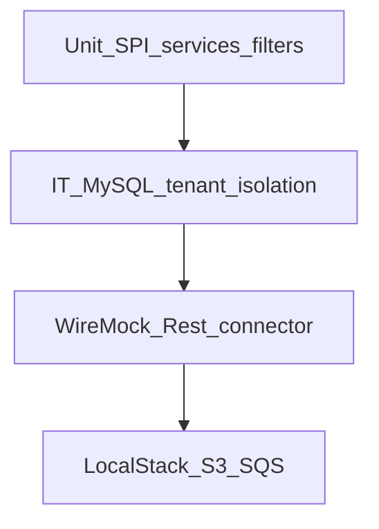

# Wave 1 TDD — Tenancy, Services, Connectors

| Field | Value |
|-------|--------|
| **Wave** | W1 — Tenancy, Services, Connectors |
| **Audience** | Technical stakeholders |
| **Status** | In Progress (W1-US01–US03 Done) |
| **Architecture refs** | §2, §3.3–3.4, §6.1, §9 SPI |
| **Branch / tags** | `wave-1` · `W1-US##` |
| **Last updated** | 2026-07-09 |
| **Template** | [`../TDD_WAVE_TEMPLATE.md`](../TDD_WAVE_TEMPLATE.md) |
| **Catalog** | [`../../DELIVERY_PLAN.md`](../../DELIVERY_PLAN.md) § Wave 1 |
| **Developer story TDD** | [`stories/README.md`](stories/README.md) § Wave 1 |
| **Coverage** | [`../TEST_MATRIX.md`](../TEST_MATRIX.md) § Wave 1 |

---

## 1. Stakeholder summary

Wave 1 proves multi-tenant identity and config: tenants can be created, request context carries `tenant_id`, JPA filters block cross-tenant reads, service types/config work, and connectors (Rest / S3 / SQS) pass connection tests against WireMock and LocalStack.

| Quality goal | How we prove it |
|--------------|-----------------|
| Tenant CRUD + context | Unit + IT for JWT/`tenant_id` binding |
| Isolation | Negative IT: tenant A cannot read B |
| Connector SPI | Rest plugin load + WireMock `/test` |
| Cloud connectors | LocalStack S3 put/get; SQS publish |

**Out of scope:** Pipeline run orchestration, webhook ingress Jobs, billing quotas, UI.

---

## 2. Test strategy

| Layer | Tools | Cadence | Notes |
|-------|-------|---------|-------|
| Unit | JUnit, Mockito | Every PR | SPI registration, validators, filter predicates |
| Integration | `@SpringBootTest` + MySQL | Every PR | Prefer Testcontainers; Compose fallback |
| WireMock | Rest connector test | PR / labeled | Reuse W0 harness patterns |
| LocalStack | S3, SQS | Labeled / local | Depends on W0-US01 |

**CI gates (target)**

1. Unit + tenant isolation IT green
2. WireMock connector test job green
3. LocalStack S3 (and SQS Should) labeled job or local exit gate

---

## 3. Environments & fixtures

| Fixture / factory | Entity | Path (planned) |
|-------------------|--------|----------------|
| `TenantFixtures.T001` / `T002` | tenants | `fixtures/tenants/` |
| `ConnectorFixtures.restPing` | rest connector | `fixtures/connectors/` |
| `ConnectorFixtures.s3Bucket` | storage | `fixtures/connectors/` |
| Service type defaults | service_type | `fixtures/services/` |

**Real vs mocked**

| Dependency | Unit | IT | Manual |
|------------|------|----|--------|
| MySQL | mock repos optional | Testcontainers/Compose | Compose |
| External HTTP | WireMock | WireMock | WireMock |
| S3 / SQS | n/a | LocalStack | LocalStack |
| IdP / JWT | stub claims | stub filter | local token helper |

---

## 4. Story TDD backlog

Junior step-by-step guides: [`stories/README.md`](stories/README.md) § Wave 1.

### W1-US01 — Tenant CRUD + JWT tenant context

**Developer guide:** [`stories/W1-US01-tdd.md`](stories/W1-US01-tdd.md)

| Step | Evidence |
|------|----------|
| **Red** | `TenantServiceTest`, `TenantControllerIT` fail |
| **Green** | CRUD API + request attribute / security filter |
| **Refactor** | Shared `TenantContext` accessor |

| Layer | Key assertions |
|-------|----------------|
| Unit | Create/update validation; context populated from token |
| IT | CRUD persists; subsequent request sees `tenant_id` |

### W1-US02 — JPA tenant isolation filters

**Developer guide:** [`stories/W1-US02-tdd.md`](stories/W1-US02-tdd.md)

| Step | Evidence |
|------|----------|
| **Red** | `TenantIsolationIT.tenantA_cannotReadTenantB` fails |
| **Green** | Hibernate filter / aspect on tenant-owned entities |
| **Refactor** | Central `@TenantOwned` marking |

| Layer | Key assertions |
|-------|----------------|
| IT | Seed T001+T002 data; switch context → empty/404 for foreign rows |

### W1-US03 — Service types + platform defaults

**Developer guide:** [`stories/W1-US03-tdd.md`](stories/W1-US03-tdd.md)

| Step | Evidence |
|------|----------|
| **Red** | `ServiceTypeRepositoryTest` / catalog IT fail |
| **Green** | Seeded service types + defaults API |
| **Refactor** | Fixture-driven seed |

### W1-US04 — Tenant service config (Auth pattern)

**Developer guide:** [`stories/W1-US04-tdd.md`](stories/W1-US04-tdd.md)

| Step | Evidence |
|------|----------|
| **Red** | `TenantServiceConfigServiceTest` fail |
| **Green** | Per-tenant Auth-like config CRUD |
| **Refactor** | Secret field redaction in responses/logs |

| Layer | Key assertions |
|-------|----------------|
| Unit | Merge defaults + overrides; never echo secrets |
| WireMock | Optional IdP stub for later W3 signature |

### W1-US05 — Connector SPI load + Rest plugin

**Developer guide:** [`stories/W1-US05-tdd.md`](stories/W1-US05-tdd.md)

| Step | Evidence |
|------|----------|
| **Red** | `ConnectorSpiLoaderTest` fail |
| **Green** | ServiceLoader / Spring plugin registration |
| **Refactor** | Shared `ConnectorPlugin` interface |

### W1-US06 — Connector test vs WireMock

**Developer guide:** [`stories/W1-US06-tdd.md`](stories/W1-US06-tdd.md)

| Step | Evidence |
|------|----------|
| **Red** | `RestConnectorTestIT.stub_returnsOk` fail |
| **Green** | `POST /connectors/{id}/test` → WireMock ping |
| **Refactor** | Reuse W0 `/external/ping` pattern |

### W1-US07 — Storage connector vs LocalStack S3

**Developer guide:** [`stories/W1-US07-tdd.md`](stories/W1-US07-tdd.md)

| Step | Evidence |
|------|----------|
| **Red** | `StorageConnectorIT.putGet_roundTrip` fail |
| **Green** | put/get against LocalStack |
| **Refactor** | Shared LocalStack endpoint config |

### W1-US08 — MessageBus connector vs LocalStack SQS (Should)

**Developer guide:** [`stories/W1-US08-tdd.md`](stories/W1-US08-tdd.md)

| Step | Evidence |
|------|----------|
| **Red** | `MessageBusConnectorIT.publish_succeeds` fail |
| **Green** | Publish to LocalStack queue |
| **Refactor** | Align naming with architecture queues |

---

## 5. Cross-cutting test themes

| Theme | Wave-specific rule | Owning stories |
|-------|--------------------|----------------|
| Tenant isolation | Every tenant-owned read/write has dual-tenant IT | US01–US02, connectors |
| Secret hygiene | Config responses redacted; logs free of tokens | US04 |
| SPI contract | Plugins tested via interface, not concrete only | US05–US08 |
| Deterministic fixtures | `T001`/`T002` fixed IDs | all |

---

## 6. Wave exit criteria ↔ tests

| Exit criterion | Verification |
|----------------|--------------|
| Tenant A cannot read B connectors | `TenantIsolationIT` (+ connector IT) |
| Rest test succeeds | W1-US06 WireMock IT |
| S3 round-trip | W1-US07 LocalStack IT |
| KB “how to add a connector” | `docs/delivery/kb/W1-*-connector*.md` |

---

## 7. Risks & deferrals

| Risk / deferral | Impact | Mitigation |
|-----------------|--------|------------|
| JWT library choice | Blocks US01 | Stub filter until IdP wired |
| LocalStack flakiness | S3/SQS IT flakes | Retry policy; labeled job |
| Cross-tenant leak | Security incident | Block wave exit without US02 green |

---

## 8. Change log

| Date | Change |
|------|--------|
| 2026-07-08 | Initial Draft for technical stakeholders |
| 2026-07-09 | Linked junior developer story TDD playbooks W1-US01–US08 |
| 2026-07-09 | W1-US01 implemented: tenant CRUD + stub X-Tenant-Id context |
| 2026-07-09 | W1-US02 implemented: Hibernate tenant filter + TenantIsolationIT |
| 2026-07-09 | W1-US03 implemented: service_types catalog + StubAuth defaults |
| 2026-07-09 | W1-US04 implemented: tenant services CRUD, merge defaults, secret redaction |
