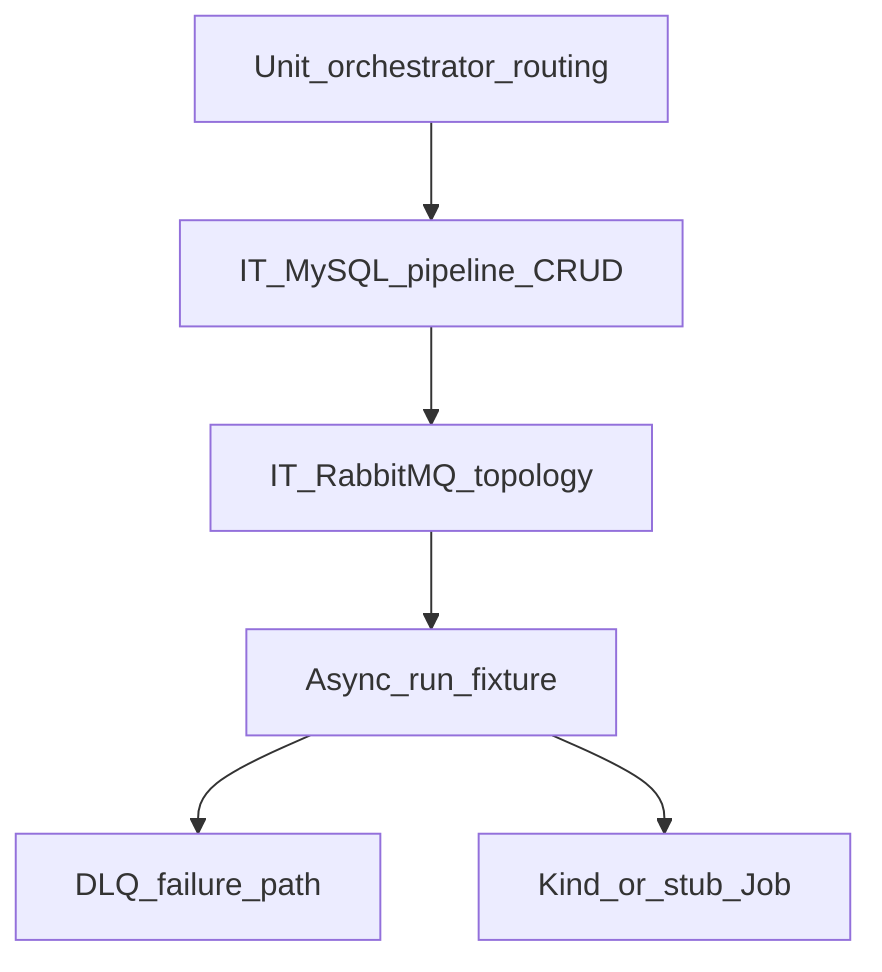

# Wave 2 TDD — Pipelines & Ephemeral Execution

| Field | Value |
|-------|--------|
| **Wave** | W2 — Pipelines & Ephemeral Execution |
| **Audience** | Technical stakeholders |
| **Status** | Draft (planning) |
| **Architecture refs** | §1.4, §2 pipeline tables, §3.1–3.2, §8, §10.3 |
| **Branch / tags** | `wave-2` (planned) · `W2-US##` |
| **Last updated** | 2026-07-08 |
| **Template** | [`../TDD_WAVE_TEMPLATE.md`](../TDD_WAVE_TEMPLATE.md) |
| **Catalog** | [`../../DELIVERY_PLAN.md`](../../DELIVERY_PLAN.md) § Wave 2 |

---

## 1. Stakeholder summary

Wave 2 proves a configurable Source → Processor → Destination pipeline can run asynchronously: RabbitMQ topology hands off between stages, execution status is persisted, poison messages land on stage DLQ, and a pipelet Job can be spawned (Kind or stub).

| Quality goal | How we prove it |
|--------------|-----------------|
| Pipeline CRUD + steps | Unit + MySQL IT |
| Stage messaging | RabbitMQ Testcontainers IT |
| Async run | Orchestration IT + status API |
| Resilience | Forced failure → DLQ assert |
| Ephemeral Job | Kind/stub spawn smoke |

**Out of scope:** Webhook ingress accept path (W3), full Grafana, billing enforcement, UI builder.

---

## 2. Test strategy

| Layer | Tools | Cadence | Notes |
|-------|-------|---------|-------|
| Unit | JUnit, Mockito | Every PR | Routing keys, state machine, retry policy |
| Integration | MySQL + RabbitMQ containers | Every PR / nightly | Prefer Testcontainers |
| Manual / Kind | Compose + Kind | Story/wave exit | Job spawn if Kind available |

**CI gates (target)**

1. Pipeline CRUD + steps IT
2. Topology publish/consume IT
3. Fixture 3-stage run → `completed`
4. One DLQ path IT green

---

## 3. Environments & fixtures

| Fixture | Entity | Path (planned) |
|---------|--------|----------------|
| `PipelineFixtures.threeStage` | pipeline + steps | `fixtures/pipelines/` |
| `TenantFixtures.T001` | tenant | reuse W0/W1 |
| `ExecutionFixtures.execHappy` | execution | `fixtures/executions/` |

**Real vs mocked**

| Dependency | Unit | IT | Manual |
|------------|------|----|--------|
| MySQL | mock | Testcontainers/Compose | Compose |
| RabbitMQ | mock publisher | Testcontainers/Compose | Compose |
| K8s Jobs | mock client | stub or Kind | Kind preferred |

---

## 4. Story TDD backlog

### W2-US01 — Pipeline CRUD (+ visibility/mode)

| Step | Evidence |
|------|----------|
| **Red** | `PipelineServiceTest`, `PipelineControllerIT` fail |
| **Green** | CRUD + tenant scoping |
| **Refactor** | Status enum validation |

### W2-US02 — Pipeline steps config API

| Step | Evidence |
|------|----------|
| **Red** | `PipelineStepsServiceTest` fail |
| **Green** | Put steps with connector_ids / queue metadata |
| **Refactor** | Step graph validation helper |

### W2-US03 — Inter-stage RabbitMQ topology

| Step | Evidence |
|------|----------|
| **Red** | `RabbitTopologyIT.declareAndPublish` fail |
| **Green** | Tenant-prefixed exchanges/queues |
| **Refactor** | Naming builder shared with W3 |

### W2-US04 — Async run orchestration

| Step | Evidence |
|------|----------|
| **Red** | `PipelineRunOrchestratorTest` / run IT fail |
| **Green** | `POST .../run` drives stages async |
| **Refactor** | Clear separation orchestration vs Job client |

### W2-US05 — Pipelet Job spawn (Kind/stub)

| Step | Evidence |
|------|----------|
| **Red** | `PipeletJobClientTest` fail |
| **Green** | Stub or Kind Job create |
| **Refactor** | Interface for later prod client |

### W2-US06 — Retries + per-stage DLQ

| Step | Evidence |
|------|----------|
| **Red** | `StageDlqIT.poison_landsOnDlq` fail |
| **Green** | Retry policy + DLQ bind |
| **Refactor** | Shared error headers |

### W2-US07 — Execution status query API

| Step | Evidence |
|------|----------|
| **Red** | `ExecutionStatusIT` fail |
| **Green** | Status/detail endpoints for fixture run |
| **Refactor** | Read models only |

---

## 5. Cross-cutting test themes

| Theme | Wave-specific rule | Owning stories |
|-------|--------------------|----------------|
| Tenant-prefixed queues | Assert naming contains tenant id | US03–US06 |
| Deterministic fixture run | Same `threeStage` pipeline every exit demo | US04, US07 |
| Isolation | Pipeline rows filtered by tenant | US01–US02, US07 |
| No hang forever | Timeouts on async IT awaits | US04 |

---

## 6. Wave exit criteria ↔ tests

| Exit criterion | Verification |
|----------------|--------------|
| 3-stage fixture → `completed` | Run IT + status API |
| Forced failure → DLQ | `StageDlqIT` |
| KB “pipeline run failed” + dataflow | `docs/delivery/kb/W2-*-run-failed.md` |

---

## 7. Risks & deferrals

| Risk / deferral | Impact | Mitigation |
|-----------------|--------|------------|
| Kind unavailable | US05 blocked | Accept stub Job client with contract IT |
| Flaky async waits | CI noise | Awaitility + bounded timeout |
| Topology drift vs W3 | Ingress mismatch | Shared routing-key builder early |

---

## 8. Change log

| Date | Change |
|------|--------|
| 2026-07-08 | Initial Draft for technical stakeholders |
