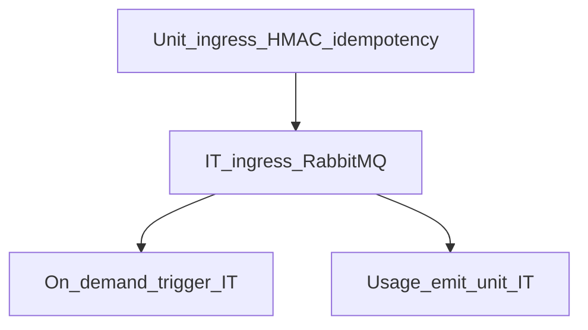

# Wave 3 TDD — Webhook Ingress + Queue

| Field | Value |
|-------|--------|
| **Wave** | W3 — Webhook Ingress + Queue |
| **Audience** | Technical stakeholders |
| **Status** | In Progress (W3-US01 Done) |
| **Architecture refs** | **§11**, §3.3 webhook APIs |
| **Branch / tags** | `wave-3` · `W3-US##` |
| **Last updated** | 2026-07-09 |
| **Template** | [`../TDD_WAVE_TEMPLATE.md`](../TDD_WAVE_TEMPLATE.md) |
| **Catalog** | [`../../DELIVERY_PLAN.md`](../../DELIVERY_PLAN.md) § Wave 3 (includes fully worked W3-US01) |
| **Execution plan** | [`../waves/WAVE_3.md`](../waves/WAVE_3.md) |
| **Developer story TDD** | [`stories/README.md`](stories/README.md) § Wave 3 |

---

## 1. Stakeholder summary

Wave 3 proves always-on ingress: external POST returns `202` immediately, events are durable on tenant webhook queues, signatures/idempotency/limits apply, on-demand processing triggers from queue depth, and webhook metering events are emitted — **without** cold-starting ingress pods for each event.

| Quality goal | How we prove it |
|--------------|-----------------|
| Accept + queue | Controller IT + Rabbit assert |
| Security limits | Unit HMAC + 429/503 IT |
| Idempotency | Duplicate POSTs → single logical event |
| On-demand trigger | Queue depth → processor Job trigger |
| Metering hooks | Usage event emits for webhook_events/bytes_in |

**Out of scope:** Full UI provisioning UX (W6), completeness dashboards (W4), PAYG hard blocks (W5).

---

## 2. Test strategy

| Layer | Tools | Cadence | Notes |
|-------|-------|---------|-------|
| Unit | JUnit | Every PR | Signature, hash idempotency, rate limiter |
| Integration | Boot + Rabbit (+ MySQL) | Every PR | Prefer Testcontainers |
| Manual | Compose + curl | Story exit | Match architecture §11 |

**CI gates (target)**

1. W3-US01 publish IT (pattern in DELIVERY_PLAN)
2. Signature + idempotency unit/IT
3. Queue-depth trigger IT (may need W2 stub Job client)

Reference AC: DELIVERY_PLAN fully worked **W3-US01** (`WebhookIngressServiceTest`, `WebhookControllerIT`).

---

## 3. Environments & fixtures

| Fixture | Entity | Path (planned) |
|---------|--------|----------------|
| `TenantFixtures.T001` | tenant | reuse |
| `ConnectorFixtures.eventListenerGithub` | connector | `fixtures/connectors/github-webhook.json` |
| Sample webhook body | payload | `fixtures/webhooks/` |

**Real vs mocked**

| Dependency | Unit | IT | Manual |
|------------|------|----|--------|
| RabbitMQ | mock | Testcontainers/Compose | Compose |
| MySQL | mock | Testcontainers/Compose | Compose |
| External sender | n/a | TestRestTemplate/curl | curl |
| Auth/HMAC secret | fixture | fixture | Compose secret |

---

## 4. Story TDD backlog

### W3-US01 — Ingress accept + queue publish

**Developer guide:** [`stories/w3/W3-US01-tdd.md`](stories/w3/W3-US01-tdd.md)

| Step | Evidence |
|------|----------|
| **Red** | `WebhookIngressServiceTest.shouldPublishToTenantQueue_andReturnAccepted`; `WebhookControllerIT.shouldReturn202_whenQueuePublishSucceeds` |
| **Green** | Controller + publisher; no Job start on accept |
| **Refactor** | Routing-key builder |

### W3-US02 — Signature verification + Auth service

**Developer guide:** [`stories/w3/W3-US02-tdd.md`](stories/w3/W3-US02-tdd.md)

| Step | Evidence |
|------|----------|
| **Red** | `WebhookSignatureVerifierTest` fail |
| **Green** | HMAC verify using tenant Auth service config |
| **Refactor** | Pluggable verifier SPI |

### W3-US03 — Idempotency (X-Webhook-Id / hash)

**Developer guide:** [`stories/w3/W3-US03-tdd.md`](stories/w3/W3-US03-tdd.md)

| Step | Evidence |
|------|----------|
| **Red** | `WebhookIdempotencyTest.duplicate_isNoOpOrSameEvent` fail |
| **Green** | Store/check idempotency key |
| **Refactor** | TTL cleanup strategy documented |

### W3-US04 — Rate limit + backpressure (Should)

**Developer guide:** [`stories/w3/W3-US04-tdd.md`](stories/w3/W3-US04-tdd.md)

| Step | Evidence |
|------|----------|
| **Red** | `WebhookRateLimitIT` / publish-fail IT |
| **Green** | `429` rate; `503` broker fail |
| **Refactor** | Shared problem+json responses |

### W3-US05 — Provision webhook URL API

**Developer guide:** [`stories/w3/W3-US05-tdd.md`](stories/w3/W3-US05-tdd.md)

| Step | Evidence |
|------|----------|
| **Red** | `WebhookUrlProvisionIT` fail |
| **Green** | `POST /connectors/{id}/webhook-url` |
| **Refactor** | URL template from config |

### W3-US06 — On-demand processor trigger

**Developer guide:** [`stories/w3/W3-US06-tdd.md`](stories/w3/W3-US06-tdd.md)

| Step | Evidence |
|------|----------|
| **Red** | `WebhookQueueTriggerIT.depth_triggersJob` fail |
| **Green** | Depth watcher → Job client |
| **Refactor** | Coalesce triggers |

### W3-US07 — Meter webhook_events + bytes_in

**Developer guide:** [`stories/w3/W3-US07-tdd.md`](stories/w3/W3-US07-tdd.md)

| Step | Evidence |
|------|----------|
| **Red** | `WebhookMeteringTest` fail |
| **Green** | Emit usage events on accept |
| **Refactor** | Align dimensions with W5 |

---

## 5. Cross-cutting test themes

| Theme | Wave-specific rule | Owning stories |
|-------|--------------------|----------------|
| Ingress must not start Jobs | Assert no Job client call in US01 | US01 |
| §11 response contracts | `202` + `event_id`; errors typed | US01–US04 |
| Idempotent at-least-once | Dup POSTs safe | US03 |
| Tenant-scoped queues | `tenant.{T}.webhook.{C}.in` | US01, US06 |

---

## 6. Wave exit criteria ↔ tests

| Exit criterion | Verification |
|----------------|--------------|
| External POST `202` without waiting pipelets | Controller IT + manual curl |
| Event on tenant webhook queue | Rabbit get/admin assert |
| Support KB troubleshooting | `kb/W3-US01-webhook-ingress-accept.md` (+ suite) |

---

## 7. Risks & deferrals

| Risk / deferral | Impact | Mitigation |
|-----------------|--------|------------|
| Clock skew HMAC | Intermittent 401 | Acceptable skew window in tests |
| Broker down | Sender retries | Document 503 + IT |
| Job trigger coupling to W2 | Blocks US06 | Stub Job client from W2-US05 |

---

## 8. Change log

| Date | Change |
|------|--------|
| 2026-07-08 | Initial Draft; mirrors W3-US01 worked example |
| 2026-07-09 | Linked execution plan + junior story TDD guides; wave-3 started |
| 2026-07-09 | W3-US01 implemented: webhook accept + RabbitMQ publish |
