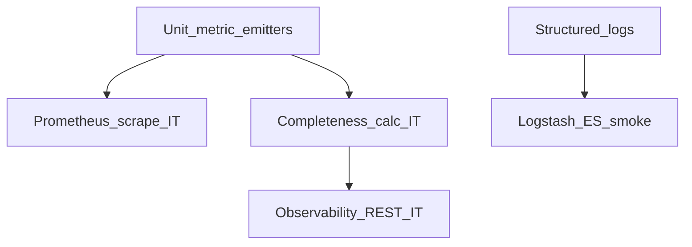

# Wave 4 TDD — Observability

| Field | Value |
|-------|--------|
| **Wave** | W4 — Observability |
| **Audience** | Technical stakeholders |
| **Status** | In Progress |
| **Architecture refs** | §7, §3.6 |
| **Branch / tags** | `wave-4` · `W4-US##` |
| **Last updated** | 2026-07-09 |
| **Execution plan** | [`../waves/WAVE_4.md`](../waves/WAVE_4.md) |
| **Developer guides** | [`stories/README.md`](stories/README.md) § Wave 4 |
| **Template** | [`../TDD_WAVE_TEMPLATE.md`](../TDD_WAVE_TEMPLATE.md) |
| **Catalog** | [`../../DELIVERY_PLAN.md`](../../DELIVERY_PLAN.md) § Wave 4 |
| **Depends on** | W0-US04 baseline; W2 fixture executions |

---

## 1. Stakeholder summary

Wave 4 proves operators and support can see completeness %, latency, heartbeats, critical errors, and logs for a known fixture execution — via Micrometer/Prometheus, ELK path, observability REST APIs, and optional Grafana tenant orgs.

| Quality goal | How we prove it |
|--------------|-----------------|
| Pipelet counters/histograms | Metric assertion IT |
| Completeness % | Fixture execution compute + API |
| Heartbeat / errors | Gauge/counter IT |
| Logs → Kibana pattern | Compose ELK smoke + query |
| Observability REST | Controller IT |
| Grafana (Should) | Provision API smoke |

**Out of scope:** UI panels (W6-US06), PAYG usage totals (W5), ingress-only metering (covered W3-US07 emit).

---

## 2. Test strategy

| Layer | Tools | Cadence | Notes |
|-------|-------|---------|-------|
| Unit | Completeness calc, metric wrappers | Every PR | Pure functions preferred |
| Integration | Boot + Prometheus + fixture run | Every PR | Build on W0-US04 |
| ELK smoke | Compose stubs | Labeled / manual | May be optional early |
| Manual | Grafana/Kibana | Wave exit | Screenshot/query id |

**CI gates (target)**

1. Metric names present after fixture emit
2. Completeness for known `execution_id`
3. Observability REST returns expected shapes

---

## 3. Environments & fixtures

| Fixture | Entity | Path (planned) |
|---------|--------|----------------|
| `ExecutionFixtures.execHappy` | completed run | reuse W2 |
| Fixed metric labels | tenant/pipeline/exec | assert in IT |

**Real vs mocked**

| Dependency | Unit | IT | Manual |
|------------|------|----|--------|
| Prometheus endpoint | n/a | Actuator | curl |
| Elasticsearch | mock client | Compose ELK | Kibana |
| Grafana | mock API | optional | UI |

---

## 4. Story TDD backlog

### W4-US01 — Emit pipelet counters + histograms

**Developer guide:** [`stories/w4/W4-US01-tdd.md`](stories/w4/W4-US01-tdd.md)

| Step | Evidence |
|------|----------|
| **Red** | `PipeletMetricsEmitterTest` fail |
| **Green** | records_in/out + processing timers |
| **Refactor** | Shared Micrometer binders |

### W4-US02 — Completeness ratio on fixture run

**Developer guide:** [`stories/w4/W4-US02-tdd.md`](stories/w4/W4-US02-tdd.md)

| Step | Evidence |
|------|----------|
| **Red** | `CompletenessCalculatorTest` / IT fail |
| **Green** | `(out/in)*100` for fixture; gauge + `completeness_pct` |
| **Refactor** | Pure calculator; latest-per-pipeline gauge labels |

**Status:** Done — `CompletenessCalculator` + `CompletenessMetricsPublisher`; stub `1/1` → 100%; fixture `98/100` → 0.98.

### W4-US03 — Heartbeat + critical error metrics

**Developer guide:** [`stories/w4/W4-US03-tdd.md`](stories/w4/W4-US03-tdd.md)

| Step | Evidence |
|------|----------|
| **Red** | `HeartbeatGaugeTest`, `CriticalErrorCounterTest` fail |
| **Green** | Gauges/counters registered |
| **Refactor** | Label cardinality limits documented |

**Status:** Done — `touchHeartbeat` + `recordCriticalError`; stub pod `stub-pipelet`; `PipeletErrorType` allowlist.

### W4-US04 — Logs → Logstash → ES → Kibana

**Developer guide:** [`stories/w4/W4-US04-tdd.md`](stories/w4/W4-US04-tdd.md)

| Step | Evidence |
|------|----------|
| **Red** | ELK smoke query fails |
| **Green** | Index pattern + sample doc for fixture |
| **Refactor** | Index naming per architecture |

### W4-US05 — Observability REST APIs

**Developer guide:** [`stories/w4/W4-US05-tdd.md`](stories/w4/W4-US05-tdd.md)

| Step | Evidence |
|------|----------|
| **Red** | `ObservabilityControllerIT` fail |
| **Green** | completeness/latency/errors/logs endpoints |
| **Refactor** | Tenant auth checks |

### W4-US06 — Grafana dashboards (Should)

**Developer guide:** [`stories/w4/W4-US06-tdd.md`](stories/w4/W4-US06-tdd.md)

| Step | Evidence |
|------|----------|
| **Red** | `GrafanaProvisionerTest` fail |
| **Green** | Org/dashboard provision API |
| **Refactor** | Template JSON fixtures |

---

## 5. Cross-cutting test themes

| Theme | Wave-specific rule | Owning stories |
|-------|--------------------|----------------|
| Label cardinality | No unbounded `execution_id` on high-cardinality series unless approved | US01–US03 |
| Tenant isolation | Observability APIs never cross tenant | US05 |
| Fixture correlation | One `execution_id` traces metrics + logs | US02, US04, US05 |
| Builds on W0 | Prometheus scrape already exists | US01 |

---

## 6. Wave exit criteria ↔ tests

| Exit criterion | Verification |
|----------------|--------------|
| Support finds completeness for fixture | US02 + US05 IT/manual |
| Logs for `exec-*` | US04 smoke/query |
| KB “how to read completeness” | `kb/W4-*-completeness.md` |

---

## 7. Risks & deferrals

| Risk / deferral | Impact | Mitigation |
|-----------------|--------|------------|
| Full ELK heavy in CI | Slow PRs | Labeled job; unit JSON shape tests always |
| Metric naming drift | W5/W7 confusion | Lock names in this TDD + architecture §7 |
| Grafana optional | Exit still valid | Should; defer with tracker note |

---

## 8. Change log

| Date | Change |
|------|--------|
| 2026-07-08 | Initial Draft for technical stakeholders |
| 2026-07-09 | Linked execution plan + junior story TDD guides; wave-4 started |
| 2026-07-09 | W4-US01 implemented: PipeletMetricsEmitter + stub worker emit |
| 2026-07-09 | W4-US02 implemented: CompletenessCalculator + gauge + execution pct |
| 2026-07-09 | W4-US03 implemented: heartbeat gauge + critical error counter |
