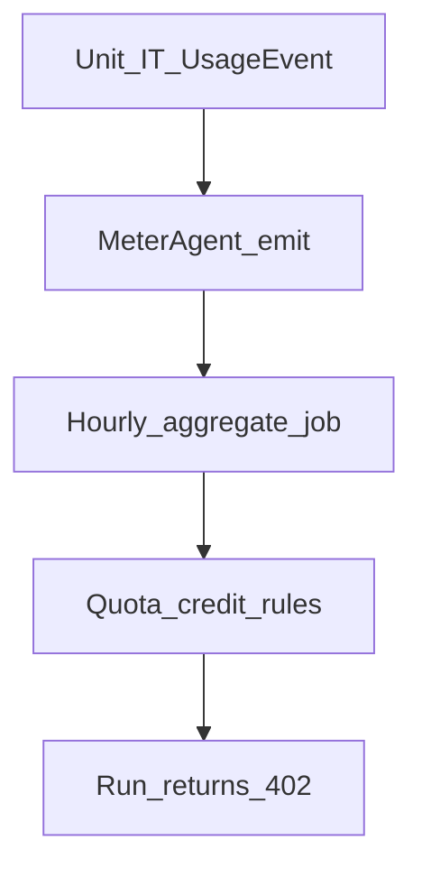

# Wave 5 TDD — Metering & Pay-as-you-go

| Field | Value |
|-------|--------|
| **Wave** | W5 — Metering & Pay-as-you-go |
| **Audience** | Technical stakeholders |
| **Status** | Complete (W5-US01–US06 Done; `wave-5-complete`; PR #10 → master **merged**) |
| **Architecture refs** | §6.2, §3.5 |
| **Branch / tags** | `wave-5` · `W5-US##` · `wave-5-complete` |
| **Last updated** | 2026-07-09 |
| **Template** | [`../TDD_WAVE_TEMPLATE.md`](../TDD_WAVE_TEMPLATE.md) |
| **Catalog** | [`../../DELIVERY_PLAN.md`](../../DELIVERY_PLAN.md) § Wave 5 |
| **Execution plan** | [`../waves/WAVE_5.md`](../waves/WAVE_5.md) |
| **Developer guides** | [`stories/README.md`](stories/README.md) § Wave 5 |
| **Depends on** | W2 fixture runs; W3 webhook meters; W4 complete (`wave-4-complete`); W0 MySQL |

---

## 1. Stakeholder summary

Wave 5 proves fixture runs yield billable usage across compute, records, connector calls, and webhooks; aggregates roll up hourly; soft/hard quotas and credits enforce; hard limit or zero credit returns `402` on run.

| Quality goal | How we prove it |
|--------------|-----------------|
| UsageEvent persist | IT insert/query |
| MeterAgent emit | Pipelet/sidecar unit + IT |
| Hourly aggregates | Job IT with clock control |
| Quota / credits | Unit + API IT |
| Hard block `402` | Run IT under zero credit |

**Out of scope:** Payment provider integration, invoice PDF, UI billing pages (beyond query APIs).

---

## 2. Test strategy

| Layer | Tools | Cadence | Notes |
|-------|-------|---------|-------|
| Unit | Aggregators, quota math | Every PR | Deterministic clocks |
| Integration | MySQL + optional queue | Every PR | Fixture tolerance |
| Manual | Query APIs vs DB | Wave exit | Billing-dispute KB |

**CI gates (target)**

1. Usage summary within tolerance of fixture meters
2. Aggregate job idempotent for same hour
3. `402` on hard limit/zero credit

---

## 3. Environments & fixtures

| Fixture | Entity | Path (planned) |
|---------|--------|----------------|
| Metered 3-stage run | usage events | `fixtures/usage/` |
| Quota profiles | soft/hard | `fixtures/billing/` |

**Real vs mocked**

| Dependency | Unit | IT | Manual |
|------------|------|----|--------|
| MySQL | mock | Testcontainers/Compose | Compose |
| MeterAgent | in-process | Boot IT | fixture run |
| Clock | fixed Instant | fixed Instant | real |

---

## 4. Story TDD backlog

### W5-US01 — UsageEvent ingest + persist

**Developer guide:** [`stories/w5/W5-US01-tdd.md`](stories/w5/W5-US01-tdd.md)

| Step | Evidence |
|------|----------|
| **Red** | `UsageEventServiceTest` / IT fail |
| **Green** | Ingest API/queue → MySQL |
| **Refactor** | Idempotent ingest keys |

**Status:** Done — `V14__usage_events`, `PersistingUsageEventCollector`, idempotent keys.

### W5-US02 — MeterAgent emit from pipelet

**Developer guide:** [`stories/w5/W5-US02-tdd.md`](stories/w5/W5-US02-tdd.md)

| Step | Evidence |
|------|----------|
| **Red** | `MeterAgentTest` fail |
| **Green** | Emit from fixture pipelet run |
| **Refactor** | Shared dimension schema |

**Status:** Done — `MeterAgent` + stub worker; records + stub vcpu; `pipeline_runs` on last stage.

### W5-US03 — Hourly aggregates job

**Developer guide:** [`stories/w5/W5-US03-tdd.md`](stories/w5/W5-US03-tdd.md)

| Step | Evidence |
|------|----------|
| **Red** | `UsageAggregateJobTest` fail |
| **Green** | Rollups for fixture hour |
| **Refactor** | Re-run safe |

**Status:** Done — `V15__usage_aggregates`, UTC hourly upsert, stub costs, fixed-clock tests.

### W5-US04 — Soft/hard quota + credit balance

**Developer guide:** [`stories/w5/W5-US04-tdd.md`](stories/w5/W5-US04-tdd.md)

| Step | Evidence |
|------|----------|
| **Red** | `QuotaEvaluatorTest` fail |
| **Green** | Soft warn / hard block thresholds |
| **Refactor** | Clear error codes |

**Status:** Done — `QuotaEvaluator` + credit deduct on aggregate cost delta; soft log-only.

### W5-US05 — Usage and billing query APIs

**Developer guide:** [`stories/w5/W5-US05-tdd.md`](stories/w5/W5-US05-tdd.md)

| Step | Evidence |
|------|----------|
| **Red** | `BillingQueryIT` fail |
| **Green** | Summary matches fixture ± tolerance |
| **Refactor** | Pagination |

**Status:** Done — §3.5 usage/events/quota/periods; cross-tenant 404; tolerance in KB.

### W5-US06 — Block run on hard limit / zero credit

**Developer guide:** [`stories/w5/W5-US06-tdd.md`](stories/w5/W5-US06-tdd.md)

| Step | Evidence |
|------|----------|
| **Red** | `RunBlockedIT.returns402` fail |
| **Green** | Orchestrator checks quota before run |
| **Refactor** | Align with W2 run API |

**Status:** Done — pre-run `QuotaService` gate; HTTP 402 body; no execution on block; default trial credit 100.

---

## 5. Cross-cutting test themes

| Theme | Wave-specific rule | Owning stories |
|-------|--------------------|----------------|
| Tolerance | Document numeric tolerance for exit | US05 |
| Tenant isolation | Usage never mixes tenants | all |
| Deterministic time | Fixed clocks in aggregate tests | US03 |
| Contract with W3 | webhook_events/bytes_in dimensions | US01–US02 |

---

## 6. Wave exit criteria ↔ tests

| Exit criterion | Verification |
|----------------|--------------|
| Usage summary matches fixture | US05 IT |
| Hard limit / zero credit `402` | US06 IT |
| Billing-dispute KB | `kb/W5-*-billing-dispute.md` / US05–US06 KBs |

---

## 7. Risks & deferrals

| Risk / deferral | Impact | Mitigation |
|-----------------|--------|------------|
| Double-count meters | Overbilling | Idempotent event ids; IT |
| Clock skew aggregates | Wrong hour bucket | UTC + fixed Instant tests |
| Orchestrator coupling | Late US06 | Interface gate in W2 run service |

---

## 8. Change log

| Date | Change |
|------|--------|
| 2026-07-08 | Initial Draft for technical stakeholders |
| 2026-07-09 | Linked execution plan + junior story TDD guides; wave-5 started |
| 2026-07-09 | W5-US01 implemented: usage_events persist + idempotent collector |
| 2026-07-09 | W5-US02 implemented: MeterAgent stub stage emit |
| 2026-07-09 | W5-US03 implemented: hourly usage_aggregates job |
| 2026-07-09 | W5-US04 implemented: QuotaEvaluator + credit deduct |
| 2026-07-09 | W5-US05 implemented: usage/billing/quota query APIs |
| 2026-07-09 | W5-US06 implemented: run blocked 402; wave exit (`wave-5-complete`) |
| 2026-07-10 | PR #10 merged to `master`; Wave 6 started |
