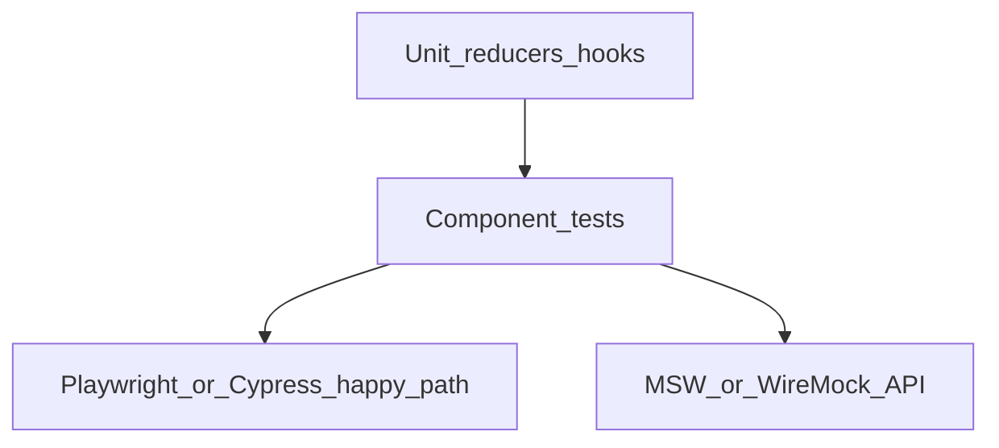

# Wave 6 TDD — No-code UI

| Field | Value |
|-------|--------|
| **Wave** | W6 — No-code UI |
| **Audience** | Technical stakeholders |
| **Status** | In Progress (W6-US05 Done; W6-US06 next) |
| **Architecture refs** | §4 |
| **Branch / tags** | `wave-6` · `W6-US##` |
| **Last updated** | 2026-07-10 |
| **Template** | [`../TDD_WAVE_TEMPLATE.md`](../TDD_WAVE_TEMPLATE.md) |
| **Catalog** | [`../../DELIVERY_PLAN.md`](../../DELIVERY_PLAN.md) § Wave 6 |
| **Execution plan** | [`../waves/WAVE_6.md`](../waves/WAVE_6.md) |
| **Developer guides** | [`stories/README.md`](stories/README.md) § Wave 6 |
| **Depends on** | W1 APIs stable; W2 run APIs; W5 complete (`wave-5-complete`); W4 for observability panels |

---

## 1. Stakeholder summary

Wave 6 proves a tenant user can navigate the app, manage connectors/services/pipelets, build a 3-step pipeline on a canvas, run/dry-run with an execution overlay, and optionally view observability panels — without writing code or using Postman for the happy path.

| Quality goal | How we prove it |
|--------------|-----------------|
| Shell + auth context | Component/unit + smoke |
| Catalogs/forms | Component tests + MSW/WireMock |
| Canvas save | Reducer/builder unit + API mock |
| Run overlay | E2E or Playwright happy path |
| Observability panels (Should) | Component + API mock |

**Out of scope:** Pixel-perfect design system maturity, multi-browser matrix beyond primary, mobile-first layouts.

---

## 2. Test strategy

| Layer | Tools | Cadence | Notes |
|-------|-------|---------|-------|
| Unit | Vitest/Jest, Testing Library | Every PR | Reducers, hooks, validators |
| Component | Testing Library | Every PR | Forms/wizards |
| API mocks | MSW / WireMock | PR | Avoid real backend flakiness |
| E2E | Playwright/Cypress | Nightly / wave exit | Full Compose stack when possible |

**CI gates (target)**

1. Unit + component suite green
2. Documented manual E2E script passes (until harness matures)
3. No Postman required for happy path demo

Per working agreements: UI stories require unit tests for reducers/hooks and Playwright/Cypress **or** documented manual equivalent until E2E harness exists.

---

## 3. Environments & fixtures

| Fixture | Entity | Path (planned) |
|---------|--------|----------------|
| `T001` session | auth context | frontend fixtures |
| `threeStage` pipeline JSON | canvas | mirror backend fixture |
| MSW handlers | APIs | `src/mocks/` |

**Real vs mocked**

| Dependency | Unit/Component | E2E |
|------------|----------------|-----|
| Backend APIs | MSW/WireMock | Real `wave-6` stack preferred |
| Auth | stub session | real/local JWT |
| Observability | mock series | real Prometheus/API optional |

---

## 4. Story TDD backlog

### W6-US01 — Level-1 nav shell + auth context

**Developer guide:** [`stories/w6/W6-US01-tdd.md`](stories/w6/W6-US01-tdd.md)

| Step | Evidence |
|------|----------|
| **Red** | `AuthContext.test`, shell render test fail |
| **Green** | Nav + tenant context provider |
| **Refactor** | Route table isolation |

### W6-US02 — Connectors / Services list+forms

**Developer guide:** [`stories/w6/W6-US02-tdd.md`](stories/w6/W6-US02-tdd.md)

| Step | Evidence |
|------|----------|
| **Red** | Form validation tests fail |
| **Green** | List + create wizards against MSW |
| **Refactor** | Shared form field kit |

### W6-US03 — Global Pipelets catalog + admin register

**Developer guide:** [`stories/w6/W6-US03-tdd.md`](stories/w6/W6-US03-tdd.md)

| Step | Evidence |
|------|----------|
| **Red** | Catalog filter tests fail |
| **Green** | Catalog UI + admin entry |
| **Refactor** | Role-gate helpers |

### W6-US04 — Drag-drop pipeline builder save

**Developer guide:** [`stories/w6/W6-US04-tdd.md`](stories/w6/W6-US04-tdd.md)

| Step | Evidence |
|------|----------|
| **Red** | `pipelineGraphReducer.test` / save mock fail |
| **Green** | React Flow graph → save API |
| **Refactor** | Pure graph transforms |

### W6-US05 — Run / dry-run / execution overlay

**Developer guide:** [`stories/w6/W6-US05-tdd.md`](stories/w6/W6-US05-tdd.md)

| Step | Evidence |
|------|----------|
| **Red** | Overlay state tests / E2E fail |
| **Green** | Run triggers W2 API; status poll |
| **Refactor** | Shared poller hook |

### W6-US06 — Observability panels (Should)

**Developer guide:** [`stories/w6/W6-US06-tdd.md`](stories/w6/W6-US06-tdd.md)

| Step | Evidence |
|------|----------|
| **Red** | Panel render with mock series fail |
| **Green** | Completeness/latency widgets |
| **Refactor** | Chart adapter isolation |

---

## 5. Cross-cutting test themes

| Theme | Wave-specific rule | Owning stories |
|-------|--------------------|----------------|
| Tenant session | All API calls include tenant context | US01+ |
| A11y baseline | Critical forms keyboard reachable | US02–US04 |
| No secrets in UI | Tokens not logged to console | all |
| Manual fallback | If E2E absent, scripted manual steps in story AC | US05 |

---

## 6. Wave exit criteria ↔ tests

| Exit criterion | Verification |
|----------------|--------------|
| Build+run 3-step without Postman | E2E or documented manual script |
| UI KB with screenshot placeholders | `kb/W6-*-builder.md` |

---

## 7. Risks & deferrals

| Risk / deferral | Impact | Mitigation |
|-----------------|--------|------------|
| E2E harness late | Exit blocked | Explicit manual script as interim DoD |
| API contract drift | UI red | Pact/OpenAPI consumer tests optional |
| Canvas flakiness | CI noise | Prefer unit graph tests over DOM drag in CI |

---

## 8. Change log

| Date | Change |
|------|--------|
| 2026-07-08 | Initial Draft for technical stakeholders |
| 2026-07-10 | Linked execution plan + junior story guides; wave-6 started |
| 2026-07-10 | W6-US02 Done — connectors/services UI + MSW |
| 2026-07-10 | W6-US03 Done — pipelets catalog + admin register modal |
| 2026-07-10 | W6-US04 Done — React Flow builder + save to steps API |
| 2026-07-10 | W6-US05 Done — run/dry-run overlay + 402 quota UI |
