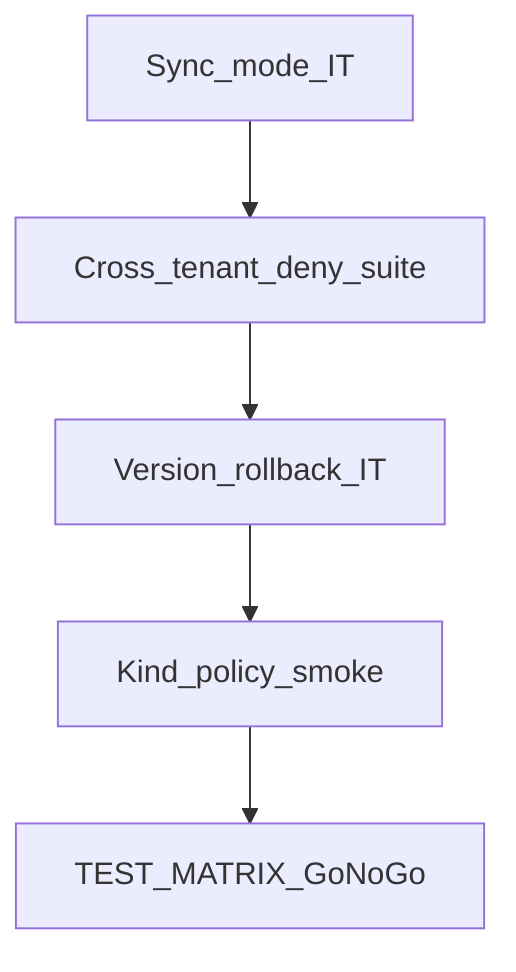

# Wave 7 TDD — Hardening & Ops

| Field | Value |
|-------|--------|
| **Wave** | W7 — Hardening & Ops |
| **Audience** | Technical stakeholders |
| **Status** | Draft (planning) |
| **Architecture refs** | §6.1, §8, §10.4–10.5, sync §8.5 |
| **Branch / tags** | `wave-7` (planned) · `W7-US##` |
| **Last updated** | 2026-07-08 |
| **Template** | [`../TDD_WAVE_TEMPLATE.md`](../TDD_WAVE_TEMPLATE.md) |
| **Catalog** | [`../../DELIVERY_PLAN.md`](../../DELIVERY_PLAN.md) § Wave 7 |

---

## 1. Stakeholder summary

Wave 7 proves production readiness: sync execution mode, automated cross-tenant denial suite, pipeline version rollback, Kind ResourceQuota/NetworkPolicy checks (Should), complete support KB suite, and a signed Go/No-Go checklist.

| Quality goal | How we prove it |
|--------------|-----------------|
| Sync mode | IT with timeout/fail-forward |
| Cross-tenant deny | Automated suite across W1–W5 surfaces |
| Version rollback | API/UI IT |
| K8s policies (Should) | Kind apply + assert |
| KB + Go/No-Go | Document review + matrix complete |

**Out of scope:** New product features; load/chaos at scale beyond agreed checklist.

---

## 2. Test strategy

| Layer | Tools | Cadence | Notes |
|-------|-------|---------|-------|
| Unit | Sync rules, rollback validators | Every PR | |
| Integration | Multi-API isolation suite | Every PR / nightly | Highest bar |
| Kind | Policy manifests | Labeled | Optional if cluster unavailable |
| Manual / review | KB + readiness checklist | Wave exit | Human sign-off |

**CI gates (target)**

1. Cross-tenant suite must be green (blocker)
2. Sync mode IT green
3. Rollback IT green
4. TEST_MATRIX complete for Must stories in shipped waves

---

## 3. Environments & fixtures

| Fixture | Purpose |
|---------|---------|
| Dual tenants `T001`/`T002` | Isolation suite across resources |
| Versioned pipeline | Rollback before/after |
| Sync-mode pipeline | Timeout scenarios |

**Real vs mocked**

| Dependency | Unit | IT | Manual |
|------------|------|----|--------|
| APIs | mock | full stack | Compose/Kind |
| K8s | fake client | Kind | Kind |
| Support KB | n/a | n/a | review |

---

## 4. Story TDD backlog

### W7-US01 — Sync execution mode

| Step | Evidence |
|------|----------|
| **Red** | `SyncExecutionIT` / timeout tests fail |
| **Green** | Sync path with fail-forward rules |
| **Refactor** | Shared timeout policy |

### W7-US02 — Cross-tenant access denied suite

| Step | Evidence |
|------|----------|
| **Red** | Parametrized suite starts failing on gaps |
| **Green** | Cover tenants, connectors, pipelines, usage, observability |
| **Refactor** | Shared attacker/victim helpers |

### W7-US03 — Pipeline version rollback

| Step | Evidence |
|------|----------|
| **Red** | `PipelineRollbackIT` fail |
| **Green** | History + rollback restores active version |
| **Refactor** | Immutable version rows |

### W7-US04 — ResourceQuota / NetworkPolicy (Should)

| Step | Evidence |
|------|----------|
| **Red** | Kind assert script fails |
| **Green** | Manifests apply; probes verify |
| **Refactor** | Document required cluster flags |

### W7-US05 — Support KB final suite

| Step | Evidence |
|------|----------|
| **Red** | Checklist of missing KB articles |
| **Green** | All major feature KBs present |
| **Refactor** | Index/`README` for support |

### W7-US06 — Production readiness Go/No-Go

| Step | Evidence |
|------|----------|
| **Red** | Incomplete checklist fails review |
| **Green** | Signed Go/No-Go attached |
| **Refactor** | Link TEST_MATRIX evidence |

---

## 5. Cross-cutting test themes

| Theme | Wave-specific rule | Owning stories |
|-------|--------------------|----------------|
| Security regression | Isolation suite runs on every release candidate | US02 |
| Correctness | Sync + rollback do not corrupt tenant data | US01, US03 |
| Ops evidence | Policies + KB required for Go | US04–US06 |
| No new features | TDD rejects scope creep PRs | all |

---

## 6. Wave exit criteria ↔ tests

| Exit criterion | Verification |
|----------------|--------------|
| Cross-tenant suite green | US02 |
| Go/No-Go signed | US06 |
| TEST_MATRIX complete for Must in shipped waves | US06 + matrix review |

---

## 7. Risks & deferrals

| Risk / deferral | Impact | Mitigation |
|-----------------|--------|------------|
| Kind unavailable | US04 deferred | Tracker note; not block Must if Should |
| Isolation suite gaps | Security risk | Expand table as APIs grow; fail closed |
| Checklist theater | False Go | Require linked CI artifacts |

---

## 8. Change log

| Date | Change |
|------|--------|
| 2026-07-08 | Initial Draft for technical stakeholders |
