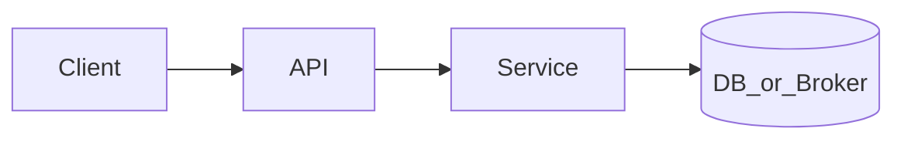

# Story TDD Guide Template (junior developers)

**Audience:** Developers implementing a user story (especially juniors)  
**Purpose:** Design-aware **Red → Green → Refactor** playbook: understand the slice, then prove it with tests.

Not the same as:

| Doc | Audience | Purpose |
|-----|----------|---------|
| [`../WAVE_N_TDD.md`](../README.md) | Tech stakeholders | Wave-level strategy & exit gates |
| [`../../kb/`](../../kb/) | Support / ops | How to verify & troubleshoot |
| [`../../waves/WAVE_N.md`](../../waves/) | Delivery | Full AC / backlog |

**Layout (all waves, including future W3+):** `docs/delivery/tdd/stories/w#/W#-US##-tdd.md`  
Examples: `w0/W0-US01-tdd.md`, `w1/W1-US01-tdd.md`, `w2/W2-US01-tdd.md`, `w3/W3-US01-tdd.md`.

Create the `wN/` folder if missing. Do **not** place guides in the flat `stories/` root.

Copy this template when pulling a story.

---

## Metadata

| Field | Value |
|-------|--------|
| **Story** | `W#-US##` — Title |
| **Depends on** | Prior story / infra |
| **Branch** | `W#-US##` from `wave-N` |
| **Timebox hint** | e.g. 0.5–1 day |
| **You will touch** | List of dirs/files |
| **Architecture refs** | e.g. §2, §9 |
| **KB (create)** | `docs/delivery/kb/…` |

---

## 1. Overview

Plain-English: what you are building, **Done means**, and **Out of scope**.

**Done means:** …  
**Out of scope:** …

---

## 2. Assumptions

| # | Assumption |
|---|------------|
| 1 | Prerequisites merged / Compose services up |
| 2 | Stub auth / fixtures available if needed |

---

## 3. HLD / DFD

High-level flow for *this story only* (not the whole platform).



Optional: short data-flow bullets (request → context → persistence → response).

---

## 4. LLD

Classes/packages, tables/migrations, key algorithms, and seams (SPI, filters, clients).

| Component | Responsibility |
|-----------|----------------|
| | |

---

## 5. API interface

| Method | Path | Request / notes | Response |
|--------|------|-----------------|----------|
| | | | |

Headers / auth: …

---

## 6. Testing

| Layer | What to cover | Tools |
|-------|---------------|-------|
| Unit | | JUnit, Mockito |
| Integration | | `@SpringBootTest`, Compose |
| External mock | | WireMock / LocalStack if needed |
| Manual | | curl / UI |

Link to [`../../TEST_MATRIX.md`](../../TEST_MATRIX.md) row when Done.

---

## 7. Risks

| Risk | Mitigation |
|------|------------|
| | |

---

## 8. RED — failing tests first

| File | Method | Asserts |
|------|--------|---------|
| | | |

```bash
# expect FAILURE
./mvnw -pl pipeline-api test -Dtest=…
```

**Stop.** Do not write production code until you have seen red.

---

## 9. GREEN — smallest code that passes

1. …
2. …

```bash
# expect SUCCESS
./mvnw -pl pipeline-api test -Dtest=…
```

### Checklist

- [ ] Tests green
- [ ] No unrelated refactors yet
- [ ] No secrets committed

---

## 10. REFACTOR

- …
- Re-run tests after each cleanup.

---

## 11. Docs & trackers

- [ ] KB under `docs/delivery/kb/`
- [ ] `WAVE_TRACKER.md` · `TEST_MATRIX.md`
- [ ] Story status in `waves/WAVE_N.md`
- [ ] Manual verify (if required):

| # | Action | Expected |
|---|--------|----------|
| 1 | | |

### Ship

```text
merge → tag W#-US## → delete → next story from wave-N
```

---

## 12. Common pitfalls

| Mistake | Fix |
|---------|-----|
| | |

---

## Help / escalate

- Architecture: [`../../../ARCHITECTURE.md`](../../../ARCHITECTURE.md)
- Stuck > 30 min on env: story KB + Compose health
- Pair / draft PR early
