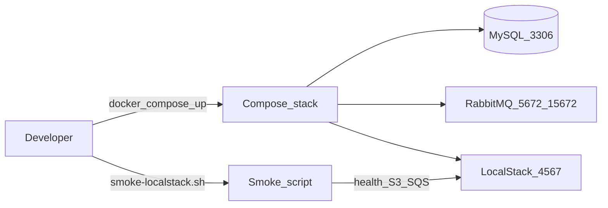

# W0-US01 TDD Guide — Compose stack + LocalStack healthy

| Field | Value |
|-------|--------|
| **Story** | W0-US01 — Compose stack + LocalStack healthy |
| **Depends on** | — (first Wave 0 story) |
| **Branch** | `W0-US01` from `wave-0` |
| **Timebox hint** | 0.5–1 day |
| **You will touch** | `docker-compose.yml`, `scripts/smoke-*.sh`, README ports |
| **Architecture refs** | §5, §10.6 LocalStack |
| **KB (create)** | `docs/delivery/kb/W0-US01-local-compose-stack.md` |
| **Stakeholder TDD** | [`../../WAVE_0_TDD.md`](../../WAVE_0_TDD.md) |
| **AC source** | [`../../../waves/WAVE_0.md`](../../../waves/WAVE_0.md) § W0-US01 |

---

## 1. Overview

You are **not** writing Java yet. You make a Docker Compose file so MySQL, RabbitMQ, and LocalStack start on a laptop, plus a small shell script that proves LocalStack S3/SQS work.

**Done means:** `docker compose up -d` brings healthy containers, and `./scripts/smoke-localstack.sh` exits `0`.

**Out of scope:** Spring Boot app container; ELK required (optional stub only); any business APIs.

---

## 2. Assumptions

| # | Assumption |
|---|------------|
| 1 | Docker Desktop / Rancher Desktop / Colima works (`docker --version`) |
| 2 | AWS CLI **or** `awslocal` available (smoke uses either) |
| 3 | Host LocalStack port defaults to **4567** (container 4566) |

```bash
git checkout wave-0 && git pull && git checkout -b W0-US01
docker --version
```

---

## 3. HLD / DFD



Data flow: Compose starts deps → smoke hits LocalStack health → create/list S3 bucket + SQS queue → exit 0.

---

## 4. LLD

| Component | Responsibility |
|-----------|----------------|
| `docker-compose.yml` | `mysql`, `rabbitmq`, `localstack` with healthchecks |
| `scripts/smoke-localstack.sh` | Wait health; S3 + SQS create/list; `set -euo pipefail` |
| `scripts/smoke-compose-deps.sh` | Optional MySQL/Rabbit ping |
| README ports | Document LocalStack **4567** vs container 4566 |

| Service | Image (example) | Host ports | Healthcheck idea |
|---------|-----------------|------------|------------------|
| `mysql` | `mysql:8.4` | `3306` | `mysqladmin ping` |
| `rabbitmq` | `rabbitmq:3.13-management` | `5672`, `15672` | `rabbitmq-diagnostics ping` |
| `localstack` | LocalStack | **`4567:4566`** | health endpoint |

Suggested MySQL env: DB `pipeline`, user/pass `pipeline` / `pipeline`. LocalStack: enable `s3,sqs`.

---

## 5. API interface

No HTTP app API in this story. Surface is Compose + smoke script:

| Surface | Notes |
|---------|-------|
| LocalStack health | `http://localhost:4567/_localstack/health` |
| Smoke env defaults | Endpoint `http://localhost:4567`; AWS keys `test` / `test` |
| Overrides | `LOCALSTACK_HOST_PORT`, `LOCALSTACK_ENDPOINT` |
| RabbitMQ UI | http://localhost:15672 (guest/guest or compose user) |

---

## 6. Testing

| Layer | Coverage | Tools |
|-------|----------|-------|
| Smoke | LocalStack health + S3 + SQS | `scripts/smoke-localstack.sh` |
| Manual | Compose healthy; Rabbit UI; idempotent re-run | `docker compose ps`, browser |
| Optional | MySQL/Rabbit ping | `scripts/smoke-compose-deps.sh` |

---

## 7. Risks

| Risk | Mitigation |
|------|------------|
| Port clash on LocalStack 4566 | Prefer host `4567` → container `4566` |
| Smoke assumes `awslocal` only | Fall back to `aws --endpoint-url=...` |
| “Up” but not healthy | Wait for healthchecks / require smoke exit 0 |
| Scope creep into app container | Out of scope — next story |

---

## 8. RED

Write the smoke script’s assertions **before** Compose works.

`scripts/smoke-localstack.sh` that:

1. Hits LocalStack health (`/_localstack/health`)
2. Creates/lists an S3 bucket
3. Creates/lists an SQS queue
4. Exits non-zero on any failure (`set -euo pipefail`)

```bash
chmod +x scripts/smoke-localstack.sh
./scripts/smoke-localstack.sh
# ERROR: LocalStack did not become healthy …  OR connection refused
```

**Stop.** Red.

---

## 9. GREEN

1. Create `docker-compose.yml` with mysql, rabbitmq, localstack (table above).
2. Enable LocalStack `s3,sqs`.
3. Bring stack up and re-run smoke.

```bash
docker compose up -d
docker compose ps          # all healthy / running
./scripts/smoke-localstack.sh   # exit 0
```

### Checklist

- [ ] Smoke exits 0
- [ ] RabbitMQ UI loads: http://localhost:15672
- [ ] Re-running smoke does not fail (idempotent create-or-skip)
- [ ] No Spring Boot app container in this story

---

## 10. REFACTOR

- Document ports in README (especially LocalStack **4567** vs container 4566)
- Allow overrides: `LOCALSTACK_HOST_PORT`, `LOCALSTACK_ENDPOINT`
- Keep smoke idempotent (`head-bucket` / create-if-missing)
- Do **not** add the Spring Boot app container

```bash
./scripts/smoke-localstack.sh   # still 0
```

---

## 11. Docs & trackers

- [ ] KB: `docs/delivery/kb/W0-US01-local-compose-stack.md`
- [ ] `WAVE_TRACKER.md` → Done · gate `LS,M,KB`
- [ ] `TEST_MATRIX.md` W0-US01: LocalStack + Manual + KB
- [ ] Mark story Done in `waves/WAVE_0.md`

| # | Action | Expected |
|---|--------|----------|
| 1 | `docker compose up -d` | Containers healthy |
| 2 | `./scripts/smoke-localstack.sh` | Exit 0 |
| 3 | Open http://localhost:15672 | Management UI loads |

**Teardown:** `docker compose down -v` (wipes volumes — OK for Wave 0).

```text
push W0-US01 → merge into wave-0 → tag W0-US01 → delete branch → checkout -b W0-US02
```

---

## 12. Common pitfalls

| Mistake | Fix |
|---------|-----|
| Mapping LocalStack as `4566:4566` and clashing | Prefer host `4567` → container `4566` |
| Smoke assumes `awslocal` only | Fall back to `aws --endpoint-url=...` |
| Forgetting `chmod +x` | Script won’t run |
| Declaring victory when containers “Up” but not healthy | Wait for healthchecks / smoke |
| Adding app code in this story | Out of scope — next story |

## Help / escalate

- Architecture §5, §10.6 LocalStack · stakeholder [`../../WAVE_0_TDD.md`](../../WAVE_0_TDD.md)
- Stuck on Docker: Desktop / Rancher / Colima health; pin LocalStack image if Apple Silicon quirks
