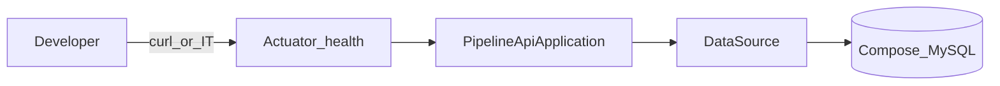

# W0-US02 TDD Guide — Spring Boot health + MySQL IT

| Field | Value |
|-------|--------|
| **Story** | W0-US02 — Spring Boot health + Compose MySQL IT |
| **Depends on** | W0-US01 (Compose MySQL) |
| **Branch** | `W0-US02` from `wave-0` |
| **Timebox hint** | 1–1.5 days |
| **You will touch** | parent `pom.xml`, `pipeline-api/`, Actuator, `HealthControllerIT` |
| **Architecture refs** | §5 Spring Boot |
| **KB (create)** | `docs/delivery/kb/W0-US02-health-endpoint.md` |
| **Stakeholder TDD** | [`../../WAVE_0_TDD.md`](../../WAVE_0_TDD.md) |
| **AC source** | [`../../../waves/WAVE_0.md`](../../../waves/WAVE_0.md) § W0-US02 |

---

## 1. Overview

A tiny Spring Boot app that starts, talks to MySQL, and answers `GET /actuator/health` with `"status":"UP"`. You prove it with an integration test.

**Done means:** With Compose MySQL up, `HealthControllerIT` is green and curl health returns UP.

**Out of scope:** Tenant/pipeline REST controllers; security; full business APIs.

**Note:** Prefer Testcontainers in CI when possible. On some Docker setups (e.g. Rancher Desktop + docker-java), use Compose MySQL + `assumeTrue` instead — that is OK for Wave 0 if documented.

---

## 2. Assumptions

| # | Assumption |
|---|------------|
| 1 | W0-US01 merged; Compose MySQL on `3306` |
| 2 | Java **21** + Maven Wrapper (`./mvnw`) |
| 3 | Compose MySQL IT + skip when port closed is acceptable if Testcontainers deferred |

```bash
git checkout wave-0 && git pull && git checkout -b W0-US02
docker compose up -d mysql
# wait until healthy
```

---

## 3. HLD / DFD



Data flow: HTTP/IT → Actuator health → JDBC ping → MySQL → `"status":"UP"` (+ `db` detail).

---

## 4. LLD

| Component | Responsibility |
|-----------|----------------|
| Parent `pom.xml` | Spring Boot 3.x, Java 21, module `pipeline-api` |
| `pipeline-api/pom.xml` | web, actuator, jdbc, mysql-connector-j, test |
| `PipelineApiApplication` | `@SpringBootApplication` |
| `application.yml` | Expose health; `local` datasource to Compose MySQL |
| `HealthControllerIT` | `@SpringBootTest` + `assumeTrue` port 3306 |

`local` profile datasource: `jdbc:mysql://localhost:3306/pipeline?...`, user/pass `pipeline`/`pipeline`. Surefire includes `**/*IT.java` if named that way.

---

## 5. API interface

| Method | Path | Notes | Response |
|--------|------|-------|----------|
| `GET` | `/actuator/health` | Actuator; details `always`, `db` enabled | `200` + `"status":"UP"` and `db` |

No business REST resources in this story.

---

## 6. Testing

| Layer | Coverage | Tools |
|-------|----------|-------|
| Integration | Health returns UP with DB | `@SpringBootTest`, Compose MySQL, `assumeTrue` |
| Manual | `spring-boot:run` + curl health | |
| Unit | n/a for this story | |

---

## 7. Risks

| Risk | Mitigation |
|------|------------|
| Hard-fail CI when Docker MySQL missing | `assumeTrue` / skip |
| Testcontainers fight (Rancher / docker-java) | Document deferral; ship Compose IT |
| Wrong JDBC URL / password | Match Compose `pipeline`/`pipeline` |
| Scope creep into business APIs | Reject — out of scope |

---

## 8. RED

| File | Method | Asserts |
|------|--------|---------|
| `HealthControllerIT` | `health_returnsUp` | GET `/actuator/health` → 200; body has `"status":"UP"` and `db` |

`@SpringBootTest(webEnvironment = RANDOM_PORT)`, `@ActiveProfiles("local")`, plus `@BeforeAll` that **skips** if port `3306` is closed:

```text
assumeTrue(portOpen("127.0.0.1", 3306), "run: docker compose up -d mysql");
```

You may need empty/minimal `pom.xml` + `PipelineApiApplication` so the project compiles. Smallest Boot main + deps, then run and watch fail on health/DB — still counts as red.

```bash
docker compose up -d mysql
./mvnw -pl pipeline-api test -Dtest=HealthControllerIT
# Failure: no context / connection / 404 / not UP
```

**Stop.** Red.

---

## 9. GREEN

1. Parent `pom.xml` — Spring Boot 3.x, Java 21, module `pipeline-api`.
2. `pipeline-api/pom.xml` — web, actuator, jdbc, mysql-connector-j, test.
3. `PipelineApiApplication.java` — `@SpringBootApplication`.
4. `application.yml` — expose health; `local` datasource to Compose MySQL.
5. Surefire includes `**/*IT.java` if needed.

```bash
./mvnw -pl pipeline-api test -Dtest=HealthControllerIT
# BUILD SUCCESS
```

Manual:

```bash
./mvnw -pl pipeline-api spring-boot:run -Dspring-boot.run.profiles=local
curl -s http://localhost:8080/actuator/health
# {"status":"UP", ... "db":...}
```

### Checklist

- [ ] IT green with MySQL up
- [ ] IT **skipped** (not errored) when MySQL down
- [ ] No tenant/pipeline REST controllers yet

---

## 10. REFACTOR

- Keep `local` profile clear (datasource only there)
- Comment in IT why Compose is used vs Testcontainers
- Align module layout with Wave 0 target tree in `WAVE_0.md`

```bash
./mvnw -pl pipeline-api test -Dtest=HealthControllerIT
```

---

## 11. Docs & trackers

- [ ] KB health article
- [ ] Tracker Done · `U,I,M,KB` (or note Testcontainers deferral)
- [ ] TEST_MATRIX W0-US02
- [ ] WAVE_0 story status Done

| # | Action | Expected |
|---|--------|----------|
| 1 | `docker compose up -d mysql` | Healthy |
| 2 | `spring-boot:run` + `local` | App starts |
| 3 | `curl .../actuator/health` | `"status":"UP"` |

```text
merge → tag W0-US02 → delete branch → W0-US03
```

---

## 12. Common pitfalls

| Mistake | Fix |
|---------|-----|
| Hard-failing CI when Docker MySQL missing | Use `assumeTrue` / skip |
| Forgetting Actuator dependency | Health 404 |
| Wrong JDBC URL / password | Match Compose `pipeline`/`pipeline` |
| Putting business APIs in this story | Out of scope |
| Fighting Testcontainers for hours | Document deferral; ship Compose IT |

## Help / escalate

- Architecture §5 · Wave 0 Compose MySQL pattern · stakeholder [`../../WAVE_0_TDD.md`](../../WAVE_0_TDD.md)
- Stuck > 30 min on Docker/Testcontainers: document deferral and ship Compose IT
