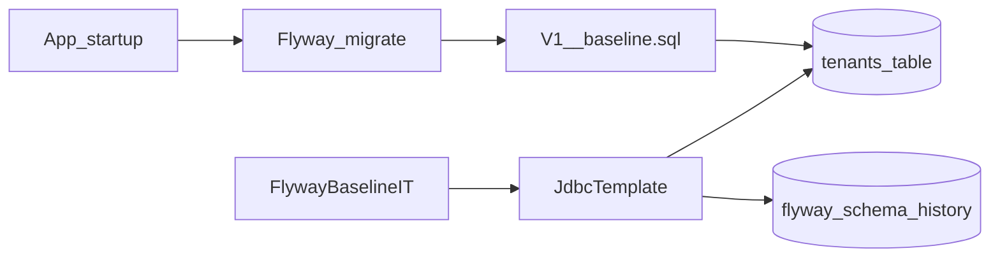

# W0-US03 TDD Guide — Flyway baseline schema

| Field | Value |
|-------|--------|
| **Story** | W0-US03 — Flyway baseline schema apply |
| **Depends on** | W0-US02 |
| **Branch** | `W0-US03` from `wave-0` |
| **Timebox hint** | 0.5–1 day |
| **You will touch** | Flyway deps, `V1__baseline.sql`, `FlywayBaselineIT`, `application.yml` |
| **Architecture refs** | §2 Data Model (stub) |
| **KB (create)** | `docs/delivery/kb/W0-US03-flyway-baseline.md` |
| **Stakeholder TDD** | [`../../WAVE_0_TDD.md`](../../WAVE_0_TDD.md) |
| **AC source** | [`../../../waves/WAVE_0.md`](../../../waves/WAVE_0.md) § W0-US03 |

---

## 1. Overview

On app startup, Flyway runs SQL migrations. Wave 0 only needs `V1__baseline.sql` creating a **`tenants`** stub table (architecture naming). An IT proves the table and Flyway history exist.

**Done means:** Fresh or existing Compose DB shows `tenants` + `flyway_schema_history` with `V1__baseline.sql` after Boot starts / IT runs.

**Out of scope:** Full pipeline/connector schema (Wave 1+).

---

## 2. Assumptions

| # | Assumption |
|---|------------|
| 1 | W0-US02 merged; Compose MySQL up |
| 2 | Architecture tenants columns (id, name, slug, status, timestamps, …) guide the stub |
| 3 | Same IT pattern as health: `@ActiveProfiles("local")` + `assumeTrue` `:3306` |

```bash
git checkout wave-0 && git pull && git checkout -b W0-US03
docker compose up -d mysql
```

---

## 3. HLD / DFD



Data flow: Boot → Flyway applies `V1__` → `tenants` + history row → IT asserts via JDBC.

---

## 4. LLD

| Component | Responsibility |
|-----------|----------------|
| `flyway-core` + `flyway-mysql` | Migration engine on classpath |
| `application.yml` Flyway block | `enabled: true`, `locations: classpath:db/migration` |
| `V1__baseline.sql` | `CREATE TABLE tenants` stub (id, name, slug, status, created_at, …) |
| `FlywayBaselineIT` | Assert table exists + history success for `V1__baseline.sql` |

Unique slug, primary key on id. Architecture extras (e.g. credit_balance) if easy.

---

## 5. API interface

No new HTTP API. Surface is schema + Flyway:

| Surface | Notes |
|---------|-------|
| Flyway on startup | Logs migrate / schema up to date |
| Tables | `tenants`, `flyway_schema_history` |
| Manual SQL check | `SHOW TABLES`; `SELECT version, script, success FROM flyway_schema_history` |

---

## 6. Testing

| Layer | Coverage | Tools |
|-------|----------|-------|
| Integration | `tenants` exists; history has successful `V1__baseline.sql` | `FlywayBaselineIT`, `JdbcTemplate`, Compose MySQL |
| Manual | Boot logs + `SHOW TABLES` | |
| Regression | Re-run with `HealthControllerIT` | |

---

## 7. Risks

| Risk | Mitigation |
|------|------------|
| Editing applied `V1__` → checksum error | Always add `V2__…` next |
| Flyway not on classpath | Add `flyway-core` + `flyway-mysql` |
| Wrong schema / user | DB `pipeline` matching Compose |
| Creating tables in Java | Migrations are source of truth |

---

## 8. RED

| File | Method | Asserts |
|------|--------|---------|
| `FlywayBaselineIT` | `tenantsTable_exists` | `information_schema.tables` count = 1 for `tenants` |
| `FlywayBaselineIT` | `flywaySchemaHistory_hasBaseline` | history row for `V1__baseline.sql` with `success = 1` |

Same pattern as health IT: `@SpringBootTest`, `@ActiveProfiles("local")`, `assumeTrue` MySQL `:3306`, autowire `JdbcTemplate`.

```bash
./mvnw -pl pipeline-api test -Dtest=FlywayBaselineIT
# table missing / flyway_schema_history missing
```

**Stop.** Red.

---

## 9. GREEN

1. Dependencies: `flyway-core`, `flyway-mysql`.
2. `application.yml` Flyway enabled + `classpath:db/migration`.
3. `pipeline-api/src/main/resources/db/migration/V1__baseline.sql` — `CREATE TABLE tenants (...)`.

```bash
./mvnw -pl pipeline-api test -Dtest=FlywayBaselineIT
# SUCCESS
```

Manual:

```bash
./mvnw -pl pipeline-api spring-boot:run -Dspring-boot.run.profiles=local
# logs: Flyway migrate / schema up to date

docker compose exec -T mysql mysql -upipeline -ppipeline pipeline -e \
  "SHOW TABLES; SELECT version, script, success FROM flyway_schema_history;"
```

### Checklist

- [ ] IT green
- [ ] Do **not** edit `V1__` after it has been applied on shared DBs — next change is `V2__`
- [ ] No full pipeline/connector schema yet

---

## 10. REFACTOR

- Align column types with architecture §2.2
- Keep migration readable; comment story id at top of SQL
- Re-run IT

```bash
./mvnw -pl pipeline-api test -Dtest=FlywayBaselineIT,HealthControllerIT
```

---

## 11. Docs & trackers

- [ ] KB Flyway baseline
- [ ] Tracker Done · `U,I,M,KB`
- [ ] TEST_MATRIX W0-US03
- [ ] WAVE_0 checklist: `V1__baseline.sql` checked

| # | Action | Expected |
|---|--------|----------|
| 1 | Boot with `local` | Flyway success in logs |
| 2 | `SHOW TABLES` | `tenants`, `flyway_schema_history` |

```text
merge → tag W0-US03 → delete → next story (US05 or US04 per sequence)
```

Delivery sequence in WAVE_0 prefers **US05 before US04**, but both only need US02.

---

## 12. Common pitfalls

| Mistake | Fix |
|---------|-----|
| Editing `V1__` after apply → checksum error | Add `V2__...sql` instead |
| Flyway not on classpath | Add `flyway-core` + `flyway-mysql` |
| Wrong schema / user | Use DB `pipeline` matching Compose |
| IT without MySQL → red X | Use `assumeTrue` skip |
| Creating tables in Java instead of SQL | Migrations are the source of truth |

## Help / escalate

- Architecture §2.2 tenants · stakeholder [`../../WAVE_0_TDD.md`](../../WAVE_0_TDD.md)
- Checksum / dirty Flyway: never rewrite applied `V1__`; add `V2__`
