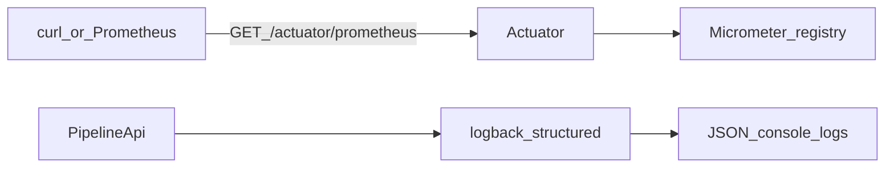

# W0-US04 TDD Guide — Structured logging + Prometheus

| Field | Value |
|-------|--------|
| **Story** | W0-US04 — Structured logging + Micrometer smoke |
| **Depends on** | W0-US02 |
| **Branch** | `W0-US04` from `wave-0` |
| **Timebox hint** | 0.5–1 day |
| **You will touch** | `micrometer-registry-prometheus`, `application.yml`, `logback-spring.xml`, ITs |
| **Architecture refs** | §5, §7 (baseline only) |
| **KB (create)** | `docs/delivery/kb/W0-US04-logging-prometheus.md` |
| **Stakeholder TDD** | [`../../WAVE_0_TDD.md`](../../WAVE_0_TDD.md) |
| **AC source** | [`../../../waves/WAVE_0.md`](../../../waves/WAVE_0.md) § W0-US04 |

---

## 1. Overview

1. **Prometheus scrape:** `GET /actuator/prometheus` returns text metrics including `jvm_memory_used_bytes`.
2. **Structured logs:** console logs are JSON (Logstash-style), not random plaintext with secrets.

**Done means:** `PrometheusEndpointIT` green; logs look like JSON; KB documents scrape URL.

**Out of scope:** Grafana / full ELK path (Wave 4).

---

## 2. Assumptions

| # | Assumption |
|---|------------|
| 1 | W0-US02 merged; Compose MySQL for ITs using `local` profile |
| 2 | Boot structured logging via `logging.structured.format.console=logstash` |
| 3 | Often last Wave 0 story if US05 already merged |

```bash
git checkout wave-0 && git pull && git checkout -b W0-US04
docker compose up -d mysql   # ITs use local profile
```

---

## 3. HLD / DFD



Data flow: scrape → Actuator prometheus → Micrometer JVM series; app logs → structured console appender → JSON lines.

---

## 4. LLD

| Component | Responsibility |
|-----------|----------------|
| `micrometer-registry-prometheus` | Prometheus meter registry |
| `application.yml` | Expose `health,info,prometheus`; structured console = logstash |
| `logback-spring.xml` | Include Boot **structured** console appender |
| `PrometheusEndpointIT` | Assert scrape body has `jvm_memory_used_bytes` |
| `StructuredLoggingSmokeTest` | Assert structured format + app name + logback on classpath |

Critical: use `structured-console-appender.xml`, not plain `console-appender.xml`.

---

## 5. API interface

| Method | Path | Notes | Response |
|--------|------|-------|----------|
| `GET` | `/actuator/prometheus` | Micrometer scrape | `200` text; includes `jvm_memory_used_bytes` |

Local scrape URL: `http://localhost:8080/actuator/prometheus`

Logging surface (not HTTP): console JSON fields (`@timestamp`, `level`, `message`).

---

## 6. Testing

| Layer | Coverage | Tools |
|-------|----------|-------|
| Integration | Prometheus scrape + JVM series | `PrometheusEndpointIT`, Compose MySQL assume |
| Config smoke | Structured format + logback present | `StructuredLoggingSmokeTest` |
| Manual | curl prometheus; watch JSON startup logs | |

---

## 7. Risks

| Risk | Mitigation |
|------|------------|
| Expose prometheus but no registry | Add `micrometer-registry-prometheus` |
| Plain console appender in logback | Use `structured-console-appender.xml` |
| Stale `target/` after yaml/logback | `./mvnw -pl pipeline-api clean test` |
| Logging DB password | Never log datasource password |

---

## 8. RED

| File | Method | Asserts |
|------|--------|---------|
| `PrometheusEndpointIT` | (GET prometheus) | 200; body contains `jvm_memory_used_bytes` |
| `StructuredLoggingSmokeTest` | (config smoke) | `logging.structured.format.console == "logstash"`; `spring.application.name == "pipeline-api"`; `logback-spring.xml` on classpath |

Same Compose MySQL assume pattern as health IT for `PrometheusEndpointIT`.

```bash
./mvnw -pl pipeline-api test -Dtest=PrometheusEndpointIT,StructuredLoggingSmokeTest
# 404 on prometheus and/or missing property
```

**Stop.** Red.

---

## 9. GREEN

1. Dependency: `io.micrometer:micrometer-registry-prometheus`.
2. `application.yml` — structured logstash console; expose `health,info,prometheus`; enable prometheus endpoint/export.
3. `logback-spring.xml` — include `org/springframework/boot/logging/logback/structured-console-appender.xml`.

```bash
./mvnw -pl pipeline-api clean test -Dtest=PrometheusEndpointIT,StructuredLoggingSmokeTest
# SUCCESS — and console shows JSON lines during the run
```

Manual:

```bash
./mvnw -pl pipeline-api spring-boot:run -Dspring-boot.run.profiles=local
curl -s http://localhost:8080/actuator/prometheus | head
# jvm_memory_used_bytes ...
```

### Checklist

- [ ] Actuator log says exposing **3** endpoints (health, info, prometheus) — if still 2, config not loaded / clean rebuild
- [ ] No passwords in log messages
- [ ] Prefer `clean test` after yaml/logback changes

---

## 10. REFACTOR

- Keep metrics tags simple (`application: pipeline-api`)
- Comment in logback that Wave 4 will extend ELK
- Re-run health + prometheus ITs together

```bash
./mvnw -pl pipeline-api test -Dtest=HealthControllerIT,PrometheusEndpointIT,StructuredLoggingSmokeTest
```

---

## 11. Docs & trackers

- [ ] KB logging + Prometheus
- [ ] Tracker Done · `U,I,M,KB`
- [ ] TEST_MATRIX W0-US04
- [ ] WAVE_0 checklist: logback + prometheus checked

| # | Action | Expected |
|---|--------|----------|
| 1 | Scrape `/actuator/prometheus` | Metrics text; JVM memory series |
| 2 | Watch console on startup | JSON fields (`@timestamp`, `level`, `message`) |

```text
merge → tag W0-US04 → delete branch
```

(Often last Wave 0 story if US05 already merged.)

---

## 12. Common pitfalls

| Mistake | Fix |
|---------|-----|
| Expose `prometheus` but no micrometer registry | Add `micrometer-registry-prometheus` |
| Custom `logback-spring.xml` includes **plain** console appender | Use `structured-console-appender.xml` |
| Stale `target/` after yaml change | `./mvnw -pl pipeline-api clean test` |
| Logging DB password | Never log datasource password |
| Expecting Grafana in this story | Out of scope (Wave 4) |

## Help / escalate

- Architecture §5, §7 baseline · stakeholder [`../../WAVE_0_TDD.md`](../../WAVE_0_TDD.md)
- Still 2 Actuator endpoints after yaml change: `clean test` / confirm config on classpath
