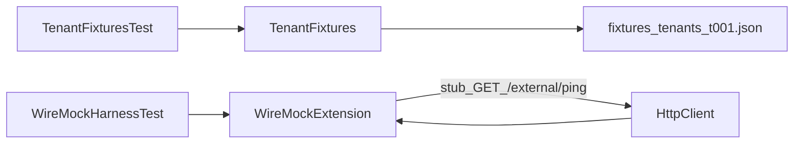

# W0-US05 TDD Guide — Mock-data fixtures + WireMock harness

| Field | Value |
|-------|--------|
| **Story** | W0-US05 — Mock-data factories + WireMock harness |
| **Depends on** | W0-US02 |
| **Branch** | `W0-US05` from `wave-0` |
| **Timebox hint** | 0.5–1 day |
| **You will touch** | fixtures JSON, `TenantFixtures`, WireMock test, `wiremock-jetty12` dep |
| **Architecture refs** | §9 (prep for connectors) |
| **KB (create)** | `docs/delivery/kb/W0-US05-mock-data-wiremock.md` |
| **Stakeholder TDD** | [`../../WAVE_0_TDD.md`](../../WAVE_0_TDD.md) |
| **AC source** | [`../../../waves/WAVE_0.md`](../../../waves/WAVE_0.md) § W0-US05 |

---

## 1. Overview

Two small test utilities for later waves:

1. **Fixture loader** — read `t001.json` from classpath → tenant id `T001`
2. **WireMock stub** — fake HTTP server returns `GET /external/ping` → `{"ok":true}`

**No Compose MySQL required** for these tests.

**Done means:** `TenantFixturesTest` and `WireMockHarnessTest` green via `./mvnw -pl pipeline-api test`.

**Out of scope:** Real network calls; Spring Boot context for these harness tests; connector plugins (Wave 1).

---

## 2. Assumptions

| # | Assumption |
|---|------------|
| 1 | W0-US02 merged (`pipeline-api` module exists) |
| 2 | Tests run without MySQL / Compose |
| 3 | Delivery sequence often does US05 before US04 |

```bash
git checkout wave-0 && git pull && git checkout -b W0-US05
```

---

## 3. HLD / DFD



Data flow: classpath JSON → fixture helper → asserts; WireMock stub → HttpClient call → status/body verify.

---

## 4. LLD

| Component | Responsibility |
|-----------|----------------|
| `fixtures/tenants/t001.json` | Deterministic tenant payload (`T001`, `demo`, `active`) |
| `TenantFixtures` | `loadT001()`, `load(relativePath)`, constant `T001` |
| `TenantFixturesTest` | Assert id/slug from classpath load |
| `WireMockHarnessTest` | `@RegisterExtension` dynamic port; stub + verify |
| `wiremock-jetty12` | Jetty 12–compatible WireMock for Boot 3.4+ |

Prefer **classpath** loading (`getResourceAsStream`), not `Path.of("src/test/...")`.

---

## 5. API interface

No production HTTP API. Test surfaces:

| Surface | Notes | Response |
|---------|-------|----------|
| Fixture JSON | `id`, `name`, `slug`, `status` | Loaded as `T001` / `demo` |
| WireMock stub | `GET /external/ping` | `200` + `{"ok":true}` |

---

## 6. Testing

| Layer | Coverage | Tools |
|-------|----------|-------|
| Unit | Fixture load id/slug | `TenantFixturesTest`, JUnit |
| WireMock | Stub + HttpClient round-trip | `WireMockHarnessTest`, `wiremock-jetty12` |
| Manual | Run both tests; skim KB “add a fixture” | |
| Integration | n/a | |

---

## 7. Risks

| Risk | Mitigation |
|------|------------|
| Plain `wiremock` → Jetty fatal on Boot 3.4+ | Use `wiremock-jetty12` |
| Filesystem fixture paths break with CWD | Classpath `fixtures/...` |
| Starting Spring Boot for WireMock | Not needed — pure JUnit + extension |
| Non-deterministic IDs | Keep `T001` / `demo` fixed |

---

## 8. RED

| File | Method | Asserts |
|------|--------|---------|
| `TenantFixturesTest` | `loadsT001` | Loaded id/slug match fixture |
| `WireMockHarnessTest` | `stub_returnsOk` | GET ping → 200 + `{"ok":true}`; request verified |

Fixture JSON (can exist before loader):

```json
{
  "id": "T001",
  "name": "Demo Tenant",
  "slug": "demo",
  "status": "active"
}
```

Path: `pipeline-api/src/test/resources/fixtures/tenants/t001.json`

WireMock: `@RegisterExtension WireMockExtension` dynamic port; stub `GET /external/ping`; call `WIRE_MOCK.baseUrl() + "/external/ping"`.

```bash
./mvnw -pl pipeline-api test -Dtest=TenantFixturesTest,WireMockHarnessTest
```

**Stop.** Red.

---

## 9. GREEN

1. `TenantFixtures` in `.../support/TenantFixtures.java` — `loadT001()`, `load(relativePath)`, constant `T001`.
2. Parent BOM / dep: **`org.wiremock:wiremock-jetty12`** (version managed).
3. Implement WireMock stub as in the test.

```bash
./mvnw -pl pipeline-api test -Dtest=TenantFixturesTest,WireMockHarnessTest
# SUCCESS
```

### Checklist

- [ ] Both tests green **without** MySQL
- [ ] Fixture IDs deterministic (`T001`)
- [ ] No real network calls to the internet

---

## 10. REFACTOR

- Keep fixture loading in one helper class
- Document in KB how to add `fixtures/<entity>/*.json`
- Optionally run full module tests

```bash
./mvnw -pl pipeline-api test
```

---

## 11. Docs & trackers

- [ ] KB mock-data + WireMock
- [ ] Tracker Done · `U,WM,M,KB`
- [ ] TEST_MATRIX W0-US05 (Unit + WireMock + Manual + KB; Integration n/a)
- [ ] WAVE_0 checklist: fixtures + WireMock checked

| # | Action | Expected |
|---|--------|----------|
| 1 | `./mvnw -pl pipeline-api test -Dtest=TenantFixturesTest,WireMockHarnessTest` | Green |
| 2 | Skim KB | Clear “how to add a fixture” |

```text
merge → tag W0-US05 → delete → next (often W0-US04)
```

---

## 12. Common pitfalls

| Mistake | Fix |
|---------|-----|
| `wiremock` artifact → Jetty fatal error | Use `wiremock-jetty12` |
| Loading fixtures with filesystem `src/test/...` | Use classpath `fixtures/...` |
| Starting Spring Boot for WireMock test | Not needed — pure JUnit + extension |
| Non-deterministic IDs | Keep `T001` / `demo` fixed |
| Committing WireMock recordings of secrets | Only stub public ping JSON |

## Help / escalate

- Architecture §9 prep · stakeholder [`../../WAVE_0_TDD.md`](../../WAVE_0_TDD.md)
- Jetty errors: confirm `wiremock-jetty12`, not plain `wiremock`
