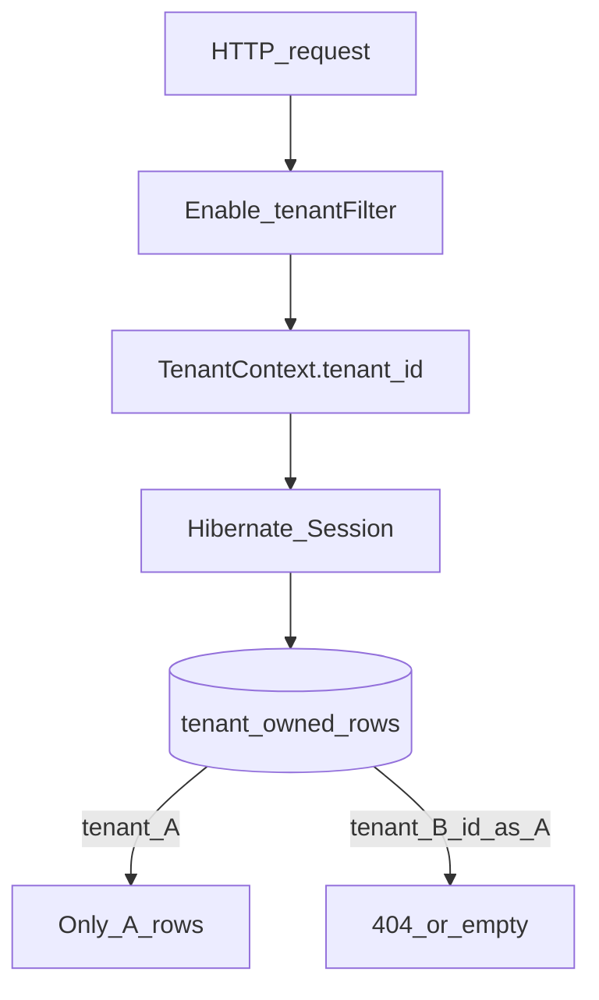

# W1-US02 TDD Guide — JPA tenant isolation filters

| Field | Value |
|-------|--------|
| **Story** | W1-US02 — JPA tenant filters block cross-tenant reads |
| **Depends on** | W1-US01 |
| **Branch** | `W1-US02` from `wave-1` |
| **Timebox hint** | 1–1.5 days |
| **You will touch** | Hibernate `@Filter`, `@TenantOwned`, interceptor/aspect, `TenantIsolationIT`, fixtures `T001`/`T002` |
| **Architecture refs** | §6.1 tenancy isolation |
| **KB (create)** | `docs/delivery/kb/W1-US02-tenant-isolation.md` |
| **Stakeholder TDD** | [`../../WAVE_1_TDD.md`](../../WAVE_1_TDD.md) |
| **AC source** | [`../../../waves/WAVE_1.md`](../../../waves/WAVE_1.md) § W1-US02 |

---

## 1. Overview

When tenant A is in context, they must **not** read tenant B’s rows. Prove with a **negative** integration test (wave exit blocker if red).

**Done means:** `TenantIsolationIT.tenantA_cannotReadTenantB` green (plus positive: B can read own row).

**Out of scope:** Full connector CRUD — a minimal owned entity (e.g. `tenant_notes`) is enough if connectors are not ready.

---

## 2. Assumptions

| # | Assumption |
|---|------------|
| 1 | US01 tenant CRUD + `TenantContext` merged |
| 2 | Two tenants available (`T001` / `T002`) |
| 3 | Isolation is at **persistence**, not only controllers |

```bash
git checkout wave-1 && git pull && git checkout -b W1-US02
docker compose up -d mysql
```

---

## 3. HLD / DFD



---

## 4. LLD

| Component | Responsibility |
|-----------|----------------|
| `@FilterDef` / `@Filter` on owned entity | `tenant_id = :tenantId` |
| `@TenantOwned` (optional marker) | Document owned tables |
| Service / interceptor | `session.enableFilter(...).setParameter(...)` |
| Filtered JPQL | Prefer `findFilteredById` over raw `findById` |

Reference shape: `TenantNote` + `/api/v1/tenant-notes`.

---

## 5. API interface

| Method | Path | Notes | Response |
|--------|------|-------|----------|
| `POST` | `/api/v1/tenant-notes` (or owned resource) | Requires `X-Tenant-Id` | `201` |
| `GET` | `/api/v1/.../{id}` | Same tenant | `200` |
| `GET` | same id as other tenant | Isolation | `404` |

---

## 6. Testing

| Layer | Coverage | Tools |
|-------|----------|-------|
| Unit | Filter parameter bound / missing context fails closed | Mockito |
| Integration | Negative + positive isolation | `TenantIsolationIT` |
| Manual | Create as T002; GET as T001 → 404 | curl |

---

## 7. Risks

| Risk | Mitigation |
|------|------------|
| Filter only in controller | Leak via repository — filter at Session |
| Missing context returns all rows | Fail closed → 401/403 |
| Native queries bypass filter | Ban or add explicit `tenant_id` |

---

## 8. RED

| File | Method | Asserts |
|------|--------|---------|
| `TenantIsolationIT` | `tenantA_cannotReadTenantB` | empty / 404 — never B’s payload |
| `TenantIsolationIT` | positive case | T002 can read B’s row |

```bash
./mvnw -pl pipeline-api test -Dtest=TenantIsolationIT
```

**Stop.** Red.

---

## 9. GREEN

1. Annotate owned entity with Hibernate filter.
2. Enable filter from `TenantContext` on each request/service call.
3. Seed A + B rows; assert isolation.

### Checklist

- [ ] Negative + positive green
- [ ] Document which entities are covered
- [ ] Missing tenant context rejected

---

## 10. REFACTOR

- Central registration of filterable entities
- Unit test for filter parameter binding
- Prefer filtered JPQL helpers

---

## 11. Docs & trackers

- [ ] KB: how isolation works + two-tenant test
- [ ] Tracker · TEST_MATRIX · link WAVE_1_TDD exit criterion

| # | Action | Expected |
|---|--------|----------|
| 1 | Create resource as T002 | 201 |
| 2 | GET as T001 | 404 |
| 3 | GET as T002 | 200 |

```text
merge → tag W1-US02 → delete → W1-US03
```

---

## 12. Common pitfalls

| Mistake | Fix |
|---------|-----|
| Filtering only in controller | Persistence-layer filter |
| Only happy-path tests | Negative test **is** the story |
| Admin list using same filter | Separate admin path/role |

## Help / escalate

- Security-sensitive: senior review on IT before merge
