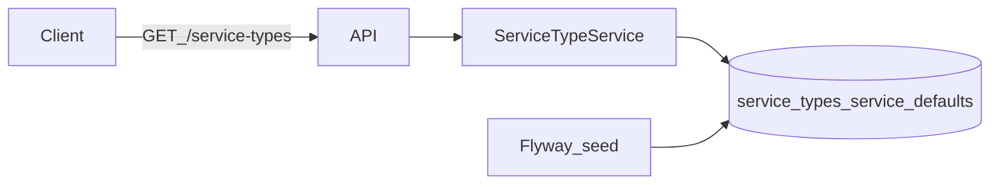

# W1-US03 TDD Guide — Service types + platform defaults

| Field | Value |
|-------|--------|
| **Story** | W1-US03 — Service types + platform default configs |
| **Depends on** | W1-US01 |
| **Branch** | `W1-US03` from `wave-1` |
| **Timebox hint** | 0.5–1 day |
| **You will touch** | `service_types` / `service_defaults` migration + seed, catalog GET API, fixtures |
| **Architecture refs** | §2 services tables, §3.4 |
| **KB (create)** | `docs/delivery/kb/W1-US03-service-types.md` |
| **Stakeholder TDD** | [`../../WAVE_1_TDD.md`](../../WAVE_1_TDD.md) |
| **AC source** | [`../../../waves/WAVE_1.md`](../../../waves/WAVE_1.md) § W1-US03 |

---

## 1. Overview

Platform catalog of **service types** (e.g. Auth vendors) plus **default configs** tenants inherit in US04.

**Done means:** `GET /api/v1/service-types` returns seeded types; IT/repo proves defaults load.

**Out of scope:** Per-tenant overrides (US04); real Auth vendor calls.

---

## 2. Assumptions

| # | Assumption |
|---|------------|
| 1 | MySQL + Flyway available |
| 2 | Start with one type: Auth + stub/okta-like vendor |
| 3 | Catalog is **global** (not tenant-filtered) — document that |

```bash
git checkout wave-1 && git pull && git checkout -b W1-US03
docker compose up -d mysql
```

---

## 3. HLD / DFD



---

## 4. LLD

| Component | Responsibility |
|-----------|----------------|
| Flyway `V3__service_types.sql` | Tables + idempotent seed |
| `ServiceType` / `ServiceDefault` entities | Catalog + defaults JSON |
| `ServiceTypeController` | Read-only list API |
| Optional fixture JSON | `fixtures/services/auth-default.json` |

---

## 5. API interface

| Method | Path | Notes | Response |
|--------|------|-------|----------|
| `GET` | `/api/v1/service-types` | Global catalog | `200` + types/vendors/schemas |

---

## 6. Testing

| Layer | Coverage | Tools |
|-------|----------|-------|
| Unit | Catalog contains Auth after seed | `ServiceTypeServiceTest` |
| Integration | GET returns non-empty catalog | `ServiceTypeControllerIT` |
| Manual | Restart app — seed idempotent | curl |

---

## 7. Risks

| Risk | Mitigation |
|------|------------|
| Non-idempotent boot seed | Prefer Flyway INSERT / upsert |
| Secrets in platform defaults | Placeholders only |

---

## 8. RED

| File | Method | Asserts |
|------|--------|---------|
| `ServiceTypeServiceTest` | `findAll_containsAuth` | Auth type present |
| `ServiceTypeControllerIT` | `list_returnsCatalog` | 200; type + vendor |

```bash
./mvnw -pl pipeline-api test -Dtest=ServiceTypeServiceTest,ServiceTypeControllerIT
```

**Stop.** Red.

---

## 9. GREEN

1. Flyway tables + seed (prefer over Java-only catalog).
2. Entity/repo/service/controller for read APIs.
3. Deterministic seed IDs.

### Checklist

- [ ] ≥1 Auth-like type seeded
- [ ] Tenant isolation N/A documented for catalog
- [ ] Restart does not duplicate keys

---

## 10. REFACTOR

- Fixture-driven seed reusable by W3 signature stories
- Clear DTO: type, vendor, `config_schema`, `default_config`

---

## 11. Docs & trackers

- [ ] KB: service type vs tenant service config
- [ ] Tracker · TEST_MATRIX · link US04

| # | Action | Expected |
|---|--------|----------|
| 1 | GET `/service-types` | Non-empty |
| 2 | Restart app | No duplicate-key errors |

```text
merge → tag W1-US03 → W1-US04
```

---

## 12. Common pitfalls

| Mistake | Fix |
|---------|-----|
| Hard-coding catalog only in Java | Prefer DB seed |
| Mixing tenant secrets into defaults | Platform-wide non-secret defaults |
| Building full OAuth | Schema/config only |

## Help / escalate

- Align naming with US04 before merge · Architecture §3.4
