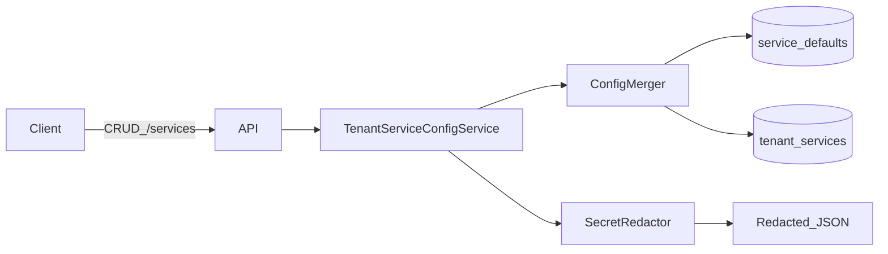

# W1-US04 TDD Guide — Tenant service config (Auth pattern)

| Field | Value |
|-------|--------|
| **Story** | W1-US04 — Tenant service config (Auth vendor pattern) |
| **Depends on** | W1-US03 |
| **Branch** | `W1-US04` from `wave-1` |
| **Timebox hint** | 1–1.5 days |
| **You will touch** | tenant services table, merge defaults+overrides, redaction, CRUD APIs |
| **Architecture refs** | §3.4, §9.3 `ServiceResolver` |
| **KB (create)** | `docs/delivery/kb/W1-US04-tenant-service-config.md` |
| **Stakeholder TDD** | [`../../WAVE_1_TDD.md`](../../WAVE_1_TDD.md) |
| **AC source** | [`../../../waves/WAVE_1.md`](../../../waves/WAVE_1.md) § W1-US04 |

---

## 1. Overview

Tenants save Auth-like service config. Responses must **never echo secrets**. Defaults from US03 merge when `inherits_default` is true.

**Done means:** Unit tests for merge + redaction; IT CRUD under tenant context.

**Out of scope:** OAuth login UI; webhook HMAC verify (W3).

---

## 2. Assumptions

| # | Assumption |
|---|------------|
| 1 | US03 catalog + defaults seeded |
| 2 | US02 tenant filter applies to tenant service rows |
| 3 | Encryption-at-rest may be stub (`encrypted:`) if documented |

```bash
git checkout wave-1 && git pull && git checkout -b W1-US04
docker compose up -d mysql
```

---

## 3. HLD / DFD



---

## 4. LLD

| Component | Responsibility |
|-----------|----------------|
| Tenant service entity/table | Per-tenant overrides + `inherits_default` |
| `ConfigMerger` | Defaults ⊕ overrides |
| `SecretRedactor` / `SecretEncryptor` | Never return raw secrets |
| Controller | Tenant-scoped CRUD |

---

## 5. API interface

| Method | Path | Notes | Response |
|--------|------|-------|----------|
| `GET` | `/api/v1/services` | Current tenant | list (redacted) |
| `POST` | `/api/v1/services` | Create | `201` redacted |
| `PUT` | `/api/v1/services/{id}` | Update | redacted |
| `DELETE` | `/api/v1/services/{id}` | Delete | `204`/`200` |

Requires `X-Tenant-Id` / `TenantContext`.

---

## 6. Testing

| Layer | Coverage | Tools |
|-------|----------|-------|
| Unit | Merge + redaction | `TenantServiceConfigServiceTest` |
| Integration | Create/get; secret absent in body; cross-tenant 404 | `TenantServiceConfigIT` |
| Manual | POST with secret → GET redacted | curl |

---

## 7. Risks

| Risk | Mitigation |
|------|------------|
| Logging config blobs | Structured logs without secret keys |
| Returning persisted JSON as-is | Always map through redactor |
| Skipping tenant filter | Reuse US02 |

---

## 8. RED

| File | Method | Asserts |
|------|--------|---------|
| `TenantServiceConfigServiceTest` | `merge_inheritsDefault` | override wins; missing from default |
| `TenantServiceConfigServiceTest` | `toResponse_redactsSecrets` | `client_secret` → `***` / omitted |
| `TenantServiceConfigIT` | `createAndGet_asTenant` | secret not in JSON |

```bash
./mvnw -pl pipeline-api test -Dtest=TenantServiceConfigServiceTest,TenantServiceConfigIT
```

**Stop.** Red.

---

## 9. GREEN

1. Migration for tenant service config.
2. Merge helper + CRUD service/controller.
3. Stub encrypt OK if documented; never log raw secret.

### Checklist

- [ ] Cross-tenant GET → 404
- [ ] Redaction unit-tested
- [ ] Spot-check logs for secrets

---

## 10. REFACTOR

- Extract `SecretRedactor`
- Align with service type `config_schema`
- Prepare W3 signature verifier → `ServiceResolver`

---

## 11. Docs & trackers

- [ ] KB: Auth fields + redaction rules + crypto stub note
- [ ] Tracker · TEST_MATRIX (WireMock n/a or optional)

| # | Action | Expected |
|---|--------|----------|
| 1 | POST with secret | 201 |
| 2 | GET | secret redacted |
| 3 | GET as other tenant | 404 |

```text
merge → tag W1-US04 → W1-US05 (or parallel US05 if staffed)
```

---

## 12. Common pitfalls

| Mistake | Fix |
|---------|-----|
| Returning persisted JSON | Response DTO + redaction |
| Over-building OAuth | Store config only |
| Skipping tenant filter | US02 must apply |

## Help / escalate

- Architecture §9.3 · security review on redaction
