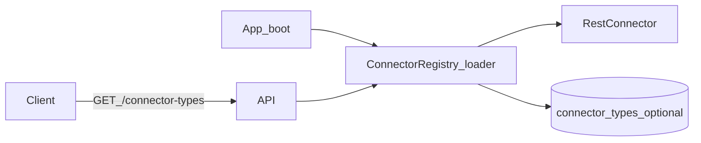

# W1-US05 TDD Guide — Connector SPI load + Rest plugin

| Field | Value |
|-------|--------|
| **Story** | W1-US05 — Connector SPI load + Rest plugin registration |
| **Depends on** | W0-US05 (WireMock harness patterns); ideally W1-US01 for tenant-owned connectors later |
| **Branch** | `W1-US05` from `wave-1` |
| **Timebox hint** | 1–2 days |
| **You will touch** | `Connector` SPI, Rest plugin, loader/registry, `connector_types` seed, unit tests |
| **Architecture refs** | §9 Connector SPI (§9.1–9.5) |
| **KB (create)** | `docs/delivery/kb/W1-US05-connector-spi.md` |
| **Stakeholder TDD** | [`../../WAVE_1_TDD.md`](../../WAVE_1_TDD.md) |
| **AC source** | [`../../../waves/WAVE_1.md`](../../../waves/WAVE_1.md) § W1-US05 |

---

## 1. Overview

A **plugin interface** (`Connector`) and one built-in **`RestConnector`** that the platform discovers/registers. `testConnection()` exists on the SPI; end-to-end `POST .../test` is US06.

**Done means:** `ConnectorSpiLoaderTest` proves Rest is registered and `getType()` returns `"rest"`.

**Out of scope:** S3/SQS plugins (US07/US08); full PF4J packaging (Spring `@Component` scan OK if documented).

---

## 2. Assumptions

| # | Assumption |
|---|------------|
| 1 | Architecture §9.1 method names are the contract |
| 2 | Rest stub may succeed without HTTP; US06 adds WireMock |
| 3 | Parallel with US03/US04 is OK if staffing allows |

```bash
git checkout wave-1 && git pull && git checkout -b W1-US05
```

SPI methods: `getType()`, `getSpiVersion()`, `configure(...)`, `testConnection()`, `read`, `write`, `close`.

---

## 3. HLD / DFD



---

## 4. LLD

| Component | Responsibility |
|-----------|----------------|
| `Connector` + result/config types | SPI contract (§9) |
| `RestConnector` | Built-in `rest` plugin |
| `ConnectorRegistry` / loader | Spring beans or `ServiceLoader` |
| Optional Flyway seed | `connector_types` row for `rest` |

Package e.g. `com.pipelineplatform.connector.spi`.

---

## 5. API interface

| Method | Path | Notes | Response |
|--------|------|-------|----------|
| `GET` | `/api/v1/connector-types` | If exposed this story | includes `rest` |

No `POST .../test` required here (US06).

---

## 6. Testing

| Layer | Coverage | Tools |
|-------|----------|-------|
| Unit | Registry loads Rest; type + clean failure without config | `ConnectorSpiLoaderTest`, `RestConnectorTest` |
| Manual | Boot logs / catalog lists `rest` | |
| Integration | Optional catalog IT | |

---

## 7. Risks

| Risk | Mitigation |
|------|------------|
| SPI drift from §9 | Align names before PR |
| Real internet in unit tests | Stub only |
| Inventing a second SPI | Ask before diverging |

---

## 8. RED

| File | Method | Asserts |
|------|--------|---------|
| `ConnectorSpiLoaderTest` | `loadsRestConnector` | registry contains `rest` |
| `RestConnectorTest` | `getType_isRest` | `"rest"` |
| `RestConnectorTest` | `testConnection_withoutConfig_failsCleanly` | failed result, not NPE |

```bash
./mvnw -pl pipeline-api test -Dtest=ConnectorSpiLoaderTest,RestConnectorTest
```

**Stop.** Red.

---

## 9. GREEN

1. SPI types: `Connector`, `ConnectionTestResult`, `ConnectorConfig`, `ConnectorContext`.
2. `RestConnector` implements SPI.
3. Registry/loader registers Rest once at startup.
4. Optional: seed `connector_types` for `rest`.

### Checklist

- [ ] SPI matches §9 closely
- [ ] Rest registered once
- [ ] No real external internet in unit tests

---

## 10. REFACTOR

- Keep SPI free of Spring annotations when possible
- Shared package for Storage/MessageBus
- Document “Spring registration now; PF4J later” if deferred

---

## 11. Docs & trackers

- [ ] KB: how to add a connector plugin
- [ ] Tracker · TEST_MATRIX (WireMock n/a until US06)
- [ ] Link US06 as next

| # | Action | Expected |
|---|--------|----------|
| 1 | Boot app; log registry | `rest` listed |
| 2 | `GET /connector-types` (if exposed) | includes rest |

```text
merge → tag W1-US05 → W1-US06
```

---

## 12. Common pitfalls

| Mistake | Fix |
|---------|-----|
| Class with no registry | Loader test fails — register it |
| AWS SDK in Rest plugin | Wrong story |
| Breaking SPI vs §9 | Align before PR |
| Fat HTTP client in constructor | Inject client; easier to mock |

## Help / escalate

- Architecture §9 — source of truth · Ask before inventing a second SPI
