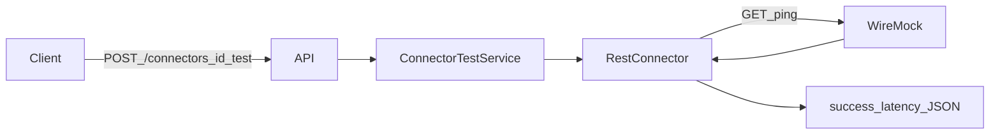

# W1-US06 TDD Guide — Connector test vs WireMock

| Field | Value |
|-------|--------|
| **Story** | W1-US06 — `POST /connectors/{id}/test` against WireMock |
| **Depends on** | W1-US05; W0-US05 WireMock; W1-US01/02 for tenant-owned connectors |
| **Branch** | `W1-US06` from `wave-1` |
| **Timebox hint** | 1 day |
| **You will touch** | connector CRUD (minimal), `POST .../test`, Rest HTTP, WireMock IT |
| **Architecture refs** | §3.3 Test Connection response shape |
| **KB (create)** | `docs/delivery/kb/W1-US06-connector-test-wiremock.md` |
| **Stakeholder TDD** | [`../../WAVE_1_TDD.md`](../../WAVE_1_TDD.md) |
| **AC source** | [`../../../waves/WAVE_1.md`](../../../waves/WAVE_1.md) § W1-US06 |

---

## 1. Overview

Create a Rest connector pointing at WireMock. Call **`POST /api/v1/connectors/{id}/test`**. Platform hits WireMock (`/external/ping` → `{"ok":true}`) and returns success JSON with latency.

**Done means:** `RestConnectorTestIT` green; response matches architecture success shape.

**Out of scope:** Real external IdP; Storage/MessageBus plugins.

---

## 2. Assumptions

| # | Assumption |
|---|------------|
| 1 | US05 SPI + Rest registered |
| 2 | W0 WireMock pattern: `GET /external/ping` → 200 `{"ok":true}` |
| 3 | Connector persistence (`connectors` / Flyway) if not already present |
| 4 | US02 tenant filter applies |

```bash
git checkout wave-1 && git pull && git checkout -b W1-US06
docker compose up -d mysql
```

---

## 3. HLD / DFD



---

## 4. LLD

| Component | Responsibility |
|-----------|----------------|
| Connector entity/table | Tenant-owned Rest config (`baseUrl`, path) |
| Controller `POST .../test` | Load by id + tenant; call SPI |
| `RestConnector.testConnection` | HTTP to WireMock ping |
| Response mapper | Architecture §3.3 shape |

IT setup: `WireMockExtension` → stub ping → connector `baseUrl = wireMock.baseUrl()`.

---

## 5. API interface

| Method | Path | Notes | Response |
|--------|------|-------|----------|
| `POST` | `/api/v1/connectors/{id}/test` | Current tenant | `{ success, latency_ms, message, tested_at }` |
| CRUD | `/api/v1/connectors` | Minimal for IT | create/get |

Example success:

```json
{
  "success": true,
  "latency_ms": 142,
  "message": "Connection successful",
  "tested_at": "..."
}
```

---

## 6. Testing

| Layer | Coverage | Tools |
|-------|----------|-------|
| Unit | HTTP failure → `success: false` | `RestConnectorTest` |
| Integration | POST test vs WireMock; verify request | `RestConnectorTestIT` |
| Isolation | Tenant B cannot test A’s connector | 404 |
| Manual | Optional curl + WireMock | |

---

## 7. Risks

| Risk | Mitigation |
|------|------------|
| Hard-coded WireMock port | Use `WIRE_MOCK.baseUrl()` |
| Missing tenant filter | Reuse US02 |
| Real internet calls | WireMock only |

---

## 8. RED

| File | Method | Asserts |
|------|--------|---------|
| `RestConnectorTestIT` | `test_returnsSuccess_againstWireMock` | `success: true`; WireMock got `/external/ping` |
| `RestConnectorTest` | `testConnection_mapsHttpFailure` | 500 → success false |

```bash
./mvnw -pl pipeline-api test -Dtest=RestConnectorTestIT,RestConnectorTest
```

**Stop.** Red.

---

## 9. GREEN

1. RestConnector HTTP client GET/POST ping from config.
2. `POST /connectors/{id}/test` loads connector for current tenant → SPI.
3. Map to §3.3 JSON shape.

### Checklist

- [ ] Cross-tenant test → 404
- [ ] WireMock verify request happened
- [ ] No real internet calls

---

## 10. REFACTOR

- Share ping path constant with W0 harness docs
- URL join helper
- Timeout config for test calls

---

## 11. Docs & trackers

- [ ] KB: point Rest connector at WireMock locally
- [ ] Tracker Done · `U,I,WM,M,KB`
- [ ] TEST_MATRIX WireMock column

| # | Action | Expected |
|---|--------|----------|
| 1 | Run IT | Green |
| 2 | Optional manual WireMock + curl | `success: true` |

```text
merge → tag W1-US06 → W1-US07
```

---

## 12. Common pitfalls

| Mistake | Fix |
|---------|-----|
| Hard-coding `localhost:8080` for WireMock | Use extension `baseUrl()` |
| Forgetting tenant filter on get | Isolation bug |
| Treating WireMock as Spring Boot app | JUnit extension only |
| Asserting only HTTP 200 | Check `success` field |

## Help / escalate

- W0-US05 WireMock guide · Architecture §3.3
