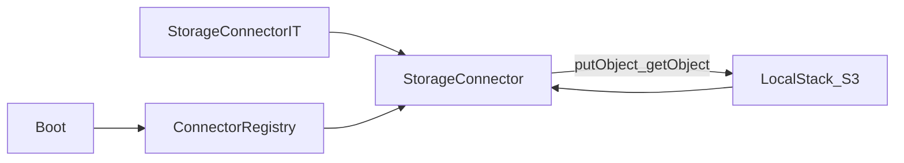

# W1-US07 TDD Guide — Storage connector vs LocalStack S3

| Field | Value |
|-------|--------|
| **Story** | W1-US07 — Storage connector put/get against LocalStack S3 |
| **Depends on** | W1-US05; W0-US01 LocalStack |
| **Branch** | `W1-US07` from `wave-1` |
| **Timebox hint** | 1–1.5 days |
| **You will touch** | `StorageConnector`, AWS SDK S3 client, LocalStack endpoint, IT |
| **Architecture refs** | §9.5 `storage` / S3; §10.6 LocalStack |
| **KB (create)** | `docs/delivery/kb/W1-US07-storage-localstack.md` |
| **Stakeholder TDD** | [`../../WAVE_1_TDD.md`](../../WAVE_1_TDD.md) |
| **AC source** | [`../../../waves/WAVE_1.md`](../../../waves/WAVE_1.md) § W1-US07 |

---

## 1. Overview

A **Storage** connector plugin that **put**s an object and **get**s it back using LocalStack S3 (not real AWS).

**Done means:** `StorageConnectorIT.putGet_roundTrip` green against Compose LocalStack.

**Out of scope:** Real AWS accounts; MessageBus/SQS (US08).

---

## 2. Assumptions

| # | Assumption |
|---|------------|
| 1 | US05 SPI registry exists |
| 2 | LocalStack host port **4567** (container 4566) |
| 3 | Creds `test`/`test`, region `us-east-1` |
| 4 | IT uses `assumeTrue` when LocalStack down |

```bash
git checkout wave-1 && git pull && git checkout -b W1-US07
docker compose up -d localstack
./scripts/smoke-localstack.sh
```

---

## 3. HLD / DFD



---

## 4. LLD

| Component | Responsibility |
|-----------|----------------|
| `StorageConnector` | SPI type `storage`; write/read/testConnection |
| AWS SDK v2 S3 client | `endpointOverride`, path-style, static creds |
| Config JSON | `bucket`, `endpoint`, `region` |
| Registry + optional seed | `ct-storage` / type `storage` |

---

## 5. API interface

SPI-focused story; optional catalog exposure:

| Surface | Notes |
|---------|--------|
| `getType()` | `"storage"` |
| `write` / `read` | putObject / getObject |
| `testConnection` | head bucket or list |
| `GET /connector-types` | includes storage if seeded |

---

## 6. Testing

| Layer | Coverage | Tools |
|-------|----------|-------|
| Unit | `getType_isStorage` | `StorageConnectorTest` |
| Integration | put/get round-trip | `StorageConnectorIT` |
| Manual | smoke script + optional `awslocal s3 ls` | |

---

## 7. Risks

| Risk | Mitigation |
|------|------------|
| Hitting real AWS | Force LocalStack endpoint |
| Wrong host port | Use **4567**, not 4566 on host |
| Path-style / signature errors | Enable path-style for LocalStack |
| Flaky first call | Wait for health like smoke script |

---

## 8. RED

| File | Method | Asserts |
|------|--------|---------|
| `StorageConnectorIT` | `putGet_roundTrip` | put bytes; get same bytes |
| `StorageConnectorTest` | `getType_isStorage` | `"storage"` |

```bash
./mvnw -pl pipeline-api test -Dtest=StorageConnectorIT,StorageConnectorTest
```

**Stop.** Red.

---

## 9. GREEN

1. Implement `StorageConnector` (`getType()` → `storage`).
2. S3 client: endpoint override, path-style, test/test creds.
3. `write` → putObject; `read` → getObject; `testConnection` → head/list.
4. Register + optional `connector_types` seed.
5. Idempotent test bucket (create if missing).

### Checklist

- [ ] LocalStack endpoint, not `s3.amazonaws.com`
- [ ] Idempotent test bucket
- [ ] Registered in SPI loader (extend US05 or new)

---

## 10. REFACTOR

- Shared `LocalStackS3ClientFactory`
- Align env with smoke script (`LOCALSTACK_ENDPOINT`)
- Keep credentials out of logs

---

## 11. Docs & trackers

- [ ] KB: endpoint + sample connector config
- [ ] Tracker Done · `U,I,LS,M,KB`
- [ ] TEST_MATRIX LocalStack

| # | Action | Expected |
|---|--------|----------|
| 1 | `./scripts/smoke-localstack.sh` | Exit 0 |
| 2 | Run IT | Green |
| 3 | Optional `awslocal s3 ls` | See test objects |

```text
merge → tag W1-US07 → W1-US08 (Should) or wave exit prep
```

---

## 12. Common pitfalls

| Mistake | Fix |
|---------|-----|
| Hitting real AWS | Wrong endpoint / missing override |
| Port 4566 on host | This project uses **4567** |
| Signature / path-style errors | Enable path-style |
| Skipping `assumeTrue` | Breaks CI without Docker |

## Help / escalate

- W0-US01 smoke + KB · AWS SDK LocalStack path-style docs
