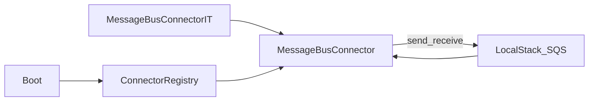

# W1-US08 TDD Guide — MessageBus connector vs LocalStack SQS (Should)

| Field | Value |
|-------|--------|
| **Story** | W1-US08 — MessageBus connector publish against LocalStack SQS |
| **Priority** | **Should** (can defer with tracker note if needed) |
| **Depends on** | W1-US05; W0-US01 LocalStack |
| **Branch** | `W1-US08` from `wave-1` |
| **Timebox hint** | 0.5–1 day |
| **You will touch** | `MessageBusConnector`, SQS client, IT publish+receive |
| **Architecture refs** | §9.5 `message_bus`; LocalStack SQS |
| **KB (create)** | `docs/delivery/kb/W1-US08-messagebus-sqs.md` |
| **Stakeholder TDD** | [`../../WAVE_1_TDD.md`](../../WAVE_1_TDD.md) |
| **AC source** | [`../../../waves/WAVE_1.md`](../../../waves/WAVE_1.md) § W1-US08 |

---

## 1. Overview

A **MessageBus** connector that **publishes** a message to a LocalStack SQS queue (and ideally receives/verifies it in the IT).

**Done means:** `MessageBusConnectorIT.publish_succeeds` green.

**Out of scope:** Platform inter-stage RabbitMQ (Wave 2). This story is the **external** SQS-style connector via LocalStack.

---

## 2. Assumptions

| # | Assumption |
|---|------------|
| 1 | US05 SPI registry exists |
| 2 | LocalStack up; smoke script passes |
| 3 | Should priority — defer only with tracker note |
| 4 | Distinct from Wave 2 RabbitMQ topology |

```bash
git checkout wave-1 && git pull && git checkout -b W1-US08
docker compose up -d localstack
./scripts/smoke-localstack.sh
```

---

## 3. HLD / DFD



---

## 4. LLD

| Component | Responsibility |
|-----------|----------------|
| `MessageBusConnector` | SPI type `message_bus`; publish/write; testConnection |
| SQS client | LocalStack endpoint, region, creds |
| Config | `queueUrl` or `queueName`, endpoint, region |
| Registry + seed | `ct-message-bus` |

Prefer shared LocalStack client factory with US07.

---

## 5. API interface

| Surface | Notes |
|---------|--------|
| `getType()` | `"message_bus"` |
| `write` / publish | Send to SQS |
| `testConnection` | Get queue attributes (optional) |
| `GET /connector-types` | includes message_bus if seeded |

---

## 6. Testing

| Layer | Coverage | Tools |
|-------|----------|-------|
| Unit | `getType_isMessageBus` | `MessageBusConnectorTest` |
| Integration | publish (+ receive same body) | `MessageBusConnectorIT` |
| Manual | smoke script SQS ops | |

---

## 7. Risks

| Risk | Mitigation |
|------|------------|
| Publishing to RabbitMQ | Wrong broker — use SQS/LocalStack |
| Confusing platform queues with connector | Document in KB |
| Silent deferral of Should | Always record in tracker |

---

## 8. RED

| File | Method | Asserts |
|------|--------|---------|
| `MessageBusConnectorIT` | `publish_succeeds` | publish OK; receive same body (or test + publish) |
| `MessageBusConnectorTest` | `getType_isMessageBus` | `"message_bus"` |

```bash
./mvnw -pl pipeline-api test -Dtest=MessageBusConnectorIT,MessageBusConnectorTest
```

**Stop.** Red.

---

## 9. GREEN

1. Implement `MessageBusConnector` with SQS → LocalStack.
2. Config: queue URL/name, endpoint, region.
3. `write`/publish on SPI; `testConnection` can get queue attributes.
4. Register plugin + seed type.

### Checklist

- [ ] Naming aligned (`message_bus`)
- [ ] LocalStack only
- [ ] Tracker notes if deferred

---

## 10. REFACTOR

- Share LocalStack client config with Storage factory
- KB: SQS connector ≠ RabbitMQ topology

---

## 11. Docs & trackers

- [ ] KB short note
- [ ] If deferred: WAVE_TRACKER Blockers = “Should deferred” + reason
- [ ] TEST_MATRIX when Done

| # | Action | Expected |
|---|--------|----------|
| 1 | Smoke script | SQS queue ops OK |
| 2 | IT | Green |

```text
merge → tag W1-US08 → prepare wave-1 exit / PR
```

Wave 1 exit still requires: isolation, Rest WireMock test, S3 round-trip, connector KB. US08 is Should.

---

## 12. Common pitfalls

| Mistake | Fix |
|---------|-----|
| Publishing to RabbitMQ for this story | Use SQS/LocalStack |
| Confusing platform queues with connector | Document in KB |
| Skipping Should without tracker note | Always record deferral |

## Help / escalate

- Confirm queue naming with architecture · Reuse US07 LocalStack lessons
