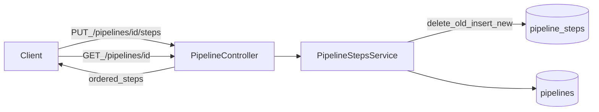

# W2-US02 TDD Guide — Pipeline steps config API

| Field | Value |
|-------|--------|
| **Story** | W2-US02 — Put steps / connector_ids / queues metadata |
| **Depends on** | W2-US01 |
| **Branch** | `W2-US02` from `wave-2` |
| **Timebox hint** | 1 day |
| **You will touch** | `pipeline_steps`, `PUT /pipelines/{id}/steps` |
| **Architecture refs** | §2 `pipeline_steps`, §3.1, §10.3 |
| **KB (create)** | `docs/delivery/kb/W2-US02-pipeline-steps.md` |
| **Stakeholder TDD** | [`../../WAVE_2_TDD.md`](../../WAVE_2_TDD.md) |
| **AC source** | [`../../../waves/WAVE_2.md`](../../../waves/WAVE_2.md) § W2-US02 |

---

## 1. Overview

Replace the full step sequence for a pipeline (Source → Processor → Destination). Store `step_order`, connector/service id arrays, and queue name fields (may be placeholders until US03 declares RabbitMQ).

**Important:** a step is the **configuration of a pipelet** for this pipeline — not the pipelet registry row itself. At run time (US04/US05) each step becomes a Job/Pod (`pipelet_id` → image, `config` / connectors / queues / `resource_limits` → pod env and limits). See architecture §2 `pipeline_steps` and §10.3.

**Done means:** `PipelineStepsServiceTest` + IT replace steps and GET pipeline returns them.

**Out of scope:** Declaring Rabbit topology; running the pipeline; validating `pipelet_id` against a registry FK.

---

## 2. Assumptions

| # | Assumption |
|---|------------|
| 1 | W2-US01 pipeline CRUD + tenant filter merged |
| 2 | Compose MySQL up; stub auth `X-Tenant-Id` |
| 3 | Queue names may stay nullable/placeholder until US03 |

```bash
git checkout wave-2 && git pull && git checkout -b W2-US02
docker compose up -d mysql
```

---

## 3. HLD / DFD



Data flow: PUT full-replace → transactional delete+insert → GET pipeline returns steps ordered by `step_order`.

---

## 4. LLD

| Component | Responsibility |
|-----------|----------------|
| `PipelineStep` + repository | Persist steps; FK to pipelines; unique `(pipeline_id, step_order)` |
| `PipelineStepsService` | Full-replace semantics; validate tenant ownership; bump `version` |
| Controller | `PUT /api/v1/pipelines/{id}/steps`; GET pipeline includes `steps` |
| Flyway `pipeline_steps` | Schema for order, connectors, queues, config, limits |

---

## 5. API interface

| Method | Path | Notes | Response |
|--------|------|-------|----------|
| `PUT` | `/api/v1/pipelines/{id}/steps` | Full replace (not partial) | `200`; `version` bumped |
| `GET` | `/api/v1/pipelines/{id}` | Includes ordered `steps` | `200` |
| `PUT` | same as other tenant | Isolation | `404` |
| `PUT` | `"steps":[]` | Empty rejected | `400` |

Auth stub: `X-Tenant-Id` header in `local`/`test`.

---

## 6. Testing

| Layer | Coverage | Tools |
|-------|----------|-------|
| Unit | Order 1..n unique; empty rejected | JUnit, Mockito |
| Integration | PUT then GET returns ordered steps; cross-tenant 404 | `@SpringBootTest`, Compose MySQL |
| Manual | PUT 3 steps; GET; empty; other tenant | |

---

## 7. Risks

| Risk | Mitigation |
|------|------------|
| Partial update API | Architecture is full replace only |
| Skipping tenant check on pipeline id | Isolation bug — validate ownership |
| Allowing empty steps | Prefer `@NotEmpty` for 3-stage fixture later |

---

## 8. RED

| File | Method | Asserts |
|------|--------|---------|
| `PipelineStepsServiceTest` | `replace_ordersSteps` | order 1..n unique |
| `PipelineStepsIT` | `putSteps_thenGetPipeline` | steps in response |

```bash
./mvnw -pl pipeline-api test -Dtest=PipelineStepsServiceTest,PipelineStepsIT
```

**Stop.** Red.

---

## 9. GREEN

1. Flyway `pipeline_steps` (FK to pipelines; unique `(pipeline_id, step_order)`).
2. Replace semantics: delete old steps, insert new (transactional).
3. Validate pipeline belongs to current tenant.

### Checklist

- [ ] Cross-tenant PUT → 404
- [ ] Empty steps rejected (prefer `@NotEmpty` for 3-stage fixture later)
- [ ] Increment pipeline `version` on save
- [ ] Tests green with MySQL up

---

## 10. REFACTOR

- Sort by `step_order` before insert; reject duplicate orders in service
- Keep request/response JSON snake_case aligned with architecture §3.1
- Leave queue names nullable/placeholder until US03 `QueueNaming` fills them

---

## 11. Docs & trackers

- [ ] KB: full-replace semantics + empty rejected + step ≠ pipelet
- [ ] Tracker · TEST_MATRIX · `WAVE_2.md` Done

| # | Action | Expected |
|---|--------|----------|
| 1 | PUT 3 steps on a pipeline | 200; `version` bumped |
| 2 | GET pipeline | `steps` ordered 1..3 |
| 3 | PUT as other tenant | 404 |
| 4 | PUT `"steps":[]` | 400 |

```text
merge → tag W2-US02 → delete → W2-US03
```

---

## 12. Common pitfalls

| Mistake | Fix |
|---------|-----|
| Partial update API | Architecture is full replace |
| Skipping tenant check on pipeline id | Isolation bug |
| Allowing empty steps | Breaks later 3-stage fixture |
| Treating step as pipelet registry row | Step = per-pipeline pipelet config |

## Help / escalate

- Architecture §2 `pipeline_steps`, §3.1, §10.3 · W2-US01 pipeline ownership
