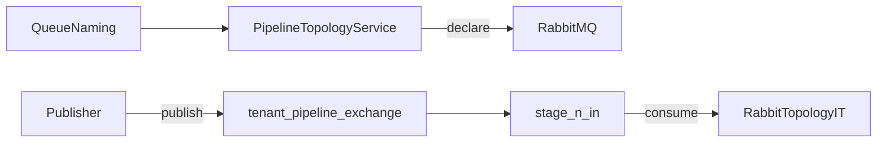

# W2-US03 TDD Guide — Inter-stage RabbitMQ topology

| Field | Value |
|-------|--------|
| **Story** | W2-US03 — Tenant-prefixed exchanges/queues; publish/consume |
| **Depends on** | W2-US02 |
| **Branch** | `W2-US03` from `wave-2` |
| **Timebox hint** | 1–1.5 days |
| **You will touch** | RabbitMQ naming builder, topology declarer, IT |
| **Architecture refs** | §5.1 broker pluggable; §8 messaging; appendix topology |
| **KB (create)** | `docs/delivery/kb/W2-US03-rabbit-topology.md` |
| **Stakeholder TDD** | [`../../WAVE_2_TDD.md`](../../WAVE_2_TDD.md) |
| **AC source** | [`../../../waves/WAVE_2.md`](../../../waves/WAVE_2.md) § W2-US03 |

---

## 1. Overview

Declare **tenant-prefixed** stage destinations on the **platform message broker** and prove publish → consume works. Wave 2’s default broker is **RabbitMQ** (Compose/Testcontainers); architecture §5.1 makes the broker pluggable (Kafka, SQS, Event Hubs, ActiveMQ, …) via a future SPI — do not hard-wire product assumptions into pipeline/step APIs.

**Done means:** `RabbitTopologyIT.declareAndPublish` green (RabbitMQ adapter).

**Out of scope:** Full run orchestrator (US04); webhook queues (W3) — but share naming helpers; non-RabbitMQ adapters.

---

## 2. Assumptions

| # | Assumption |
|---|------------|
| 1 | W2-US02 steps API merged (queue fields may be placeholders) |
| 2 | Compose RabbitMQ on `5672` / mgmt `15672` (`pipeline`/`pipeline`) |
| 3 | LocalStack (`4567`) is for connector SQS — **not** platform stage broker |
| 4 | Naming helpers will be reused by W3 webhooks |

```bash
git checkout wave-2 && git pull && git checkout -b W2-US03
docker compose up -d mysql rabbitmq
# mgmt http://localhost:15672 pipeline/pipeline
```

Target names (architecture appendix):

```text
Exchange: tenant.{tenantId}.pipeline.{pipelineId}
Queue:    ...stage.{n}.in
DLQ:      ...stage.{n}.dlq   (declare now; DLX wiring in US06)
```

---

## 3. HLD / DFD



Data flow: naming builder → declare exchange/queues → publish → consume round-trip in IT.

---

## 4. LLD

| Component | Responsibility |
|-----------|----------------|
| `QueueNaming` | Pure builder for tenant-prefixed exchange/queue/DLQ names |
| `PipelineTopologyService` | Idempotent declare from step queues or generated names |
| Spring AMQP / `AmqpAdmin` | Declare + publish (Boot auto-config) |
| Persist queue names | Fill step placeholders if still null |

---

## 5. API interface

| Surface | Notes |
|---------|--------|
| `QueueNaming` | `tenant.{tenantId}.pipeline.{pipelineId}` + `stage.{n}.in` / `.dlq` |
| Topology declare | Idempotent; called when steps/run need destinations |
| IT publish/consume | Prove round-trip on RabbitMQ |
| (No new public REST) | Topology is internal; steps may store resolved queue names |

---

## 6. Testing

| Layer | Coverage | Tools |
|-------|----------|-------|
| Unit | Names include `tenant_id` | `QueueNamingTest` |
| Integration | Declare + publish → consume | `RabbitTopologyIT` (port 5672) |
| Manual | Mgmt UI shows `tenant.*.pipeline.*` after IT | |

---

## 7. Risks

| Risk | Mitigation |
|------|------------|
| Global queue names | Always tenant-prefix |
| Using LocalStack SQS for stages | Wrong broker — RabbitMQ for platform stages |
| Binding stub worker to every stage exchange | Breaks topology IT receive asserts |
| Hard-wiring Rabbit into step APIs | Keep broker pluggable per §5.1 |

---

## 8. RED

| File | Method | Asserts |
|------|--------|---------|
| `QueueNamingTest` | `includesTenantId` | name contains tenant |
| `RabbitTopologyIT` | `declareAndPublish` | message round-trip |

```bash
./mvnw -pl pipeline-api test -Dtest=QueueNamingTest,RabbitTopologyIT
```

**Stop.** Red.

---

## 9. GREEN

1. Spring AMQP dependency if missing (`spring-boot-starter-amqp`).
2. `QueueNaming` / `PipelineTopologyService` from step queues or generated names.
3. Persist resolved queue names onto steps if still placeholders.
4. IT: `assumeTrue` RabbitMQ port 5672 (same pattern as MySQL).

### Checklist

- [ ] Names include `tenant_id`
- [ ] Idempotent declare
- [ ] Shared builder documented for W3 (webhook helpers OK)
- [ ] Tests green with RabbitMQ up

---

## 10. REFACTOR

- Keep `QueueNaming` free of Spring (unit-testable)
- Inject `AmqpAdmin` (Boot auto-config), not a custom `RabbitAdmin` bean unless needed
- Disable rabbit health indicator if non-messaging ITs fail when broker is down

---

## 11. Docs & trackers

- [ ] KB: naming table + Compose ports (`5672` / `15672`)
- [ ] Tracker · TEST_MATRIX · note W3 reuses `QueueNaming.webhook*`
- [ ] Mark Done in `WAVE_2.md`

| # | Action | Expected |
|---|--------|----------|
| 1 | `docker compose up -d rabbitmq` | healthy on 5672 / 15672 |
| 2 | Run `RabbitTopologyIT` | green |
| 3 | Mgmt UI → Exchanges | `tenant.*.pipeline.*` present after IT |

```text
merge → tag W2-US03 → W2-US04 (and/or US06 in parallel)
```

---

## 12. Common pitfalls

| Mistake | Fix |
|---------|-----|
| Global queue names | Always tenant-prefix |
| Using LocalStack SQS (port 4567) | Wrong broker — RabbitMQ for platform stages |
| Binding stub worker to every stage exchange | Breaks topology IT receive asserts |

## Help / escalate

- Architecture §5.1, §8, appendix topology · Compose RabbitMQ credentials
