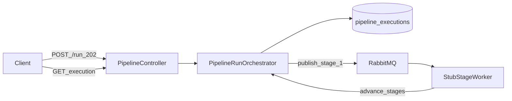

# W2-US04 TDD Guide — Async run orchestration

| Field | Value |
|-------|--------|
| **Story** | W2-US04 — Async `POST .../run` orchestration across stages |
| **Depends on** | W2-US03 |
| **Branch** | `W2-US04` from `wave-2` |
| **Timebox hint** | 1.5–2 days |
| **You will touch** | `pipeline_executions`, run endpoint, orchestrator |
| **Architecture refs** | §3.1 run, §8 async |
| **KB (create)** | `docs/delivery/kb/W2-US04-async-run.md` |
| **Stakeholder TDD** | [`../../WAVE_2_TDD.md`](../../WAVE_2_TDD.md) |
| **AC source** | [`../../../waves/WAVE_2.md`](../../../waves/WAVE_2.md) § W2-US04 |

---

## 1. Overview

`POST /api/v1/pipelines/{id}/run` creates an execution and drives stages asynchronously via RabbitMQ. HTTP returns quickly with an execution id; fixture 3-stage pipeline eventually reaches a terminal state (full `completed` may need US05 stub).

**Done means:** Run IT starts execution; status progresses (or completes with stub workers).

**Out of scope:** Real K8s Jobs (US05); status list polish (US07 can deepen).

---

## 2. Assumptions

| # | Assumption |
|---|------------|
| 1 | W2-US03 topology declare + publish/consume works |
| 2 | Pipeline must be **`active`** with steps configured |
| 3 | Compose MySQL + RabbitMQ up; stub auth `X-Tenant-Id` |
| 4 | Awaitility waits are bounded (no infinite hang) |

```bash
git checkout wave-2 && git pull && git checkout -b W2-US04
docker compose up -d mysql rabbitmq
```

---

## 3. HLD / DFD



Data flow: POST run → create execution → publish stage 1 → stub worker advances → poll status until terminal.

---

## 4. LLD

| Component | Responsibility |
|-----------|----------------|
| `pipeline_executions` (Flyway) | Persist execution id, status, timestamps |
| `PipelineRunOrchestrator` | Start run; publish first stage; complete |
| `StubStageWorker` | Consume and hand off stages (async) |
| `StageMessage` | Small JSON-friendly stage payload |
| Controller | `POST .../run` → 202; minimal GET execution |

---

## 5. API interface

| Method | Path | Notes | Response |
|--------|------|-------|----------|
| `POST` | `/api/v1/pipelines/{id}/run` | Pipeline must be `active` with steps | `202` + `execution_id` |
| `GET` | `/api/v1/pipelines/{id}/executions/{executionId}` | Minimal status (US07 expands list) | `200` |
| `POST` | run as other tenant | Isolation | `404` |
| `POST` | draft/archived / empty steps | Rejected | `400` |

Auth stub: `X-Tenant-Id` header in `local`/`test`.

---

## 6. Testing

| Layer | Coverage | Tools |
|-------|----------|-------|
| Unit | Start creates execution `running`/`pending` | `PipelineRunOrchestratorTest` |
| Integration | 202 + id; eventually terminal | `PipelineRunIT`, Awaitility ≤ 15s |
| Manual | activate → run → poll → other-tenant 404 | |

---

## 7. Risks

| Risk | Mitigation |
|------|------------|
| Blocking HTTP until completed | Return 202 immediately |
| Infinite Awaitility | Bound timeout + fail fast (`atMost` ≤ 15s) |
| Allowing draft run | Require `active` |
| Flaky async waits | Deterministic stub worker + bounded await |

---

## 8. RED

| File | Method | Asserts |
|------|--------|---------|
| `PipelineRunOrchestratorTest` | `start_createsExecution` | status `running`/`pending` |
| `PipelineRunIT` | `run_returnsExecutionId` | 202 + id; eventually terminal |

```bash
./mvnw -pl pipeline-api test -Dtest=PipelineRunOrchestratorTest,PipelineRunIT
```

**Stop.** Red.

---

## 9. GREEN

1. Flyway `pipeline_executions` if not already added.
2. Orchestrator publishes to first stage; stub consumer advances stages.
3. Bound timeouts (Awaitility) — no infinite wait.

### Checklist

- [ ] Tenant isolation on run → 404
- [ ] Draft/archived pipeline rejected → 400
- [ ] Empty steps rejected
- [ ] Awaitility `atMost` ≤ 15s
- [ ] Tests green with MySQL + RabbitMQ up

---

## 10. REFACTOR

- Separate `PipelineRunOrchestrator` (start/complete) from `StubStageWorker` (handoff)
- Keep stage payload (`StageMessage`) small and JSON-friendly
- Defer real Job spawn to US05 behind an interface if you already see the seam

---

## 11. Docs & trackers

- [ ] KB: activate-before-run + stub worker note
- [ ] Tracker · TEST_MATRIX · link US05 (Jobs) and US07 (list executions)
- [ ] Mark Done in `WAVE_2.md`

| # | Action | Expected |
|---|--------|----------|
| 1 | Create pipeline → PUT steps → PUT `status=active` | 200 |
| 2 | `POST .../run` | 202 + `execution_id` |
| 3 | Poll GET execution | reaches `completed` (with stub) |
| 4 | Run as other tenant | 404 |

```text
merge → tag W2-US04 → W2-US05 / W2-US07
```

---

## 12. Common pitfalls

| Mistake | Fix |
|---------|-----|
| Blocking HTTP until completed | Return 202 immediately |
| Infinite Awaitility | Bound timeout + fail fast |
| Allowing draft run | Require `active` |

## Help / escalate

- Architecture §3.1 run, §8 async · W2-US03 topology · Awaitility patterns from Wave 0/1 ITs
