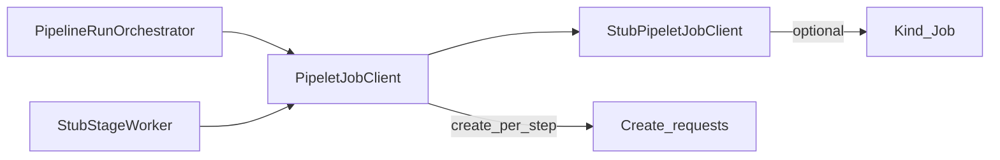

# W2-US05 TDD Guide — Pipelet Job spawn (Kind/stub)

| Field | Value |
|-------|--------|
| **Story** | W2-US05 — Create pipelet Job/Pod (Kind or stub) |
| **Depends on** | W2-US04 |
| **Branch** | `W2-US05` from `wave-2` |
| **Timebox hint** | 1 day |
| **You will touch** | `PipeletJobClient` interface + stub/Kind impl |
| **Architecture refs** | §10.3 |
| **KB (create)** | `docs/delivery/kb/W2-US05-pipelet-job.md` |
| **Stakeholder TDD** | [`../../WAVE_2_TDD.md`](../../WAVE_2_TDD.md) |
| **AC source** | [`../../../waves/WAVE_2.md`](../../../waves/WAVE_2.md) § W2-US05 |

---

## 1. Overview

An interface the orchestrator calls to **spawn ephemeral work** for each **pipeline step** (the step’s pipelet config → one Job/Pod). Default: in-process stub that records create requests. Optional: Kind Job if available.

**Done means:** `PipeletJobClientTest` proves create is invoked with tenant/pipeline/execution/pipelet ids from the step.

**Out of scope:** Production cluster RBAC; full container images.

---

## 2. Assumptions

| # | Assumption |
|---|------------|
| 1 | W2-US04 async run + stub stage worker merged |
| 2 | Kind is **optional** — stub is enough to close the story |
| 3 | Step ≠ pipelet: Job is spawned from step’s pipelet config |

```bash
git checkout wave-2 && git pull && git checkout -b W2-US05
```

Architecture §10.3 naming:

```text
Job name:  exec-{execution_id}-stage-{step_order}
Namespace: tenant-{tenant_id}
```

---

## 3. HLD / DFD



Data flow: run path / stage worker → `PipeletJobClient.create` per step → stub records (or Kind Job).

---

## 4. LLD

| Component | Responsibility |
|-----------|----------------|
| `PipeletJobClient` | SPI: create Job/Pod from step config |
| `StubPipeletJobClient` | Default `@Component`; records create requests |
| Kind client (optional) | Real Job when cluster available |
| Wire into orchestrator | Stage-1 start + stub worker for stages 2..N |

---

## 5. API interface

| Surface | Notes |
|---------|--------|
| `PipeletJobClient.create(...)` | tenant / pipeline / execution / pipelet ids from step |
| Job name | `exec-{execution_id}-stage-{step_order}` |
| Namespace | `tenant-{tenant_id}` |
| (No new public REST) | Invoked from run orchestration path |

---

## 6. Testing

| Layer | Coverage | Tools |
|-------|----------|-------|
| Unit | Stub records create with ids | `PipeletJobClientTest` |
| Integration | Run path calls client N times for N stages | Extended `PipelineRunIT` |
| Manual | Optional Kind: `kubectl get jobs -n tenant-<id>` | |

---

## 7. Risks

| Risk | Mitigation |
|------|------------|
| Blocking wave on Kind | Stub is acceptable for Wave 2 |
| No interface | Hard to swap later — keep SPI free of Fabric8 |
| Creating Job only for stage 1 | Worker must spawn subsequent stages |

---

## 8. RED

| File | Method | Asserts |
|------|--------|---------|
| `PipeletJobClientTest` | `stub_recordsCreate` | request captured |
| `PipelineRunIT` (extend) | run path calls client | N creates for N stages |

```bash
./mvnw -pl pipeline-api test -Dtest=PipeletJobClientTest,PipelineRunOrchestratorTest,PipelineRunIT
```

**Stop.** Red.

---

## 9. GREEN

1. `PipeletJobClient` + `StubPipeletJobClient` (default `@Component`).
2. Wire into orchestrator stage-1 start and stub worker for stages 2..N.
3. Document Kind path as optional manual in KB.

### Checklist

- [ ] Request includes tenant / pipeline / execution / pipelet ids
- [ ] Job name + namespace match §10.3
- [ ] Run IT asserts create count == stage count
- [ ] Tests green without Kind

---

## 10. REFACTOR

- Keep SPI free of Fabric8 types so stub stays lightweight
- Prefer `@ConditionalOnMissingBean` later when adding Kind client
- Do not block wave exit on Kind availability

---

## 11. Docs & trackers

- [ ] KB: stub vs Kind swap checklist
- [ ] Tracker · TEST_MATRIX · `WAVE_2.md` Done

| # | Action | Expected |
|---|--------|----------|
| 1 | Run 3-stage `PipelineRunIT` | stub records 3 creates |
| 2 | (Optional) Kind cluster + real client | `kubectl get jobs -n tenant-<id>` |

```text
merge → tag W2-US05 → continue US06/US07
```

---

## 12. Common pitfalls

| Mistake | Fix |
|---------|-----|
| Blocking wave on Kind | Stub is acceptable for Wave 2 |
| No interface | Hard to swap later |
| Creating Job only for stage 1 | Worker must spawn subsequent stages |
| Confusing step with pipelet | Job comes from step’s pipelet config |

## Help / escalate

- Architecture §10.3 · W2-US04 orchestrator seam · Kind optional only
