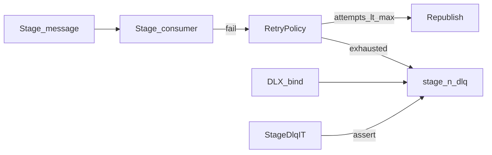

# W2-US06 TDD Guide — Retries + per-stage DLQ

| Field | Value |
|-------|--------|
| **Story** | W2-US06 — Retry + stage DLQ path for poison messages |
| **Depends on** | W2-US03 |
| **Branch** | `W2-US06` from `wave-2` |
| **Timebox hint** | 1–1.5 days |
| **You will touch** | DLQ binds, retry policy, failure IT |
| **Architecture refs** | §8 retries / DLQ |
| **KB (create)** | `docs/delivery/kb/W2-US06-stage-dlq.md` |
| **Stakeholder TDD** | [`../../WAVE_2_TDD.md`](../../WAVE_2_TDD.md) |
| **AC source** | [`../../../waves/WAVE_2.md`](../../../waves/WAVE_2.md) § W2-US06 |

---

## 1. Overview

When a stage message fails repeatedly, it lands on a **per-stage DLQ**. Retry uses pipeline `retry_config` (max retries, backoff).

**Done means:** `StageDlqIT.poison_landsOnDlq` green.

**Out of scope:** Alerting UI; full observability dashboards.

---

## 2. Assumptions

| # | Assumption |
|---|------------|
| 1 | W2-US03 declared stage queues + DLQ names (DLX wiring here) |
| 2 | Compose MySQL + RabbitMQ up |
| 3 | Can run in parallel with US04 after US03 |

```bash
git checkout wave-2 && git pull && git checkout -b W2-US06
docker compose up -d mysql rabbitmq
```

Architecture §8.1 `retry_config` shape:

```json
{
  "max_retries": 3,
  "backoff_multiplier": 2.0,
  "initial_delay_ms": 1000,
  "max_delay_ms": 60000
}
```

DLQ name: `tenant.{tenantId}.pipeline.{pipelineId}.stage.{n}.dlq`

---

## 3. HLD / DFD



Data flow: poison message → retries per `retry_config` → exhausted → per-stage DLQ (tenant-prefixed).

---

## 4. LLD

| Component | Responsibility |
|-----------|----------------|
| DLX + dead-letter args | On stage input queues; bind DLQs |
| `RetryPolicy` | Parse `retry_config`; `isExhausted(failureCount)` |
| `StageDeadLetterService` | Republish until exhausted, then DLQ |
| `QueueNaming` | Reuse for DLX / DLQ routing keys |
| Error headers | `x-pipeline-failure-count`, `x-pipeline-error` |

---

## 5. API interface

| Surface | Notes |
|---------|--------|
| `retry_config` on pipeline | `max_retries`, backoff fields (architecture §8.1) |
| DLQ name | `tenant.{tenantId}.pipeline.{pipelineId}.stage.{n}.dlq` |
| Headers on DLQ message | failure count + error preserved |
| (No new public REST required) | Failure path is messaging + IT |

---

## 6. Testing

| Layer | Coverage | Tools |
|-------|----------|-------|
| Unit | Exhausts then DLQ; attempts == max | `RetryPolicyTest` |
| Integration | Poison lands on DLQ | `StageDlqIT` |
| Manual | Mgmt UI DLQ depth ≥ 1; inspect headers | |

---

## 7. Risks

| Risk | Mitigation |
|------|------------|
| DLQ queue without DLX bind | Messages never arrive — declare + bind |
| Infinite retry | `isExhausted(failureCount)` must terminate |
| Dropping tenant from DLQ name | Isolation / support nightmare |

---

## 8. RED

| File | Method | Asserts |
|------|--------|---------|
| `RetryPolicyTest` | `exhaustsThenDlq` | attempts == max |
| `StageDlqIT` | `poison_landsOnDlq` | message on DLQ |

```bash
./mvnw -pl pipeline-api test -Dtest=RetryPolicyTest,StageDlqIT
```

**Stop.** Red.

---

## 9. GREEN

1. Declare DLX + dead-letter args on stage input queues; bind DLQs.
2. `RetryPolicy` + `StageDeadLetterService` (republish until exhausted, then DLQ).
3. Assert DLQ receive in IT (headers optional but useful).

### Checklist

- [ ] Error headers preserved (`x-pipeline-failure-count`, `x-pipeline-error`)
- [ ] Tenant still in queue / DLX names
- [ ] Feeds support KB “pipeline run failed”
- [ ] Tests green with RabbitMQ up

---

## 10. REFACTOR

- Keep policy parsing separate from Rabbit publish
- Reuse `QueueNaming` for DLX / DLQ routing keys
- Avoid changing happy-path stub worker unless needed for forced failure

---

## 11. Docs & trackers

- [ ] KB: DLX table + support “pipeline run failed” steps
- [ ] Tracker · TEST_MATRIX · `WAVE_2.md` Done

| # | Action | Expected |
|---|--------|----------|
| 1 | Run `StageDlqIT` | poison body on `…stage.1.dlq` |
| 2 | Mgmt UI → Queues | DLQ depth ≥ 1 after IT |
| 3 | Inspect message headers | failure count + error present |

```text
merge → tag W2-US06 → W2-US07 (if not already Done)
```

---

## 12. Common pitfalls

| Mistake | Fix |
|---------|-----|
| DLQ queue without DLX bind | Messages never arrive |
| Infinite retry | `isExhausted(failureCount)` must terminate |
| Dropping tenant from DLQ name | Isolation / support nightmare |

## Help / escalate

- Architecture §8 retries / DLQ · W2-US03 `QueueNaming` · support KB “pipeline run failed”
