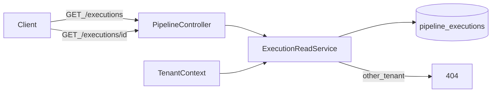

# W2-US07 TDD Guide — Execution status query API

| Field | Value |
|-------|--------|
| **Story** | W2-US07 — Execution status/detail API |
| **Depends on** | W2-US04 |
| **Branch** | `W2-US07` from `wave-2` |
| **Timebox hint** | 0.5–1 day |
| **You will touch** | `GET .../executions` endpoints, read models |
| **Architecture refs** | §3.1 executions |
| **KB (create)** | `docs/delivery/kb/W2-US07-execution-status.md` |
| **Stakeholder TDD** | [`../../WAVE_2_TDD.md`](../../WAVE_2_TDD.md) |
| **AC source** | [`../../../waves/WAVE_2.md`](../../../waves/WAVE_2.md) § W2-US07 |

---

## 1. Overview

List and get execution detail for a pipeline so operators can see status after `POST .../run`.

**Done means:** `ExecutionStatusIT` returns fixture execution with status; cross-tenant 404.

**Out of scope:** Full per-stage metrics dashboards (Wave 4).

---

## 2. Assumptions

| # | Assumption |
|---|------------|
| 1 | W2-US04 run creates `pipeline_executions` (get-by-id may already exist) |
| 2 | Compose MySQL + RabbitMQ up; stub auth `X-Tenant-Id` |
| 3 | Extend with **list** and harden isolation |

```bash
git checkout wave-2 && git pull && git checkout -b W2-US07
docker compose up -d mysql rabbitmq
```

---

## 3. HLD / DFD



Data flow: run creates execution → list/get read models filtered by pipeline + tenant → foreign tenant → 404.

---

## 4. LLD

| Component | Responsibility |
|-----------|----------------|
| List/detail controllers | Under `/api/v1/pipelines/{id}/executions` |
| Read-only queries | Tenant filter via pipeline ownership |
| `PipelineExecutionResponse` | Reuse from US04 if present |
| Fixture wiring | create → steps → activate → run → list/get |

---

## 5. API interface

| Method | Path | Notes | Response |
|--------|------|-------|----------|
| `GET` | `/api/v1/pipelines/{id}/executions` | List; prefer `started_at` desc | `200` |
| `GET` | `/api/v1/pipelines/{id}/executions/{executionId}` | Detail | `200` |
| `GET` | same as other tenant | Isolation | `404` |

Response fields: `id`, `status`, `pipeline_id`, timestamps.

Auth stub: `X-Tenant-Id` header in `local`/`test`.

---

## 6. Testing

| Layer | Coverage | Tools |
|-------|----------|-------|
| Integration | List/get after run; cross-tenant 404 | `ExecutionStatusIT` |
| Integration | Fixture run still green | `PipelineRunIT` |
| Manual | Run → list → get → other-tenant 404 | |

---

## 7. Risks

| Risk | Mitigation |
|------|------------|
| Listing all tenants’ executions | Filter by pipeline + tenant |
| Returning 200 for foreign pipeline id | 404 like other tenant APIs |
| Blocking on incomplete run in IT | Awaitility with bound timeout |

---

## 8. RED

| File | Method | Asserts |
|------|--------|---------|
| `ExecutionStatusIT` | `listAndGet_afterRun` | status present |
| `ExecutionStatusIT` | `get_asOtherTenant_404` | isolation |

```bash
./mvnw -pl pipeline-api test -Dtest=ExecutionStatusIT
```

**Stop.** Red.

---

## 9. GREEN

1. Controllers for list/detail under `/api/v1/pipelines/{id}/executions`.
2. Read-only queries; tenant filter via pipeline ownership.
3. Wire to fixture run from US04 (create → steps → activate → run → list/get).

### Checklist

- [ ] List ordered by `started_at` desc (or documented order)
- [ ] Cross-tenant list/get → 404
- [ ] Response fields: `id`, `status`, `pipeline_id`, timestamps
- [ ] Tests green with MySQL (+ RabbitMQ if run fixture needed)

---

## 10. REFACTOR

- Keep read models separate from orchestrator write path
- Reuse `PipelineExecutionResponse` from US04 if present
- Avoid embedding stage metrics (Wave 4)

---

## 11. Docs & trackers

- [ ] KB: list/get examples + isolation
- [ ] Tracker · TEST_MATRIX · `WAVE_2.md` Done
- [ ] Prepare wave exit / PR `wave-2` → `master` when all Must Done

| # | Action | Expected |
|---|--------|----------|
| 1 | Run a pipeline | 202 |
| 2 | `GET .../executions` | includes new execution |
| 3 | `GET .../executions/{id}` | status matches |
| 4 | Same URLs as other tenant | 404 |

```text
merge → tag W2-US07 → wave exit prep when all Must Done
```

---

## 12. Common pitfalls

| Mistake | Fix |
|---------|-----|
| Listing all tenants’ executions | Filter by pipeline + tenant |
| Returning 200 for foreign pipeline id | 404 like other tenant APIs |
| Blocking on incomplete run in IT | Awaitility with bound timeout |

## Help / escalate

- Architecture §3.1 executions · W2-US04 run fixture · wave exit when all Must Done
