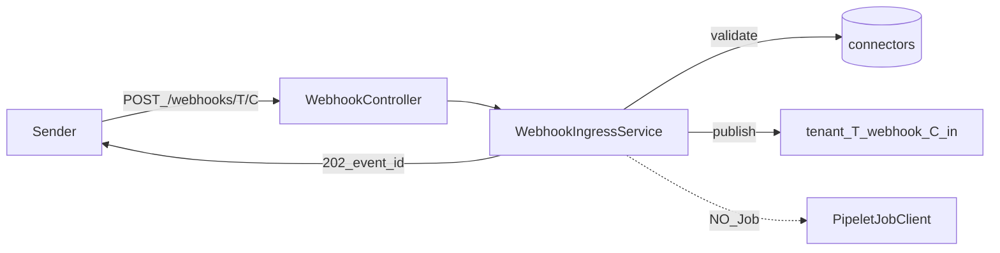

# W3-US01 TDD Guide — Ingress accept + RabbitMQ publish

| Field | Value |
|-------|--------|
| **Story** | W3-US01 — Ingress accepts webhook and publishes to tenant queue |
| **Depends on** | W2-US03 (RabbitMQ topology), Wave 1 (tenant context) |
| **Branch** | `W3-US01` from `wave-3` |
| **Timebox hint** | 1.5–2 days |
| **You will touch** | Webhook controller/service, RabbitMQ publisher, webhook `QueueNaming` helpers |
| **Architecture refs** | §11.2–11.5, §3.3 webhook POST |
| **KB (create)** | `docs/delivery/kb/W3-US01-webhook-ingress-accept.md` |
| **Stakeholder TDD** | [`../../WAVE_3_TDD.md`](../../WAVE_3_TDD.md) |
| **AC source** | [`../../../waves/WAVE_3.md`](../../../waves/WAVE_3.md) § W3-US01 |

---

## 1. Overview

Always-on ingress accepts external POSTs, validates tenant + connector exist, publishes to the tenant webhook queue, and returns `202` with `event_id` — **without** starting a pipelet Job.

**Done means:** `WebhookIngressServiceTest` + `WebhookControllerIT` green; message on `tenant.{T}.webhook.{C}.in`; no Job start on accept.

**Out of scope:** Signature (US02), idempotency (US03), rate/503 polish (US04), URL provision (US05), Job trigger (US06), metering (US07).

---

## 2. Assumptions

| # | Assumption |
|---|------------|
| 1 | `wave-3` exists from Wave 2; W2-US03 `QueueNaming` + RabbitMQ available |
| 2 | Compose **MySQL + RabbitMQ** up (`3306`, `5672` / mgmt `15672`) |
| 3 | **Public ingress path:** tenant is in the URL (`/webhooks/{tenantId}/{connectorId}`). Do **not** require `X-Tenant-Id` for this endpoint — set `TenantContext` from path (or resolve tenant without the admin stub header) |
| 4 | Webhook topology is **separate** from stage topology (`tenant.*.pipeline.*`) — reuse naming patterns, not stage exchanges |

```bash
git checkout wave-3 && git pull && git checkout -b W3-US01
docker compose up -d mysql rabbitmq
# mgmt http://localhost:15672 pipeline/pipeline
```

Target names (architecture §11.5):

```text
Exchange: tenant.{tenantId}.webhook (topic)
Queue:    tenant.{tenantId}.webhook.{connectorId}.in
DLQ:      tenant.{tenantId}.webhook.{connectorId}.dlq   (declare OK; wiring later)
```

---

## 3. HLD / DFD



Data flow: External POST → validate tenant/connector → publish to webhook `.in` → `202` + `event_id` + `queued_to`. Never call Job client.

---

## 4. LLD

| Component | Responsibility |
|-----------|----------------|
| `WebhookController` | `POST /api/v1/webhooks/{tenantId}/{connectorId}` |
| `WebhookIngressService` | Validate + publish + return accept DTO |
| `QueueNaming.webhook*` | Pure builder for webhook exchange/queue names (extend W2 helper) |
| Webhook topology declarer | Idempotent declare exchange + `.in` (+ `.dlq` name OK) |
| Publisher | Spring AMQP publish with routing key `{connectorId}` |

---

## 5. API interface

| Method | Path | Notes | Response |
|--------|------|-------|----------|
| `POST` | `/api/v1/webhooks/{tenantId}/{connectorId}` | Public ingress; body = event payload | `202` + `event_id` + `queued_to` |
| `POST` | unknown connector / tenant | Not found | `404` |

Example `202` body (architecture §3.3):

```json
{
  "accepted": true,
  "event_id": "evt-uuid",
  "queued_to": "tenant.T001.webhook.conn-github-events.in"
}
```

Auth stub note: **no `X-Tenant-Id` required** on this path — tenant comes from `{tenantId}` in the URL. Admin/connector APIs still use the Wave 1 stub header.

---

## 6. Testing

| Layer | Coverage | Tools |
|-------|----------|-------|
| Unit | Publish expected exchange/routing key; returns `event_id`; never starts Job | `WebhookIngressServiceTest` |
| Unit | Unknown connector → NotFound | same + fixtures |
| Integration | POST → 202; message on queue | `WebhookControllerIT` + RabbitMQ (+ MySQL for connector row) |
| Manual | curl + mgmt UI / `rabbitmqadmin get`; confirm no Job | |

Fixtures (from DELIVERY_PLAN): `TenantFixtures.T001`, `ConnectorFixtures.eventListenerGithub` → `fixtures/connectors/github-webhook.json`.

---

## 7. Risks

| Risk | Mitigation |
|------|------------|
| Starting Job on accept | Assert Job client **never** called in US01 |
| Reusing stage exchange names | Separate `webhook` topology per §11.5 |
| Requiring `X-Tenant-Id` on public ingress | Tenant from URL path |
| Blocking until processing | Return 202 after durable publish only |

---

## 8. RED

| File | Method | Asserts |
|------|--------|---------|
| `WebhookIngressServiceTest` | `shouldPublishToTenantQueue_andReturnAccepted` | exchange/routing key; `event_id`; no Job |
| `WebhookIngressServiceTest` | unknown connector | NotFound / 404 mapping |
| `WebhookControllerIT` | `shouldReturn202_whenQueuePublishSucceeds` | 202; message body on queue |

```bash
./mvnw -pl pipeline-api test -Dtest=WebhookIngressServiceTest,WebhookControllerIT
```

**Stop.** Red.

---

## 9. GREEN

1. Extend `QueueNaming` with webhook exchange/queue helpers (keep pure / unit-testable).
2. Idempotent declare `tenant.{T}.webhook` + `{C}.in` (and `.dlq` name if cheap).
3. Minimal controller + `WebhookIngressService` + AMQP publisher.
4. IT: MySQL connector row + RabbitMQ (Testcontainers or Compose `assumeTrue` port 5672).

### Checklist

- [ ] `202` + `event_id` + `queued_to`
- [ ] Message payload on `tenant.{T}.webhook.{C}.in`
- [ ] Unknown connector → 404
- [ ] No `PipeletJobClient` / Job create on accept
- [ ] Tests green with MySQL + RabbitMQ up

---

## 10. REFACTOR

- Extract routing-key / queue-name builder; keep tests green
- Keep webhook topology separate from stage topology
- Leave seams for US02 (signature), US03 (idempotency), US07 (metering) without implementing them

---

## 11. Docs & trackers

- [ ] KB: curl accept + queue inspect + “no Job on ingress”
- [ ] Tracker · TEST_MATRIX · `WAVE_3.md` Done
- [ ] Note public path vs `X-Tenant-Id` admin APIs

| # | Action | Expected |
|---|--------|----------|
| 1 | `POST /api/v1/webhooks/T001/conn-github-events` with JSON | `202` + `event_id` + `queued_to` |
| 2 | RabbitMQ mgmt / `rabbitmqadmin get` | payload matches body |
| 3 | Confirm no pipelet Job from this POST alone | no Job create |

```text
merge → tag W3-US01 → delete → W3-US02 (or parallel US03/US05 after US01)
```

---

## 12. Common pitfalls

| Mistake | Fix |
|---------|-----|
| Starting Job on accept | Defer to US06; assert no Job client call |
| Publishing to stage queues | Use `tenant.*.webhook.*.in` only |
| Requiring `X-Tenant-Id` on ingress | Tenant is in the URL |
| Returning 200 before publish | Only 202 after durable queue publish |

## Help / escalate

- Architecture §11.2–11.5, §3.3 · DELIVERY_PLAN fully worked W3-US01 · W2-US03 `QueueNaming`
