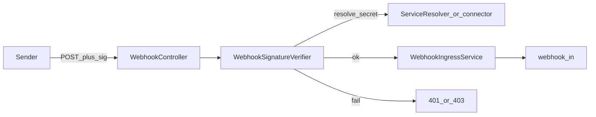

# W3-US02 TDD Guide — HMAC/signature + Auth service

| Field | Value |
|-------|--------|
| **Story** | W3-US02 — HMAC/signature verification via tenant Auth service |
| **Depends on** | W3-US01, W1-US04 (`ServiceResolver` / Auth config) |
| **Branch** | `W3-US02` from `wave-3` |
| **Timebox hint** | 1–1.5 days |
| **You will touch** | Signature verifier, Auth service resolution, ingress reject path |
| **Architecture refs** | §11.4 Authentication, §9.3 `ServiceResolver`, §3.3 signing headers |
| **KB (create)** | `docs/delivery/kb/W3-US02-webhook-signature.md` |
| **Stakeholder TDD** | [`../../WAVE_3_TDD.md`](../../WAVE_3_TDD.md) |
| **AC source** | [`../../../waves/WAVE_3.md`](../../../waves/WAVE_3.md) § W3-US02 |

---

## 1. Overview

Before publish, ingress verifies the webhook signature (e.g. `X-Hub-Signature-256`) using the tenant’s Auth / connector signing secret resolved via W1 service config patterns.

**Done means:** `WebhookSignatureVerifierTest` green; bad signature → reject (401/403); good signature → accept path still 202.

**Out of scope:** Idempotency (US03); rate limits (US04); OAuth login UI.

---

## 2. Assumptions

| # | Assumption |
|---|------------|
| 1 | W3-US01 accept + publish merged |
| 2 | W1-US04 Auth / `ServiceResolver` (or connector `signing_secret`) available |
| 3 | Compose MySQL + RabbitMQ; fixture secret for HMAC tests |
| 4 | Public ingress still uses `{tenantId}` in URL — no `X-Tenant-Id` required |

```bash
git checkout wave-3 && git pull && git checkout -b W3-US02
docker compose up -d mysql rabbitmq
```

Typical header (architecture §11.4 / §3.3):

```text
X-Hub-Signature-256: sha256=<hex>
```

---

## 3. HLD / DFD



Data flow: POST + signature header → resolve signing secret for tenant/connector → HMAC verify → publish on success; reject on failure (no publish).

---

## 4. LLD

| Component | Responsibility |
|-----------|----------------|
| `WebhookSignatureVerifier` | HMAC verify against raw body + header |
| Secret resolution | Tenant Auth service config and/or connector `signing_secret` |
| Ingress gate | Call verifier before publish |
| Error mapping | Invalid/missing signature → 401/403 (document chosen code) |

---

## 5. API interface

| Method | Path | Notes | Response |
|--------|------|-------|----------|
| `POST` | `/api/v1/webhooks/{tenantId}/{connectorId}` | Valid signature | `202` (US01) |
| `POST` | same | Missing/invalid signature | `401` or `403` |
| Header | `X-Hub-Signature-256` (or configured `signature_header`) | From provision response | |

Auth stub: public ingress — tenant from URL. Signing secret comes from fixture / Auth service config, **not** from `X-Tenant-Id`.

---

## 6. Testing

| Layer | Coverage | Tools |
|-------|----------|-------|
| Unit | Valid HMAC accepts; tampered body / bad header rejects | `WebhookSignatureVerifierTest` |
| Unit / IT | Ingress does not publish on failed verify | mock publisher assert |
| Manual | curl with correct vs wrong signature | |

---

## 7. Risks

| Risk | Mitigation |
|------|------------|
| Clock skew / timestamp schemes | Document acceptable skew if using timed signatures |
| Verifying after publish | Always verify **before** publish |
| Hard-coding GitHub-only header | Use configured `signature_header` from connector/Auth |
| Leaking secrets in logs/errors | Never log raw signing secret |

---

## 8. RED

| File | Method | Asserts |
|------|--------|---------|
| `WebhookSignatureVerifierTest` | `validSignature_accepts` | verify true |
| `WebhookSignatureVerifierTest` | `invalidSignature_rejects` | verify false / exception |
| `WebhookControllerIT` (extend) | bad sig → no 202 / no queue message | |

```bash
./mvnw -pl pipeline-api test -Dtest=WebhookSignatureVerifierTest,WebhookControllerIT
```

**Stop.** Red.

---

## 9. GREEN

1. Resolve signing secret via Auth service / connector config (W1-US04 pattern).
2. HMAC verify on raw request body before publish.
3. Map failures to 401/403; keep US01 happy path green with fixture signature.

### Checklist

- [ ] Valid signature → 202 + publish
- [ ] Invalid/missing → reject; **no** queue message
- [ ] Secret not echoed in responses/logs
- [ ] Tests green with MySQL + RabbitMQ up

---

## 10. REFACTOR

- Pluggable verifier SPI (GitHub HMAC first; other vendors later)
- Keep raw-body capture correct for Spring (filter / `@RequestBody` byte[])
- Align with US05 provisioned `signature_header` / `signing_secret` fields

---

## 11. Docs & trackers

- [ ] KB: how to sign a test POST + common 401 causes
- [ ] Tracker · TEST_MATRIX · `WAVE_3.md` Done

| # | Action | Expected |
|---|--------|----------|
| 1 | POST with valid HMAC | 202 + message on queue |
| 2 | POST with wrong signature | 401/403; queue unchanged |
| 3 | POST with no signature header | reject |

```text
merge → tag W3-US02 → W3-US03 / continue parallel Musts
```

---

## 12. Common pitfalls

| Mistake | Fix |
|---------|-----|
| Verifying after publish | Gate before AMQP publish |
| Using parsed JSON for HMAC | Sign/verify raw bytes |
| Requiring `X-Tenant-Id` | Tenant still from URL path |

## Help / escalate

- Architecture §11.4 · W1-US04 `ServiceResolver` · W3-US01 accept path
