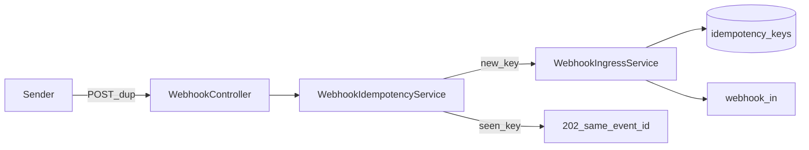

# W3-US03 TDD Guide — Idempotency X-Webhook-Id / hash

| Field | Value |
|-------|--------|
| **Story** | W3-US03 — Idempotency via `X-Webhook-Id` or payload hash |
| **Depends on** | W3-US01 |
| **Branch** | `W3-US03` from `wave-3` |
| **Timebox hint** | 1–1.5 days |
| **You will touch** | Idempotency store/check, ingress dedup path |
| **Architecture refs** | §11.4 Idempotency, §11.8 duplicate deliveries |
| **KB (create)** | `docs/delivery/kb/W3-US03-webhook-idempotency.md` |
| **Stakeholder TDD** | [`../../WAVE_3_TDD.md`](../../WAVE_3_TDD.md) |
| **AC source** | [`../../../waves/WAVE_3.md`](../../../waves/WAVE_3.md) § W3-US03 |

---

## 1. Overview

Duplicate webhook deliveries must produce a **single logical event**. Prefer `X-Webhook-Id` when present; otherwise hash the payload (scoped by tenant + connector).

**Done means:** `WebhookIdempotencyTest.duplicate_isNoOpOrSameEvent` green; second POST does not create a second queued logical event.

**Out of scope:** Downstream processor idempotency (`execution_id` + `record_id` — §8.3); rate limits (US04).

---

## 2. Assumptions

| # | Assumption |
|---|------------|
| 1 | W3-US01 accept + publish works |
| 2 | Compose MySQL + RabbitMQ; store can be DB table or Redis-like — pick one and document |
| 3 | Public ingress: tenant from URL; no `X-Tenant-Id` required |
| 4 | Signature (US02) may run before or after key extract — order: verify (if present) → idempotency → publish |

```bash
git checkout wave-3 && git pull && git checkout -b W3-US03
docker compose up -d mysql rabbitmq
```

---

## 3. HLD / DFD



Data flow: extract key (`X-Webhook-Id` or hash) → if seen, return prior `event_id` (or documented no-op 202) without second publish → if new, store + publish once.

---

## 4. LLD

| Component | Responsibility |
|-----------|----------------|
| Key extractor | `X-Webhook-Id` else SHA-256(body) + tenant + connector |
| Idempotency store | Persist key → `event_id` (TTL strategy documented) |
| Ingress integration | Check before publish; short-circuit duplicates |
| Response | Same `event_id` on replay (preferred) or documented equivalent |

---

## 5. API interface

| Method | Path | Notes | Response |
|--------|------|-------|----------|
| `POST` | `/api/v1/webhooks/{tenantId}/{connectorId}` | First delivery | `202` + new `event_id` |
| `POST` | same + same `X-Webhook-Id` / body | Duplicate | `202` + **same** `event_id`; no second logical publish |
| Header | `X-Webhook-Id` | Optional but preferred | |

Auth stub: public ingress — tenant from URL path.

---

## 6. Testing

| Layer | Coverage | Tools |
|-------|----------|-------|
| Unit | Dup key → same event / no second publish | `WebhookIdempotencyTest` |
| Unit | Different keys → two events | same |
| Integration | Double POST → one queue message (or one logical event) | extend `WebhookControllerIT` |
| Manual | curl twice with same `X-Webhook-Id` | |

---

## 7. Risks

| Risk | Mitigation |
|------|------------|
| Hash-only collisions across connectors | Scope key by tenant + connector |
| Unbounded store growth | TTL / cleanup strategy in refactor docs |
| Returning 409 instead of safe 202 | Prefer at-least-once-safe 202 with same `event_id` |
| Race on concurrent dups | Unique constraint / atomic insert |

---

## 8. RED

| File | Method | Asserts |
|------|--------|---------|
| `WebhookIdempotencyTest` | `duplicate_isNoOpOrSameEvent` | same `event_id`; publish once |
| `WebhookIdempotencyTest` | `differentKeys_twoEvents` | two publishes |
| `WebhookControllerIT` (extend) | double POST with same header | one logical event |

```bash
./mvnw -pl pipeline-api test -Dtest=WebhookIdempotencyTest,WebhookControllerIT
```

**Stop.** Red.

---

## 9. GREEN

1. Key from `X-Webhook-Id` or payload hash (tenant + connector scoped).
2. Persist key → `event_id` before/with publish (atomic enough for IT).
3. Duplicate path returns prior accept without second publish.

### Checklist

- [ ] Dup POST → single logical event
- [ ] Distinct keys → distinct events
- [ ] Key scoped by tenant + connector
- [ ] Tests green with MySQL + RabbitMQ up

---

## 10. REFACTOR

- Document TTL / cleanup strategy
- Keep extractor pure for unit tests
- Align response shape with US01 (`accepted`, `event_id`, `queued_to` on first accept)

---

## 11. Docs & trackers

- [ ] KB: `X-Webhook-Id` vs hash; how to verify single queue message
- [ ] Tracker · TEST_MATRIX · `WAVE_3.md` Done

| # | Action | Expected |
|---|--------|----------|
| 1 | POST with `X-Webhook-Id: abc` | 202 + `event_id` |
| 2 | Repeat same header + body | same `event_id`; no second logical message |
| 3 | New `X-Webhook-Id` | new `event_id` |

```text
merge → tag W3-US03 → continue US04 / US05
```

---

## 12. Common pitfalls

| Mistake | Fix |
|---------|-----|
| Global hash without tenant/connector | Always scope the key |
| Publishing then checking | Check (or atomic claim) before publish |
| Treating dup as hard error | Prefer safe 202 + same `event_id` |

## Help / escalate

- Architecture §11.4 Idempotency, §11.8 · W3-US01 accept path
