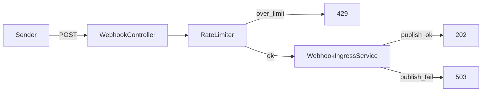

# W3-US04 TDD Guide — Rate limit 429 + broker fail 503

| Field | Value |
|-------|--------|
| **Story** | W3-US04 — Rate limit `429` + RabbitMQ failure `503` (Should) |
| **Depends on** | W3-US01 |
| **Branch** | `W3-US04` from `wave-3` |
| **Timebox hint** | 0.5–1 day |
| **You will touch** | Rate limiter, publish error mapping, problem+json responses |
| **Architecture refs** | §11.4 Rate limiting / Backpressure, §11.8 broker fail |
| **KB (create)** | `docs/delivery/kb/W3-US04-webhook-limits.md` |
| **Stakeholder TDD** | [`../../WAVE_3_TDD.md`](../../WAVE_3_TDD.md) |
| **AC source** | [`../../../waves/WAVE_3.md`](../../../waves/WAVE_3.md) § W3-US04 |

---

## 1. Overview

Protect ingress with per-tenant rate limiting (`429`) and never return `2xx` when RabbitMQ publish fails (`503` so senders retry). Optional: hard queue-depth backpressure also → `503`.

**Done means:** `WebhookRateLimitIT` (or equivalent) proves `429`; publish-fail IT proves `503`.

**Out of scope:** Full PAYG quota hard-blocks (Wave 5); DLQ consumer path.

---

## 2. Assumptions

| # | Assumption |
|---|------------|
| 1 | W3-US01 accept path exists |
| 2 | Compose MySQL + RabbitMQ; can mock/fail publisher in IT |
| 3 | Priority **Should** — ship after Musts if timeboxed |
| 4 | Public ingress: tenant from URL |

```bash
git checkout wave-3 && git pull && git checkout -b W3-US04
docker compose up -d mysql rabbitmq
```

---

## 3. HLD / DFD



Data flow: rate check → publish → 202 on success; 429 if limited; 503 if broker/publish fails (never 2xx).

---

## 4. LLD

| Component | Responsibility |
|-----------|----------------|
| Per-tenant token bucket / counter | Excess → 429 |
| Publish error handler | AMQP failure → 503 |
| Optional depth check | Hard limit → 503 (architecture backpressure) |
| Problem+json (or consistent error body) | Typed errors for clients |

---

## 5. API interface

| Method | Path | Notes | Response |
|--------|------|-------|----------|
| `POST` | `/api/v1/webhooks/{tenantId}/{connectorId}` | Under limit + broker OK | `202` |
| `POST` | same | Rate exceeded | `429` |
| `POST` | same | Publish / broker failure | `503` |

Auth stub: public ingress — tenant from URL. Prefer `Retry-After` on 429 if easy.

---

## 6. Testing

| Layer | Coverage | Tools |
|-------|----------|-------|
| Unit | Limiter trips after N requests | rate limiter unit |
| Integration | Burst → 429 | `WebhookRateLimitIT` |
| Integration | Forced publish fail → 503; no false 202 | publish-fail IT |
| Manual | Stop RabbitMQ mid-test / mock fail; burst curl | |

---

## 7. Risks

| Risk | Mitigation |
|------|------------|
| Returning 202 after failed publish | Map all publish exceptions to 503 |
| Global (not per-tenant) limiter | Key by `tenantId` |
| Flaky IT with real broker kill | Prefer mock publisher failure in IT |

---

## 8. RED

| File | Method | Asserts |
|------|--------|---------|
| `WebhookRateLimitIT` | burst exceeds limit | `429` |
| Publish-fail IT / unit | broker/publish throws | `503`; no accepted event |

```bash
./mvnw -pl pipeline-api test -Dtest=WebhookRateLimitIT,WebhookIngressServiceTest
```

**Stop.** Red.

---

## 9. GREEN

1. Per-tenant rate limiter in front of publish (configurable limit for tests).
2. Catch publish failures → 503 (never 2xx).
3. Shared error response shape with other ingress errors.

### Checklist

- [ ] Over limit → 429
- [ ] Publish fail → 503
- [ ] Happy path still 202
- [ ] Tests green with MySQL + RabbitMQ (or mocked fail)

---

## 10. REFACTOR

- Shared problem+json / error DTO with US01–US03
- Config-driven limits for local vs IT
- Document sender retry guidance in KB

---

## 11. Docs & trackers

- [ ] KB: 429 vs 503 — when sender should retry
- [ ] Tracker · TEST_MATRIX · `WAVE_3.md` Done (Should)

| # | Action | Expected |
|---|--------|----------|
| 1 | Burst POSTs over limit | eventually 429 |
| 2 | Simulate publish failure | 503 |
| 3 | Normal POST with broker up | 202 |

```text
merge → tag W3-US04 → continue remaining Musts
```

---

## 12. Common pitfalls

| Mistake | Fix |
|---------|-----|
| 202 after failed publish | Always 503 on broker fail |
| Single global bucket | Per-tenant key |
| Blocking wave on Should polish | Finish Musts first if timeboxed |

## Help / escalate

- Architecture §11.4, §11.8 · W3-US01 publisher seam
