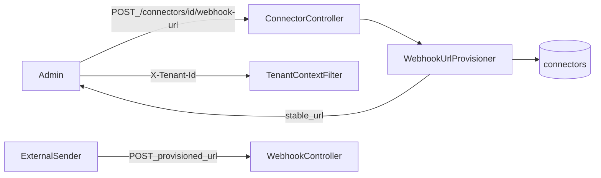

# W3-US05 TDD Guide — Provision webhook URL

| Field | Value |
|-------|--------|
| **Story** | W3-US05 — `POST /connectors/{id}/webhook-url` provisions stable URL |
| **Depends on** | W3-US01 |
| **Branch** | `W3-US05` from `wave-3` |
| **Timebox hint** | 0.5–1 day |
| **You will touch** | Connector webhook-url endpoint, URL template config, signing metadata |
| **Architecture refs** | §3.3 Provision Webhook URL, §11.4 Endpoint |
| **KB (create)** | `docs/delivery/kb/W3-US05-webhook-url-provision.md` |
| **Stakeholder TDD** | [`../../WAVE_3_TDD.md`](../../WAVE_3_TDD.md) |
| **AC source** | [`../../../waves/WAVE_3.md`](../../../waves/WAVE_3.md) § W3-US05 |

---

## 1. Overview

For an `event_listener` connector, provision a **stable** ingress URL that external systems call. Returns `webhook_url`, signing metadata, and timestamps per architecture §3.3.

**Done means:** `WebhookUrlProvisionIT` green; URL matches `/api/v1/webhooks/{tenantId}/{connectorId}` template; repeatable provision stays stable.

**Out of scope:** Full UI provisioning UX (Wave 6); changing public ingress path shape.

---

## 2. Assumptions

| # | Assumption |
|---|------------|
| 1 | W3-US01 ingress path exists and accepts that URL shape |
| 2 | Connector CRUD / fixtures from Wave 1 available (`event_listener` type) |
| 3 | Compose MySQL (+ RabbitMQ if IT also posts); **admin** API uses stub `X-Tenant-Id` |
| 4 | Public POST to provisioned URL does **not** need `X-Tenant-Id` |

```bash
git checkout wave-3 && git pull && git checkout -b W3-US05
docker compose up -d mysql rabbitmq
```

---

## 3. HLD / DFD



Data flow: authenticated tenant admin provisions URL → store/return stable URL + signing fields → external sender POSTs to public ingress (US01).

---

## 4. LLD

| Component | Responsibility |
|-----------|----------------|
| `POST .../webhook-url` handler | Only for `event_listener` connectors |
| URL template | Config base + `/api/v1/webhooks/{tenantId}/{connectorId}` |
| Signing metadata | `signing_secret`, `signature_header` (redact/encrypt as W1) |
| Idempotent provision | Same connector → same stable URL |

---

## 5. API interface

| Method | Path | Notes | Response |
|--------|------|-------|----------|
| `POST` | `/api/v1/connectors/{id}/webhook-url` | Requires tenant auth stub | `200`/`201` + body below |
| `POST` | non-`event_listener` connector | Reject | `400` |
| `POST` | other tenant’s connector | Isolation | `404` |

Response (architecture §3.3):

```json
{
  "webhook_url": "https://ingress.platform.example.com/api/v1/webhooks/T001/conn-github-events",
  "signing_secret": "encrypted:...",
  "signature_header": "X-Hub-Signature-256",
  "created_at": "2026-07-08T00:12:00Z"
}
```

Auth stub: **`X-Tenant-Id` required** on this admin API. The provisioned public URL itself does not use that header.

---

## 6. Testing

| Layer | Coverage | Tools |
|-------|----------|-------|
| Integration | Provision returns stable URL for fixture connector | `WebhookUrlProvisionIT` |
| Integration | Cross-tenant → 404; wrong type → 400 | same |
| Manual | Provision → curl public URL (US01) → 202 | |

---

## 7. Risks

| Risk | Mitigation |
|------|------------|
| Unstable URL on re-provision | Persist / deterministic template from ids |
| Echoing raw secrets | Redact / `encrypted:` prefix like W1-US04 |
| Confusing admin vs public auth | Document `X-Tenant-Id` only on provision API |

---

## 8. RED

| File | Method | Asserts |
|------|--------|---------|
| `WebhookUrlProvisionIT` | `provision_returnsStableUrl` | URL contains tenant + connector ids |
| `WebhookUrlProvisionIT` | other tenant / wrong type | 404 / 400 |

```bash
./mvnw -pl pipeline-api test -Dtest=WebhookUrlProvisionIT
```

**Stop.** Red.

---

## 9. GREEN

1. Endpoint under `/api/v1/connectors/{id}/webhook-url`.
2. Build URL from config base host + path template.
3. Return signing metadata; ensure re-POST is stable (same URL).

### Checklist

- [ ] Stable URL for same connector
- [ ] Tenant isolation on provision
- [ ] Only `event_listener` allowed
- [ ] Secrets redacted/encrypted in response
- [ ] Tests green with MySQL up

---

## 10. REFACTOR

- URL template from config (`ingress.base-url`)
- Align `signature_header` / secret with US02 verifier
- Avoid embedding host assumptions in tests (assert path suffix)

---

## 11. Docs & trackers

- [ ] KB: provision curl + how external systems use the URL
- [ ] Tracker · TEST_MATRIX · `WAVE_3.md` Done

| # | Action | Expected |
|---|--------|----------|
| 1 | `POST /api/v1/connectors/{id}/webhook-url` with `X-Tenant-Id` | stable `webhook_url` |
| 2 | Re-POST provision | same URL |
| 3 | External POST to that URL (no `X-Tenant-Id`) | 202 (US01) |

```text
merge → tag W3-US05 → W3-US06 / US07
```

---

## 12. Common pitfalls

| Mistake | Fix |
|---------|-----|
| Requiring `X-Tenant-Id` on public webhook POST | Only on provision/admin APIs |
| New random URL each provision | Stable from tenant + connector ids |
| Allowing non-listener connectors | 400 |

## Help / escalate

- Architecture §3.3, §11.4 · W3-US01 path shape · W1 secret redaction
