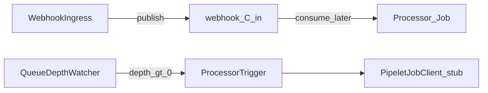

# W3-US06 TDD Guide — On-demand processor trigger

| Field | Value |
|-------|--------|
| **Story** | W3-US06 — On-demand processor when queue depth > 0 |
| **Depends on** | W3-US01, W2-US04 / W2-US05 (run + Job client stub OK) |
| **Branch** | `W3-US06` from `wave-3` |
| **Timebox hint** | 1–1.5 days |
| **You will touch** | Queue depth watcher / trigger, Job client wiring |
| **Architecture refs** | §11.6 On-Demand Processing Trigger, §10.3 Jobs |
| **KB (create)** | `docs/delivery/kb/W3-US06-webhook-queue-trigger.md` |
| **Stakeholder TDD** | [`../../WAVE_3_TDD.md`](../../WAVE_3_TDD.md) |
| **AC source** | [`../../../waves/WAVE_3.md`](../../../waves/WAVE_3.md) § W3-US06 |

---

## 1. Overview

When webhook `.in` queue depth > 0, trigger on-demand processor work (KEDA-style or Pipeline Manager poller). **Stub Job client is OK** — prove the trigger seam, not production K8s.

**Done means:** `WebhookQueueTriggerIT.depth_triggersJob` green; ingress alone still does **not** start Jobs (US01 invariant holds).

**Out of scope:** Real KEDA install; full processor pipelet image; Wave 4 metrics.

---

## 2. Assumptions

| # | Assumption |
|---|------------|
| 1 | W3-US01 publishes to `tenant.{T}.webhook.{C}.in` |
| 2 | W2-US05 `PipeletJobClient` stub (or equivalent) available |
| 3 | Compose MySQL + RabbitMQ; poller/watcher enabled in `local`/`test` |
| 4 | Architecture allows poller **or** KEDA — implement poller + stub first |

```bash
git checkout wave-3 && git pull && git checkout -b W3-US06
docker compose up -d mysql rabbitmq
```

---

## 3. HLD / DFD



Data flow: US01 publish increases depth → watcher/poller sees depth > 0 → calls Job client (stub records create). Ingress path still never calls Job client directly.

---

## 4. LLD

| Component | Responsibility |
|-----------|----------------|
| `QueueDepthWatcher` / poller | Read RabbitMQ depth for webhook `.in` queues |
| `ProcessorTrigger` | Coalesce → `PipeletJobClient.create` (stub OK) |
| Binding knowledge | Which pipeline/processor consumes this connector queue (minimal fixture wiring) |
| Feature flag / schedule | Enable in test; avoid busy-loop |

---

## 5. API interface

| Surface | Notes |
|---------|--------|
| (No new public REST required) | Trigger is internal |
| `PipeletJobClient.create(...)` | Reuse W2-US05 stub |
| Optional admin/debug | Not required for story exit |
| Ingress POST | Still 202 only; **no** Job from controller |

Auth stub: N/A for watcher; fixture tenant/connector from US01.

---

## 6. Testing

| Layer | Coverage | Tools |
|-------|----------|-------|
| Unit | Depth > 0 → trigger once (coalesce) | trigger unit |
| Integration | Publish → depth → stub Job create | `WebhookQueueTriggerIT` |
| Integration | Ingress-only path still no Job in US01 tests | regression |
| Manual | Publish → see stub record / optional Kind Job | |

---

## 7. Risks

| Risk | Mitigation |
|------|------------|
| Coupling trigger into ingress accept | Keep separate component; US01 asserts no Job |
| Trigger storm on depth | Coalesce / debounce |
| Blocking on real K8s | Stub is enough for Wave 3 |
| Missing W2 Job client | Add thin stub interface if not merged |

---

## 8. RED

| File | Method | Asserts |
|------|--------|---------|
| `WebhookQueueTriggerIT` | `depth_triggersJob` | stub create after publish |
| Unit (optional) | coalesce duplicate triggers | single create window |

```bash
./mvnw -pl pipeline-api test -Dtest=WebhookQueueTriggerIT
```

**Stop.** Red.

---

## 9. GREEN

1. Poller/watcher reads webhook `.in` depth (RabbitMQ management API or AMQP passive declare).
2. On depth > 0, call `PipeletJobClient` stub.
3. Coalesce rapid triggers; keep ingress free of Job calls.

### Checklist

- [ ] Depth > 0 → Job client invoked
- [ ] Ingress accept still does not call Job client
- [ ] Stub acceptable (no Kind required)
- [ ] Tests green with MySQL + RabbitMQ up

---

## 10. REFACTOR

- Coalesce triggers (single create per idle→busy edge)
- Interface ready for KEDA later without rewriting ingress
- Document which fixture pipeline/processor is bound to the webhook queue

---

## 11. Docs & trackers

- [ ] KB: how trigger works locally + stub vs Kind
- [ ] Tracker · TEST_MATRIX · `WAVE_3.md` Done

| # | Action | Expected |
|---|--------|----------|
| 1 | POST webhook (US01) | 202; message on `.in` |
| 2 | Wait for watcher | stub Job create recorded |
| 3 | Confirm controller path | no direct Job call on accept |

```text
merge → tag W3-US06 → W3-US07 / wave exit prep
```

---

## 12. Common pitfalls

| Mistake | Fix |
|---------|-----|
| Starting Job inside accept | Trigger is separate (US01 invariant) |
| Blocking story on Kind/KEDA | Stub Job client is OK |
| Spamming creates every poll | Coalesce while depth > 0 |

## Help / escalate

- Architecture §11.6, §10.3 · W2-US05 `PipeletJobClient` · W3-US01 no-Job rule
