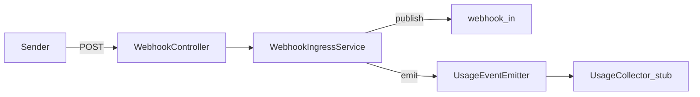

# W3-US07 TDD Guide — Meter webhook_events + bytes_in

| Field | Value |
|-------|--------|
| **Story** | W3-US07 — Emit `platform.webhook_events` + `data.bytes_in` usage events |
| **Depends on** | W3-US01 |
| **Branch** | `W3-US07` from `wave-3` |
| **Timebox hint** | 0.5–1 day |
| **You will touch** | Usage event emitter on accept path |
| **Architecture refs** | §11.4 Metering, §11.7, §6.2 Usage Collector |
| **KB (create)** | `docs/delivery/kb/W3-US07-webhook-metering.md` |
| **Stakeholder TDD** | [`../../WAVE_3_TDD.md`](../../WAVE_3_TDD.md) |
| **AC source** | [`../../../waves/WAVE_3.md`](../../../waves/WAVE_3.md) § W3-US07 |

---

## 1. Overview

On successful webhook accept, emit usage events for **`platform.webhook_events`** (count) and **`data.bytes_in`** (payload size), tagged with `tenant_id` and `connector_id`.

**Done means:** `WebhookMeteringTest` green; accept path emits both dimensions (collector/publisher can be stubbed).

**Out of scope:** Wave 5 PAYG hard blocks / invoices; completeness dashboards (Wave 4).

---

## 2. Assumptions

| # | Assumption |
|---|------------|
| 1 | W3-US01 accept + publish works |
| 2 | Usage collector SPI or event bus may be stub — emit is enough for Wave 3 |
| 3 | Meter **accepted** events only (not 401/404/429 rejects) — document if dups (US03) count once |
| 4 | Compose MySQL + RabbitMQ for IT if needed |

```bash
git checkout wave-3 && git pull && git checkout -b W3-US07
docker compose up -d mysql rabbitmq
```

Dimensions (architecture §11.7):

| Dimension | Unit | Source |
|-----------|------|--------|
| `platform.webhook_events` | events | Ingress counter |
| `data.bytes_in` | bytes/GB | Ingress payload size |

---

## 3. HLD / DFD



Data flow: successful accept → publish → emit `webhook_events` (+1) and `bytes_in` (body length) with tenant/connector tags.

---

## 4. LLD

| Component | Responsibility |
|-----------|----------------|
| `UsageEventEmitter` (or existing W1/W5 seam) | Emit dimensioned usage events |
| Ingress hook | After successful accept/publish |
| Tags | `tenant_id`, `connector_id` |
| Stub collector | Capture events in unit/IT |

---

## 5. API interface

| Surface | Notes |
|---------|--------|
| (No new public REST) | Side effect of US01 POST |
| Usage event payload | dimension, amount, tenant, connector, timestamp |
| `POST /api/v1/webhooks/...` | Still `202`; metering is async-safe side effect |

Auth stub: public ingress — tenant from URL; tags use path `tenantId` + `connectorId`.

---

## 6. Testing

| Layer | Coverage | Tools |
|-------|----------|-------|
| Unit | Accept emits both dimensions with tags | `WebhookMeteringTest` |
| Unit | Reject path does not emit (or documented) | same |
| Integration | Optional: stub collector sees events after IT POST | extend controller IT |
| Manual | Accept → inspect stub/collector log | |

---

## 7. Risks

| Risk | Mitigation |
|------|------------|
| Emitting before durable publish | Emit only after successful accept |
| Double-count on idempotent replay | Align with US03 — prefer count once per logical event |
| Wrong dimension names | Use exact `platform.webhook_events` / `data.bytes_in` |
| Blocking HTTP on collector | Fire-and-forget / stub; don’t fail 202 on meter errors (document) |

---

## 8. RED

| File | Method | Asserts |
|------|--------|---------|
| `WebhookMeteringTest` | `accept_emitsWebhookEventsAndBytesIn` | both dimensions + tags |
| `WebhookMeteringTest` | reject path | no emit (if required) |

```bash
./mvnw -pl pipeline-api test -Dtest=WebhookMeteringTest,WebhookIngressServiceTest
```

**Stop.** Red.

---

## 9. GREEN

1. Hook emitter into successful accept path.
2. Emit `platform.webhook_events` = 1 and `data.bytes_in` = payload size.
3. Tag with tenant + connector; stub collector for asserts.

### Checklist

- [x] Both dimensions emitted on accept
- [x] Tags include tenant + connector
- [x] Dimension names match architecture
- [x] Tests green (MySQL + RabbitMQ if IT wired)

---

## 10. REFACTOR

- Align event shape with Wave 5 usage collector
- Document idempotent-dup metering policy with US03 (count once)
- Keep emitter free of RabbitMQ details

---

## 11. Docs & trackers

- [x] KB: which dimensions fire on webhook accept
- [x] Tracker · TEST_MATRIX · `WAVE_3.md` Done
- [ ] Wave exit prep when all Must Done (US04 Should optional)

| # | Action | Expected |
|---|--------|----------|
| 1 | POST accepted webhook | 202 |
| 2 | Inspect stub collector | `platform.webhook_events` + `data.bytes_in` |
| 3 | Tags | tenant + connector present |

```text
merge → tag W3-US07 → wave exit when all Must Done
```

---

## 12. Common pitfalls

| Mistake | Fix |
|---------|-----|
| Emitting on failed auth/publish | Only after successful accept |
| Inventing dimension names | Use §11.7 names exactly |
| Failing the HTTP request if meter stub errors | Don’t lose 202 for metering |

## Help / escalate

- Architecture §11.4 Metering, §11.7, §6.2 · W3-US01 accept · Wave 5 alignment
