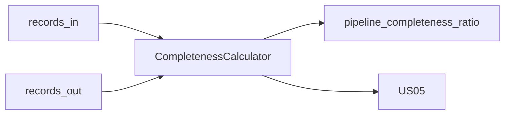

# W4-US02 TDD Guide — Completeness ratio

| Field | Value |
|-------|--------|
| **Story** | W4-US02 — Completeness % on fixture execution |
| **Depends on** | W4-US01 |
| **Branch** | `W4-US02` from `wave-4` |
| **Timebox hint** | 0.5–1 day |
| **You will touch** | Completeness calculator, gauge emit, fixture IT |
| **Architecture refs** | §7.4 Completeness Calculation |
| **KB (create)** | `docs/delivery/kb/W4-US02-completeness.md` |
| **Stakeholder TDD** | [`../../WAVE_4_TDD.md`](../../WAVE_4_TDD.md) |
| **AC source** | [`../../../waves/WAVE_4.md`](../../../waves/WAVE_4.md) § W4-US02 |

---

## 1. Overview

Compute completeness for a known fixture execution:

```text
completeness_pct = (total_records_out / total_records_in) × 100
```

Expose as `pipeline_completeness_ratio` (0–1) and/or percent for APIs.

**Done means:** `CompletenessCalculatorTest` green; fixture run yields expected ratio (e.g. 98/100 → 0.98).

**Out of scope:** REST surface (US05); Grafana alerts (US06).

---

## 2. Assumptions

| # | Assumption |
|---|------------|
| 1 | US01 emitters (or in-memory counters) available |
| 2 | Fixture with known in/out counts (W2 execution or synthetic) |
| 3 | Division by zero → documented (0% or N/A) |

```bash
git checkout wave-4 && git pull && git checkout -b W4-US02
```

---

## 3. HLD / DFD



---

## 4. LLD

| Component | Responsibility |
|-----------|----------------|
| `CompletenessCalculator` | Pure `(in, out) → ratio/pct` |
| Aggregation | Stage + pipeline totals |
| Gauge | Micrometer `pipeline_completeness_ratio` |
| Fixture | Fixed execution with known counts |

---

## 5. API interface

| Surface | Notes |
|---------|--------|
| (No REST yet) | US05 will expose |
| Prometheus gauge | Optional in this story |

---

## 6. Testing

| Layer | Coverage | Tools |
|-------|----------|-------|
| Unit | 100/100 → 1.0; 98/100 → 0.98; 0 in | `CompletenessCalculatorTest` |
| Integration | Fixture emit → expected ratio | optional IT |
| Manual | Document expected fixture numbers | |

---

## 7. Risks

| Risk | Mitigation |
|------|------------|
| Mixing stage vs pipeline totals | Document aggregation rule |
| Floating precision | Assert with delta |
| Zero records_in | Explicit policy |

---

## 8. RED

| File | Method | Asserts |
|------|--------|---------|
| `CompletenessCalculatorTest` | known fixtures | expected ratios |

```bash
./mvnw -pl pipeline-api test -Dtest=CompletenessCalculatorTest
```

**Stop.** Red.

---

## 9. GREEN

1. Pure calculator.
2. Wire totals from US01 counters or fixture store.
3. Optional gauge update.

### Checklist

- [ ] Formula matches §7.4
- [ ] Fixture expected value documented
- [ ] Tests green

---

## 10. REFACTOR

- Share DTO with US05 response
- Keep calculator pure

---

## 11. Docs & trackers

- [ ] KB: how to read completeness for fixture
- [ ] Tracker · TEST_MATRIX · `WAVE_4.md` Done

```text
merge → tag W4-US02 → W4-US03 / US05
```

---

## 12. Common pitfalls

| Mistake | Fix |
|---------|-----|
| Percent vs ratio confusion | Document both; Prometheus uses ratio |
| Using wrong stage totals | Aggregate per §7.4 |

## Help / escalate

- Architecture §7.4 · W4-US01 metrics
