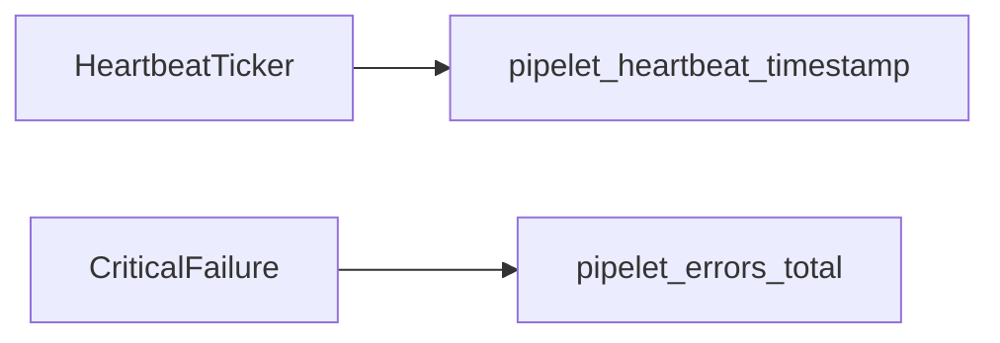

# W4-US03 TDD Guide — Heartbeat + critical errors

| Field | Value |
|-------|--------|
| **Story** | W4-US03 — Heartbeat gauge + critical error counters |
| **Depends on** | W4-US01 |
| **Branch** | `W4-US03` from `wave-4` |
| **Timebox hint** | 0.5–1 day |
| **You will touch** | Heartbeat gauge, error counter, tests |
| **Architecture refs** | §7.1, §7.5 Heartbeat |
| **KB (create)** | `docs/delivery/kb/W4-US03-heartbeat-errors.md` |
| **Stakeholder TDD** | [`../../WAVE_4_TDD.md`](../../WAVE_4_TDD.md) |
| **AC source** | [`../../../waves/WAVE_4.md`](../../../waves/WAVE_4.md) § W4-US03 |

---

## 1. Overview

Register `pipelet_heartbeat_timestamp` (epoch seconds) and increment `pipelet_errors_total` for critical failures. Local stub/timer is enough — no Kind required.

**Done means:** `HeartbeatGaugeTest` + `CriticalErrorCounterTest` (or combined) green.

**Out of scope:** Real K8s liveness; Notification service alerts.

---

## 2. Assumptions

| # | Assumption |
|---|------------|
| 1 | US01 MeterRegistry wiring exists |
| 2 | Heartbeat interval can be shortened in tests |
| 3 | `error_type` label is a small enum |

```bash
git checkout wave-4 && git pull && git checkout -b W4-US03
```

---

## 3. HLD / DFD



---

## 4. LLD

| Component | Responsibility |
|-----------|----------------|
| Heartbeat updater | Set gauge to `Instant.now().getEpochSecond()` |
| Error recorder | Increment counter with `error_type` |
| Labels | tenant, pipeline, pipelet (+ pod_name stub) |

---

## 5. API interface

| Surface | Notes |
|---------|--------|
| Prometheus series | After tick / error |
| REST | Deferred to US05 |

---

## 6. Testing

| Layer | Coverage | Tools |
|-------|----------|-------|
| Unit | Gauge updates; counter increments | `HeartbeatGaugeTest`, `CriticalErrorCounterTest` |
| Manual | scrape prometheus | |

---

## 7. Risks

| Risk | Mitigation |
|------|------------|
| Cardinality on `pod_name` | Use fixed stub name in Wave 4 |
| Alert thresholds | Document 90s rule; don’t implement Notification |

---

## 8. RED

| File | Method | Asserts |
|------|--------|---------|
| Heartbeat / error tests | update / increment | registry values |

```bash
./mvnw -pl pipeline-api test -Dtest=HeartbeatGaugeTest,CriticalErrorCounterTest
```

**Stop.** Red.

---

## 9. GREEN

1. Gauge + counter on MeterRegistry.
2. Stub tick / recordCriticalError APIs.
3. Tests green.

### Checklist

- [x] Heartbeat gauge updates
- [x] Critical error counter increments
- [x] Label policy documented
- [x] Tests green

---

## 10. REFACTOR

- Shared label factory with US01
- Document alert threshold in KB

---

## 11. Docs & trackers

- [x] KB: how to spot stale heartbeat / error spikes
- [x] Tracker · TEST_MATRIX · `WAVE_4.md` Done

```text
merge → tag W4-US03 → W4-US04 / continue
```

---

## 12. Common pitfalls

| Mistake | Fix |
|---------|-----|
| Milliseconds vs seconds for gauge | Architecture: epoch seconds |
| Unbounded error_type strings | Enum / allowlist |

## Help / escalate

- Architecture §7.5 · W4-US01 emitter
