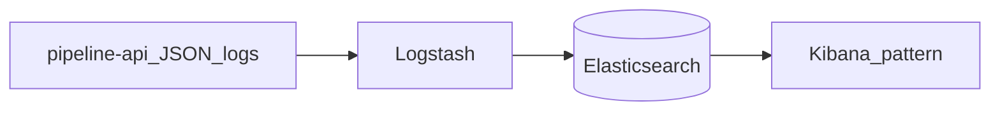

# W4-US04 TDD Guide — ELK log path

| Field | Value |
|-------|--------|
| **Story** | W4-US04 — Structured logs → Logstash → ES → Kibana pattern |
| **Depends on** | W0 structured JSON logs |
| **Branch** | `W4-US04` from `wave-4` |
| **Timebox hint** | 1–1.5 days |
| **You will touch** | Compose ELK (or stub), index naming, smoke script/IT |
| **Architecture refs** | §7.3 Logging (ELK) |
| **KB** | [`../../../kb/W4-US04-elk-logs.md`](../../../kb/W4-US04-elk-logs.md) |
| **Stakeholder TDD** | [`../../WAVE_4_TDD.md`](../../WAVE_4_TDD.md) |
| **AC source** | [`../../../waves/WAVE_4.md`](../../../waves/WAVE_4.md) § W4-US04 |

---

## 1. Overview

Prove a fixture execution log (with `execution_id`) lands in an Elasticsearch index named like `pipeline-logs-{tenant_id}-{YYYY.MM.DD}` and is discoverable (Kibana pattern or curl query).

**Done means:** ELK smoke (script or IT) finds a sample doc for fixture `exec-*`.

**Out of scope:** Production Filebeat sidecars; multi-cluster ILM.

---

## 2. Assumptions

| # | Assumption |
|---|------------|
| 1 | W0 Logstash JSON console logs exist |
| 2 | Compose can add ES/Logstash/Kibana **or** document a stub indexer for CI |
| 3 | Heavy ELK may be labeled / manual — unit JSON shape always |

```bash
git checkout wave-4 && git pull && git checkout -b W4-US04
# docker compose up -d elasticsearch logstash kibana   # if added
```

---

## 3. HLD / DFD



---

## 4. LLD

| Component | Responsibility |
|-----------|----------------|
| Index naming | `pipeline-logs-{tenant}-{date}` |
| Log fields | tenant_id, pipeline_id, execution_id, … (§7.3) |
| Smoke | Script or IT query by `execution_id` |
| Compose | Optional services + ports documented |

---

## 5. API interface

| Surface | Notes |
|---------|--------|
| (No platform REST required) | US05 may proxy logs later |
| ES query / Kibana Discover | Manual + smoke |

---

## 6. Testing

| Layer | Coverage | Tools |
|-------|----------|-------|
| Unit | Log JSON shape includes execution_id | optional |
| Smoke | Index + query fixture | script / labeled IT |
| Manual | Kibana Discover | |

---

## 7. Risks

| Risk | Mitigation |
|------|------------|
| CI too slow | Labeled job; always-on unit shape tests |
| Port conflicts | Document compose ports in KB |

---

## 8. RED

| File | Method | Asserts |
|------|--------|---------|
| ELK smoke | query by execution_id | hit ≥ 1 |

```bash
# example — adjust to chosen smoke entrypoint
./scripts/smoke-elk.sh   # or mvn -Dtest=ElkLogSmokeIT
```

**Stop.** Red.

---

## 9. GREEN

1. Compose/stub path for ingest.
2. Emit sample structured log with fixture ids.
3. Query succeeds.

### Checklist

- [x] Index naming matches architecture
- [x] Fixture `execution_id` queryable
- [x] KB documents ports + query
- [x] Smoke green (or labeled + unit shape)

---

## 10. REFACTOR

- Align field names with US05 log API
- Keep smoke idempotent

---

## 11. Docs & trackers

- [x] KB: how to find logs for `exec-*`
- [x] Tracker · TEST_MATRIX · `WAVE_4.md` Done

```text
merge → tag W4-US04 → W4-US05
```

---

## 12. Common pitfalls

| Mistake | Fix |
|---------|-----|
| Blocking wave on full Kind Filebeat | Stub/compose smoke is enough |
| Wrong index pattern | Follow §7.3 |

## Help / escalate

- Architecture §7.3 · W0 structured logging
