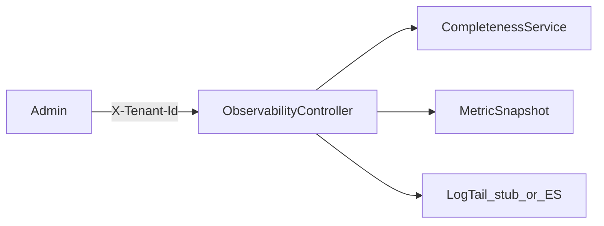

# W4-US05 TDD Guide — Observability REST APIs

| Field | Value |
|-------|--------|
| **Story** | W4-US05 — Observability REST (completeness / latency / heartbeat / errors / logs) |
| **Depends on** | W4-US02; W4-US04 preferred for logs |
| **Branch** | `W4-US05` from `wave-4` |
| **Timebox hint** | 1–1.5 days |
| **You will touch** | Observability controller/service, DTOs, tenant isolation |
| **Architecture refs** | §3.6 Observability Endpoints |
| **KB (create)** | `docs/delivery/kb/W4-US05-observability-api.md` |
| **Stakeholder TDD** | [`../../WAVE_4_TDD.md`](../../WAVE_4_TDD.md) |
| **AC source** | [`../../../waves/WAVE_4.md`](../../../waves/WAVE_4.md) § W4-US05 |

---

## 1. Overview

Expose tenant-scoped REST APIs so support can read completeness, latency, heartbeat, errors, and execution log tails without Kibana/Grafana.

**Done means:** `ObservabilityControllerIT` green for completeness (minimum) + at least one other endpoint; cross-tenant → 404.

**Out of scope:** UI panels (Wave 6); full Kibana proxy fidelity.

---

## 2. Assumptions

| # | Assumption |
|---|------------|
| 1 | Completeness calculator from US02 |
| 2 | Admin APIs use `X-Tenant-Id` stub |
| 3 | Paths under `/api/v1/observability/...` (prefix `/api/v1` like other APIs) |

Architecture table uses `/observability/...` — implement as `/api/v1/observability/...` for consistency with Wave 1–3.

```bash
git checkout wave-4 && git pull && git checkout -b W4-US05
docker compose up -d mysql
```

---

## 3. HLD / DFD



---

## 4. LLD

| Component | Responsibility |
|-----------|----------------|
| Controller | Map §3.6 endpoints |
| Services | Completeness, latency summary, heartbeat, errors, logs |
| Isolation | Tenant filter / ownership checks |
| Logs | Stub list or ES query from US04 |

---

## 5. API interface

| Method | Path | Response |
|--------|------|----------|
| `GET` | `/api/v1/observability/pipelines/{id}/completeness` | ratio/pct + in/out |
| `GET` | `/api/v1/observability/pipelines/{id}/latency` | percentiles / summary |
| `GET` | `/api/v1/observability/pipelines/{id}/heartbeat` | last heartbeat |
| `GET` | `/api/v1/observability/pipelines/{id}/errors` | critical error summary |
| `GET` | `/api/v1/observability/executions/{execId}/logs` | log tail |

Auth: **`X-Tenant-Id` required**. Cross-tenant → 404.

---

## 6. Testing

| Layer | Coverage | Tools |
|-------|----------|-------|
| Integration | Completeness + isolation | `ObservabilityControllerIT` |
| Integration | Other endpoints smoke | same |
| Manual | curl with fixture ids | |

---

## 7. Risks

| Risk | Mitigation |
|------|------------|
| Leaking other tenant data | Strict ownership checks |
| Logs unavailable without ES | Stub empty/tail with documented flag |

---

## 8. RED

| File | Method | Asserts |
|------|--------|---------|
| `ObservabilityControllerIT` | completeness for fixture | 200 + expected shape |
| same | other tenant | 404 |

```bash
./mvnw -pl pipeline-api test -Dtest=ObservabilityControllerIT
```

**Stop.** Red.

---

## 9. GREEN

1. Controller + services.
2. Wire US02 calculator.
3. Tenant isolation.

### Checklist

- [ ] Completeness endpoint works
- [ ] Cross-tenant 404
- [ ] At least latency or heartbeat or errors stubbed
- [ ] Logs endpoint returns documented shape
- [ ] Tests green

---

## 10. REFACTOR

- Shared error DTO with other APIs
- Align field names with KB

---

## 11. Docs & trackers

- [ ] KB: curl examples for support
- [ ] Tracker · TEST_MATRIX · `WAVE_4.md` Done

```text
merge → tag W4-US05 → W4-US06 / wave exit prep
```

---

## 12. Common pitfalls

| Mistake | Fix |
|---------|-----|
| Skipping `/api/v1` prefix | Match platform convention |
| Returning 403 instead of 404 | Prefer 404 for isolation |

## Help / escalate

- Architecture §3.6 · W4-US02 · W1 tenant filter
