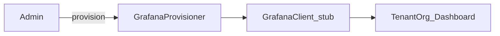

# W4-US06 TDD Guide — Grafana provision (Should)

| Field | Value |
|-------|--------|
| **Story** | W4-US06 — Provision Grafana dashboards per tenant org |
| **Depends on** | W4-US02 |
| **Branch** | `W4-US06` from `wave-4` |
| **Timebox hint** | 0.5–1 day |
| **You will touch** | Grafana client stub, provisioner, template JSON |
| **Architecture refs** | §7.2 Grafana Dashboards |
| **KB** | [`../../../kb/W4-US06-grafana-provision.md`](../../../kb/W4-US06-grafana-provision.md) |
| **Stakeholder TDD** | [`../../WAVE_4_TDD.md`](../../WAVE_4_TDD.md) |
| **AC source** | [`../../../waves/WAVE_4.md`](../../../waves/WAVE_4.md) § W4-US06 |

---

## 1. Overview

Provision a tenant Grafana Organization (and baseline dashboard) via API. **Stub client is OK** for Wave 4.

**Done means:** `GrafanaProvisionerTest` green; provision call recorded for tenant.

**Out of scope:** Full multi-cluster Grafana ops; UI embedding (Wave 6).

---

## 2. Assumptions

| # | Assumption |
|---|------------|
| 1 | Priority **Should** — ship after Musts if timeboxed |
| 2 | Stub HTTP client acceptable |
| 3 | Template JSON under `src/main/resources/grafana/` or fixtures |

```bash
git checkout wave-4 && git pull && git checkout -b W4-US06
```

---

## 3. HLD / DFD



---

## 4. LLD

| Component | Responsibility |
|-----------|----------------|
| `GrafanaClient` | createOrg / upsertDashboard |
| `GrafanaProvisioner` | Map tenant → org + template |
| Stub | Record calls for tests |

---

## 5. API interface

| Surface | Notes |
|---------|--------|
| Optional `POST /api/v1/tenants/{id}/grafana` | Or internal on tenant create |
| Stub | No real Grafana required |

---

## 6. Testing

| Layer | Coverage | Tools |
|-------|----------|-------|
| Unit | Provisioner calls client | `GrafanaProvisionerTest` |
| Manual | Optional real Grafana | |

---

## 7. Risks

| Risk | Mitigation |
|------|------------|
| Blocking wave exit | Defer with tracker note if needed |
| Secret tokens in repo | Config / env only |

---

## 8. RED

| File | Method | Asserts |
|------|--------|---------|
| `GrafanaProvisionerTest` | provision_createsOrg | stub invoked |

```bash
./mvnw -pl pipeline-api test -Dtest=GrafanaProvisionerTest
```

**Stop.** Red.

---

## 9. GREEN

1. Stub client + provisioner.
2. Template fixture.
3. Tests green.

### Checklist

- [x] Stub provision path works
- [x] Tenant id mapped to org
- [x] KB documents stub vs real
- [x] Tests green

---

## 10. REFACTOR

- Template versioning
- Ready for real Grafana HTTP later

---

## 11. Docs & trackers

- [x] KB: how dashboards are provisioned
- [x] Tracker · TEST_MATRIX · `WAVE_4.md` Done (Should)

```text
merge → tag W4-US06 → wave exit prep
```

---

## 12. Common pitfalls

| Mistake | Fix |
|---------|-----|
| Requiring live Grafana for CI | Stub is enough |
| Blocking Musts on Should | Finish US01–US05 first |

## Help / escalate

- Architecture §7.2 · W4-US02 completeness
