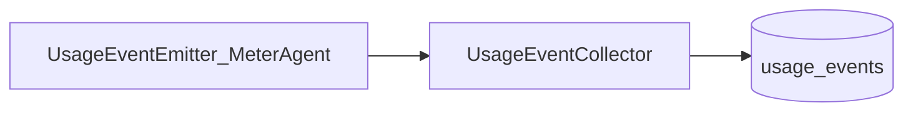

# W5-US01 TDD Guide — UsageEvent ingest + persist

| Field | Value |
|-------|--------|
| **Story** | W5-US01 — UsageEvent ingest API/queue + MySQL persist |
| **Depends on** | W0 MySQL; W3 `UsageEvent` / `UsageEventCollector` |
| **Branch** | `W5-US01` from `wave-5` |
| **Timebox hint** | 1–1.5 days |
| **You will touch** | Flyway `usage_events`, durable collector, optional ingest API |
| **Architecture refs** | §6.2 `usage_events` |
| **KB** | [`../../../kb/W5-US01-usage-ingest.md`](../../../kb/W5-US01-usage-ingest.md) |
| **Stakeholder TDD** | [`../../WAVE_5_TDD.md`](../../WAVE_5_TDD.md) |
| **AC source** | [`../../../waves/WAVE_5.md`](../../../waves/WAVE_5.md) § W5-US01 |

---

## 1. Overview

Persist `UsageEvent`s to MySQL so Wave 5 aggregates and billing queries have a durable source. Wire `UsageEventCollector` to a DB-backed implementation (keep stub for unit tests).

**Done means:** `UsageEventServiceTest` / IT green; webhook or direct emit lands in `usage_events`.

**Out of scope:** Aggregates (US03); MeterAgent pipelet dimensions (US02).

---

## 2. Assumptions

| # | Assumption |
|---|------------|
| 1 | Compose MySQL up |
| 2 | W3 `UsageEvent` record exists; may extend fields for `execution_id` / `pipeline_id` |
| 3 | Idempotent key: e.g. `(tenant_id, dimension, occurred_at, source_id)` or event UUID |

```bash
git checkout wave-5 && git pull && git checkout -b W5-US01
docker compose up -d mysql
```

---

## 3. HLD / DFD



---

## 4. LLD

| Component | Responsibility |
|-----------|----------------|
| Flyway migration | `usage_events` table per §6.2 |
| Entity + repository | JPA persist |
| `PersistingUsageEventCollector` | Implements `UsageEventCollector` |
| Idempotency | Unique constraint / upsert |

---

## 5. API interface

| Surface | Notes |
|---------|--------|
| Collector SPI | Primary path (W3 webhook already calls emitter) |
| Optional `POST /api/v1/usage/events` | Internal/batch if needed |

---

## 6. Testing

| Layer | Coverage | Tools |
|-------|----------|-------|
| Unit | Map event → entity; idempotent second insert | `UsageEventServiceTest` |
| Integration | Emit → row in MySQL | Boot IT + Compose |

---

## 7. Risks

| Risk | Mitigation |
|------|------------|
| Break W3 webhook tests | Keep stub bean for unit; profile for persist |
| Schema drift vs §6.2 | Match architecture columns |

---

## 8. RED

| File | Method | Asserts |
|------|--------|---------|
| `UsageEventPersistIT` | emit_persistsRow | count ≥ 1 |

```bash
./mvnw -pl pipeline-api test -Dtest=UsageEventPersistIT,UsageEventServiceTest
```

**Stop.** Red.

---

## 9. GREEN

1. Migration + entity.
2. Persisting collector.
3. Wire emitter path; tests green.

### Checklist

- [x] `usage_events` migration
- [x] Collector persists
- [x] Idempotent / no double-bill on retry
- [x] Tests green

---

## 10. REFACTOR

- Share dimension constants with US02
- Keep collector interface stable for W3

---

## 11. Docs & trackers

- [x] KB: how to query raw events for a tenant
- [x] Tracker · TEST_MATRIX · `WAVE_5.md` Done

```text
merge → tag W5-US01 → W5-US02
```

---

## 12. Common pitfalls

| Mistake | Fix |
|---------|-----|
| Dropping stub collector | Profile or `@Primary` carefully |
| Missing tenant index | Follow §6.2 indexes |

## Help / escalate

- Architecture §6.2 · W3-US07 metering
