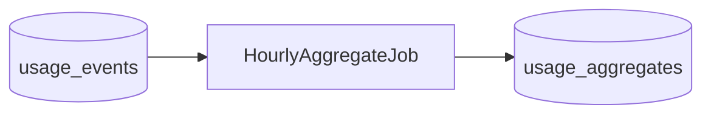

# W5-US03 TDD Guide — Hourly aggregates

| Field | Value |
|-------|--------|
| **Story** | W5-US03 — Hourly usage aggregate job |
| **Depends on** | W5-US01 |
| **Branch** | `W5-US03` from `wave-5` |
| **Timebox hint** | 1 day |
| **You will touch** | `usage_aggregates` migration, scheduled job, clock |
| **Architecture refs** | §6.2 Aggregation Schedule |
| **KB** | [`../../../kb/W5-US03-hourly-aggregates.md`](../../../kb/W5-US03-hourly-aggregates.md) |
| **Stakeholder TDD** | [`../../WAVE_5_TDD.md`](../../WAVE_5_TDD.md) |
| **AC source** | [`../../../waves/WAVE_5.md`](../../../waves/WAVE_5.md) § W5-US03 |

---

## 1. Overview

Roll raw `usage_events` into hourly `usage_aggregates` (quantity ± cost stub). Job must be safe to re-run for the same hour.

**Done means:** `UsageAggregateJobTest` green with fixed Instant.

**Out of scope:** Monthly invoices; daily reports (optional stretch).

---

## 2. Assumptions

| # | Assumption |
|---|------------|
| 1 | Events have `recorded_at` / `occurred_at` in UTC |
| 2 | Unit prices can be stub constants for Wave 5 |
| 3 | Clock injectable for tests |

```bash
git checkout wave-5 && git pull && git checkout -b W5-US03
```

---

## 3. HLD / DFD



---

## 4. LLD

| Component | Responsibility |
|-----------|----------------|
| Migration | `usage_aggregates` |
| Job | `@Scheduled` or triggered method |
| Idempotency | Upsert by tenant+dimension+period |

---

## 5. API interface

| Surface | Notes |
|---------|--------|
| (Internal job) | US05 reads aggregates |

---

## 6. Testing

| Layer | Coverage | Tools |
|-------|----------|-------|
| Unit | Bucket math; re-run same hour | `UsageAggregateJobTest` |
| Integration | Seed events → aggregate rows | IT |

---

## 7. Risks

| Risk | Mitigation |
|------|------------|
| Wrong hour bucket | UTC truncation tests |
| Partial failure | Transaction per tenant/hour |

---

## 8. RED

```bash
./mvnw -pl pipeline-api test -Dtest=UsageAggregateJobTest
```

**Stop.** Red.

---

## 9. GREEN

1. Table + job.
2. Fixed clock tests.
3. Idempotent re-run.

### Checklist

- [x] Hourly rows created
- [x] Re-run safe
- [x] Tests green

---

## 10. REFACTOR

- Cost calculation shared with US05 (`UsageUnitPrices`)
- Ready for credit deduct (US04)

---

## 11. Docs & trackers

- [x] KB: how to re-run aggregate for an hour
- [x] Tracker · TEST_MATRIX · `WAVE_5.md` Done

```text
merge → tag W5-US03 → W5-US04 / US05
```

---

## 12. Common pitfalls

| Mistake | Fix |
|---------|-----|
| Local TZ buckets | Always UTC |
| Deleting events after agg | Keep raw for disputes |

## Help / escalate

- Architecture §6.2 · W5-US01
